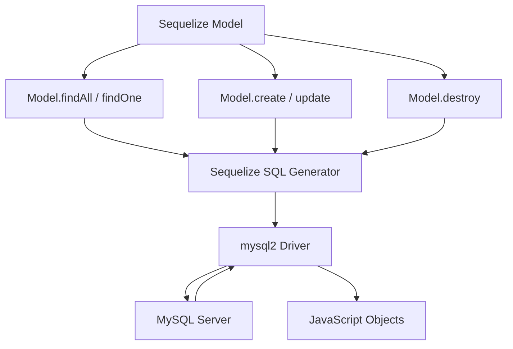

# How to Use MySQL with Sequelize ORM in Node.js

Author: [nawazdhandala](https://www.github.com/nawazdhandala)

Tags: MySQL, Node.js, Sequelize, ORM, JavaScript, Database

Description: Learn how to use Sequelize ORM with MySQL in Node.js to define models, run queries, manage migrations, and handle associations with async/await.

---

## How Sequelize Works with MySQL

Sequelize is a promise-based Node.js ORM that supports MySQL, PostgreSQL, SQLite, and others. It maps JavaScript classes to database tables, generates SQL automatically, and manages schema migrations. Sequelize uses `mysql2` under the hood for the MySQL connection.



## Installation

```bash
npm install sequelize mysql2
```

## Sequelize Instance Setup

```javascript
// db.js
const { Sequelize } = require('sequelize');

const sequelize = new Sequelize('myapp', 'appuser', 'secret', {
    host:     'localhost',
    dialect:  'mysql',
    timezone: '+00:00',      // Store and retrieve in UTC
    pool: {
        max:     10,
        min:     2,
        acquire: 30000,
        idle:    10000
    },
    logging: false           // Set to console.log to see generated SQL
});

module.exports = sequelize;
```

## Defining Models

```javascript
// models/User.js
const { DataTypes, Model } = require('sequelize');
const sequelize = require('../db');

class User extends Model {}

User.init({
    id: {
        type:          DataTypes.INTEGER,
        autoIncrement: true,
        primaryKey:    true
    },
    name: {
        type:      DataTypes.STRING(100),
        allowNull: false
    },
    email: {
        type:      DataTypes.STRING(150),
        allowNull: false,
        unique:    true,
        validate:  { isEmail: true }
    },
    role: {
        type:         DataTypes.ENUM('admin', 'user', 'viewer'),
        defaultValue: 'user'
    }
}, {
    sequelize,
    tableName:  'users',
    timestamps: true,               // Adds createdAt and updatedAt
    underscored: true               // snake_case column names
});

module.exports = User;
```

```javascript
// models/Post.js
const { DataTypes, Model } = require('sequelize');
const sequelize = require('../db');

class Post extends Model {}

Post.init({
    id:      { type: DataTypes.INTEGER, autoIncrement: true, primaryKey: true },
    title:   { type: DataTypes.STRING(200), allowNull: false },
    body:    { type: DataTypes.TEXT },
    userId:  { type: DataTypes.INTEGER, allowNull: false, field: 'user_id' }
}, {
    sequelize,
    tableName:   'posts',
    timestamps:  true,
    underscored: true
});

module.exports = Post;
```

## Associations

```javascript
// models/index.js
const User = require('./User');
const Post = require('./Post');

User.hasMany(Post, { foreignKey: 'userId', as: 'posts' });
Post.belongsTo(User, { foreignKey: 'userId', as: 'author' });

module.exports = { User, Post };
```

## CRUD Operations

```javascript
const { User, Post } = require('./models');
const { Op } = require('sequelize');

// Create
const user = await User.create({ name: 'Alice', email: 'alice@example.com' });
console.log(user.id);

// Find by primary key
const found = await User.findByPk(1);

// Find with conditions
const admins = await User.findAll({
    where: { role: 'admin' },
    order: [['name', 'ASC']],
    limit: 10
});

// Find with complex conditions
const recent = await Post.findAll({
    where: {
        createdAt: { [Op.gte]: new Date('2026-01-01') },
        title:     { [Op.like]: '%MySQL%' }
    }
});

// Update
await User.update({ role: 'admin' }, { where: { email: 'alice@example.com' } });

// Update single instance
const u = await User.findByPk(1);
await u.update({ name: 'Alice Smith' });

// Delete
await User.destroy({ where: { id: 99 } });
```

## Eager Loading (JOIN)

```javascript
// Load posts with their authors:
const posts = await Post.findAll({
    include: [{
        model: User,
        as:    'author',
        attributes: ['id', 'name', 'email']
    }],
    order: [['created_at', 'DESC']],
    limit: 20
});

// Load users with their posts:
const usersWithPosts = await User.findAll({
    include: [{ model: Post, as: 'posts' }],
    where: { role: 'admin' }
});
```

## Transactions

```javascript
const sequelize = require('./db');

async function registerUser(name, email, planId) {
    const t = await sequelize.transaction();
    try {
        const user = await User.create({ name, email }, { transaction: t });

        await sequelize.query(
            'INSERT INTO subscriptions (user_id, plan_id) VALUES (?, ?)',
            { replacements: [user.id, planId], transaction: t }
        );

        await t.commit();
        return user;
    } catch (err) {
        await t.rollback();
        throw err;
    }
}
```

## Raw Queries

When you need full control over SQL:

```javascript
const [rows] = await sequelize.query(
    'SELECT u.id, u.name, COUNT(p.id) AS post_count ' +
    'FROM users u LEFT JOIN posts p ON u.id = p.user_id ' +
    'GROUP BY u.id ORDER BY post_count DESC',
    { type: sequelize.QueryTypes.SELECT }
);
```

## Sync and Migrations

For development only (creates/alters tables):

```javascript
await sequelize.sync({ alter: true });
```

For production, use Sequelize CLI migrations:

```bash
npm install --save-dev sequelize-cli
npx sequelize-cli migration:generate --name create-users
npx sequelize-cli db:migrate
```

## Best Practices

- Use Sequelize CLI migrations for schema changes in production - never use `sync({ force: true })`.
- Always pass `{ transaction: t }` to every query inside a transaction block.
- Use `attributes` in `findAll` to select only needed columns instead of fetching entire rows.
- Use `Op` (Sequelize operators) instead of raw SQL strings for WHERE conditions to maintain parameterization.
- Disable `logging` in production or route it through your application logger.
- Use `findAndCountAll` for paginated endpoints that also need a total count.

## Summary

Sequelize provides a full-featured ORM for MySQL in Node.js with model definitions, associations, eager loading, and migration support. Models are defined with `Model.init()` and queried using methods like `findAll`, `findByPk`, `create`, `update`, and `destroy`. Associations like `hasMany` and `belongsTo` enable eager loading via `include`. Transactions use `sequelize.transaction()` with the `{ transaction: t }` option passed to every operation. Use raw `sequelize.query()` when you need SQL features that the ORM does not cover.
