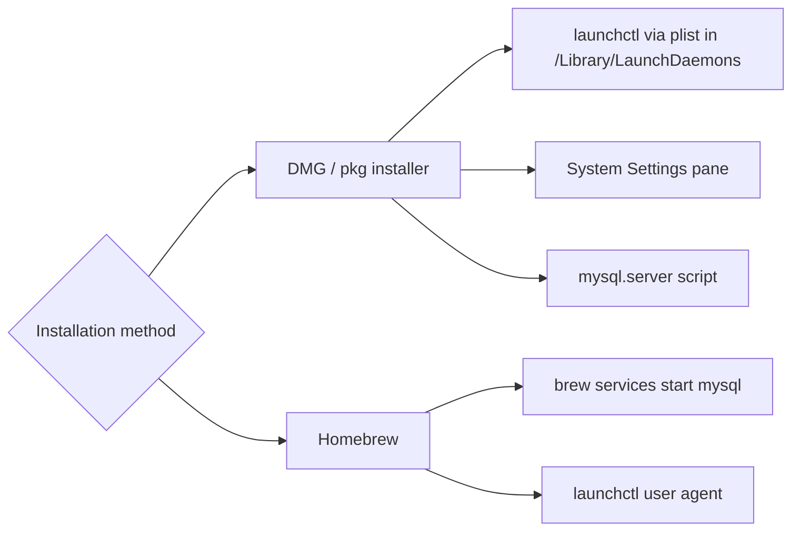

# How to Start and Stop MySQL on macOS

Author: [nawazdhandala](https://www.github.com/nawazdhandala)

Tags: MySQL, Service, macOS, Administration, Homebrew

Description: Start, stop, restart, and configure MySQL on macOS using the mysql.server script, launchctl, Homebrew services, and the System Settings pane.

---

## How It Works

MySQL on macOS can be installed in two ways - the official DMG package or Homebrew. Each uses a different mechanism to manage the service: the DMG install uses a launchd plist, while Homebrew uses its own `brew services` wrapper around launchd.



## Method 1 - MySQL Installed via DMG Package

### Using the mysql.server Script

```bash
# Start
sudo /usr/local/mysql/support-files/mysql.server start

# Stop
sudo /usr/local/mysql/support-files/mysql.server stop

# Restart
sudo /usr/local/mysql/support-files/mysql.server restart

# Status
sudo /usr/local/mysql/support-files/mysql.server status
```

### Using launchctl

Start MySQL as a launchd daemon (persists across reboots).

```bash
sudo launchctl load -w /Library/LaunchDaemons/com.oracle.oss.mysql.mysqld.plist
```

Stop and disable autostart.

```bash
sudo launchctl unload -w /Library/LaunchDaemons/com.oracle.oss.mysql.mysqld.plist
```

Check if the daemon is loaded.

```bash
sudo launchctl list | grep mysql
```

```text
12345   0   com.oracle.oss.mysql.mysqld
```

### Using System Settings

1. Open **System Settings** (macOS 13+) or **System Preferences** (macOS 12).
2. Scroll to find the **MySQL** pane at the bottom.
3. Click **Start MySQL Server** or **Stop MySQL Server**.
4. Check the **Automatically Start MySQL Server on Startup** checkbox to enable autostart.

## Method 2 - MySQL Installed via Homebrew

### List Homebrew Services

```bash
brew services list | grep mysql
```

```text
mysql   started   username  ~/Library/LaunchAgents/homebrew.mxcl.mysql.plist
```

### Start MySQL

```bash
brew services start mysql
```

### Stop MySQL

```bash
brew services stop mysql
```

### Restart MySQL

```bash
brew services restart mysql
```

### Start Without Registering as a Login Item

If you only want MySQL running for the current session (no autostart):

```bash
/opt/homebrew/opt/mysql/bin/mysqld_safe --datadir=/opt/homebrew/var/mysql &
```

Stop with:

```bash
mysqladmin -u root shutdown
```

## Checking MySQL Status

Regardless of installation method:

```bash
mysqladmin -u root -p status
```

```text
Uptime: 3600  Threads: 2  Questions: 32  Slow queries: 0  Opens: 120
```

Check if the port is open:

```bash
lsof -iTCP:3306 -sTCP:LISTEN
```

```text
COMMAND  PID   USER  FD   TYPE   DEVICE  SIZE/OFF NODE NAME
mysqld   1234  _mysql  23u  IPv4  0x...   0t0  TCP *:mysql (LISTEN)
```

## Viewing MySQL Logs on macOS

For DMG installs:

```bash
tail -f /usr/local/mysql/data/$(hostname).err
```

For Homebrew installs:

```bash
tail -f /opt/homebrew/var/log/mysql/mysqld_error.log
# or
tail -f /opt/homebrew/var/mysql/$(hostname).err
```

## Autostart Configuration

For Homebrew, registering with `brew services start` automatically creates a LaunchAgent plist in `~/Library/LaunchAgents/`, which starts MySQL when you log in.

For the DMG install, the plist is in `/Library/LaunchDaemons/`, which starts MySQL at system boot (before login).

## Summary

macOS provides three ways to manage MySQL: the `mysql.server` shell script for the DMG install, `launchctl` for direct daemon control, and `brew services` for Homebrew installs. The System Settings MySQL pane provides a graphical toggle. Use `brew services` for Homebrew installs to enable autostart, and use `launchctl load -w` for DMG installs. Always use a graceful stop method to allow InnoDB to flush buffers before shutdown.
