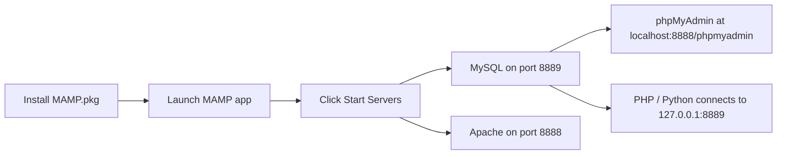

# How to Set Up MySQL with MAMP for Local Development

Author: [OneUptime](https://oneuptime.com)

Tags: MySQL, MAMP, macOS, Installation, Development

Description: Install MAMP on macOS, start the bundled MySQL server, configure the port, access phpMyAdmin, and connect from PHP or Python for local development.

---

## How It Works

MAMP (macOS, Apache, MySQL, PHP) is a local development environment for macOS and Windows. The free version bundles Apache or Nginx, MySQL, and PHP. MAMP PRO adds virtual hosts and per-site configuration. This guide covers MAMP free on macOS.



## Prerequisites

- macOS 12 Monterey or later
- ~1 GB free disk space
- No other MySQL instance running on port 3306 (MAMP uses 8889 by default)

## Step 1 - Download MAMP

Visit [https://www.mamp.info/en/downloads/](https://www.mamp.info/en/downloads/) and download **MAMP & MAMP PRO** for macOS.

## Step 2 - Install MAMP

1. Open the downloaded `.pkg` file.
2. Follow the installer wizard.
3. MAMP installs to `/Applications/MAMP/`.

## Step 3 - Launch MAMP and Start Servers

1. Open **MAMP** from Applications.
2. The MAMP control panel shows Apache and MySQL status indicators.
3. Click **Start Servers**.
4. Both indicators turn green when the servers are running.

The default ports are:
```text
Apache: 8888
MySQL:  8889
```

## Step 4 - Change the MySQL Port (Optional)

To use the standard MySQL port 3306, open **Preferences > Ports** in MAMP and change the MySQL port to 3306. Click **Set Web and MySQL ports to 80 & 3306** for the standard combination.

Note: You need administrator rights and no other MySQL instance running on port 3306.

## Step 5 - Access phpMyAdmin

Open a browser and navigate to:

```text
http://localhost:8888/phpmyadmin
```

The default credentials are:
```text
Username: root
Password: root
```

## Step 6 - Create a Development Database

In phpMyAdmin, click **New**, enter a database name, set collation to `utf8mb4_unicode_ci`, and click **Create**.

Or connect from the Terminal using the bundled mysql client.

```bash
/Applications/MAMP/Library/bin/mysql -u root -p --host=127.0.0.1 --port=8889
```

```sql
CREATE DATABASE myproject CHARACTER SET utf8mb4 COLLATE utf8mb4_unicode_ci;
CREATE USER 'devuser'@'localhost' IDENTIFIED BY 'DevPass1!';
GRANT ALL PRIVILEGES ON myproject.* TO 'devuser'@'localhost';
FLUSH PRIVILEGES;
EXIT;
```

## Step 7 - Configure the Document Root

By default, MAMP serves files from `/Applications/MAMP/htdocs/`. Place your PHP project there.

To change the document root, open **MAMP > Preferences > Web Server** and set the document root to your project directory.

## Step 8 - Connect from PHP

```php
<?php
$pdo = new PDO(
    'mysql:host=127.0.0.1;port=8889;dbname=myproject;charset=utf8mb4',
    'devuser',
    'DevPass1!',
    [PDO::ATTR_ERRMODE => PDO::ERRMODE_EXCEPTION]
);

$stmt = $pdo->query("SELECT VERSION() AS version");
$row  = $stmt->fetch(PDO::FETCH_ASSOC);
echo "MySQL version: " . $row['version'];
```

## Step 9 - Connect from Python

```python
import mysql.connector

conn = mysql.connector.connect(
    host="127.0.0.1",
    port=8889,
    user="devuser",
    password="DevPass1!",
    database="myproject"
)

cursor = conn.cursor()
cursor.execute("SELECT VERSION()")
print("MySQL version:", cursor.fetchone()[0])
conn.close()
```

## Adding MySQL to the Terminal PATH

```bash
echo 'export PATH="/Applications/MAMP/Library/bin:$PATH"' >> ~/.zshrc
source ~/.zshrc
```

Now you can type `mysql` directly in Terminal.

## Key File Locations

```text
/Applications/MAMP/Library/bin/mysql       MySQL client binary
/Applications/MAMP/db/mysql/               Data directory (MAMP free)
/Applications/MAMP/conf/my.cnf             MySQL configuration
/Applications/MAMP/logs/mysql_error.log    Error log
/Applications/MAMP/htdocs/                 Web document root
```

## MAMP vs. Homebrew MySQL

| Feature | MAMP | Homebrew |
|---|---|---|
| Setup effort | Very low | Low |
| Port conflicts | Uses 8889 by default | Uses 3306 |
| phpMyAdmin | Bundled | Manual install |
| Multiple PHP versions | MAMP PRO | Manual |
| CLI access | Via /Applications/MAMP/Library/bin | Directly in PATH |

## Stopping the Servers

In the MAMP control panel, click **Stop Servers**.

## Summary

MAMP provides a one-click local MySQL environment on macOS with no manual configuration. After installing and clicking Start Servers, MySQL is accessible on port 8889 (or 3306 if changed in preferences) and phpMyAdmin is available in the browser. Add the MAMP bin directory to your PATH for command-line access. MAMP is ideal for quick local PHP development; for more control, consider Homebrew or Docker.
