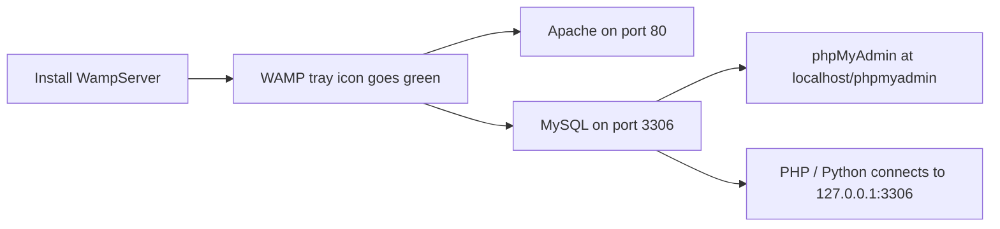

# How to Set Up MySQL with WAMP for Local Development

Author: [OneUptime](https://oneuptime.com)

Tags: MySQL, WAMP, Windows, Installation, Development

Description: Install WampServer on Windows, start the bundled MySQL server, configure phpMyAdmin, and connect from PHP or Python applications for local development.

---

## How It Works

WampServer (WAMP) is a Windows-based development environment that bundles Apache, MySQL (or MariaDB), and PHP with a system tray icon for easy server management. Each component can be started, stopped, and configured independently from the tray menu.



## Prerequisites

- Windows 10 or Windows 11 (64-bit)
- Microsoft Visual C++ Redistributable (2012, 2013, 2015-2022) - the installer provides these
- ~500 MB free disk space
- No other Apache or MySQL instance on ports 80 and 3306

## Step 1 - Download WampServer

Visit [https://www.wampserver.com/en/](https://www.wampserver.com/en/) and download the 64-bit installer for your system.

## Step 2 - Install WampServer

1. Run the downloaded `.exe` installer as Administrator.
2. Accept the license agreement.
3. Choose an installation directory (default: `C:\wamp64`).
4. Select your default browser and text editor if prompted.
5. Complete the installation wizard.

If any Microsoft Visual C++ Redistributable packages are missing, the installer will prompt you to install them. Install them before proceeding.

## Step 3 - Start WampServer

Click the WampServer icon in the Start Menu. The system tray icon appears. Wait for it to turn **green**, which means all services (Apache and MySQL) are running.

If the icon is **orange**, one or more services failed to start. Right-click the tray icon, select **Tools**, and check the error log.

## Step 4 - Access phpMyAdmin

Open a browser and navigate to:

```text
http://localhost/phpmyadmin
```

Default credentials:
```text
Username: root
Password: (empty - no password by default)
```

## Step 5 - Set a Root Password

Open phpMyAdmin, click **User accounts**, click **Edit privileges** for `root@localhost`, go to **Change password**, enter a password, and click **Go**.

Or connect from Command Prompt:

```bash
C:\wamp64\bin\mysql\mysql8.x.x\bin\mysql.exe -u root
```

```sql
ALTER USER 'root'@'localhost' IDENTIFIED BY 'WampDevPass1!';
FLUSH PRIVILEGES;
EXIT;
```

After setting the password, update phpMyAdmin to use it. Edit:

```text
C:\wamp64\apps\phpmyadmin5.x.x\config.inc.php
```

Find the password line and update:

```php
$cfg['Servers'][$i]['password'] = 'WampDevPass1!';
```

## Step 6 - Create a Development Database

```bash
C:\wamp64\bin\mysql\mysql8.x.x\bin\mysql.exe -u root -p
```

```sql
CREATE DATABASE myapp CHARACTER SET utf8mb4 COLLATE utf8mb4_unicode_ci;
CREATE USER 'appuser'@'localhost' IDENTIFIED BY 'AppPass1!';
GRANT ALL PRIVILEGES ON myapp.* TO 'appuser'@'localhost';
FLUSH PRIVILEGES;
EXIT;
```

## Step 7 - Connect from PHP

Place your PHP files in `C:\wamp64\www\` (the document root).

```php
<?php
$pdo = new PDO(
    'mysql:host=127.0.0.1;port=3306;dbname=myapp;charset=utf8mb4',
    'appuser',
    'AppPass1!',
    [PDO::ATTR_ERRMODE => PDO::ERRMODE_EXCEPTION]
);

$stmt = $pdo->query("SELECT VERSION()");
echo "MySQL: " . $stmt->fetchColumn();
```

Access via browser: `http://localhost/yourfile.php`

## Step 8 - Connect from Python

```python
import mysql.connector

conn = mysql.connector.connect(
    host="127.0.0.1",
    port=3306,
    user="appuser",
    password="AppPass1!",
    database="myapp"
)

cursor = conn.cursor()
cursor.execute("SELECT VERSION()")
print("MySQL version:", cursor.fetchone()[0])
conn.close()
```

## Managing Services from the Tray Icon

Right-click the WAMP tray icon:

```text
Start All Services     Start Apache and MySQL
Stop All Services      Stop Apache and MySQL
Restart All Services   Restart both

MySQL > Start/Stop/Restart Service
MySQL > MySQL console         Open mysql CLI
MySQL > my.ini                Edit MySQL config
```

## Key File Locations

```text
C:\wamp64\bin\mysql\mysql8.x.x\bin\mysql.exe   MySQL client
C:\wamp64\bin\mysql\mysql8.x.x\data\           Data directory
C:\wamp64\bin\mysql\mysql8.x.x\my.ini          MySQL configuration
C:\wamp64\logs\mysql.log                       Error log
C:\wamp64\www\                                 Web document root
```

## Changing the MySQL Port

To run MySQL on a non-default port, right-click the tray icon, go to **MySQL > my.ini**, and update the port under `[mysqld]`.

```ini
[mysqld]
port = 3307

[client]
port = 3307
```

Restart the MySQL service from the tray icon after saving.

## Summary

WampServer provides a graphical local development environment for Windows with Apache, MySQL, and PHP bundled together. The green tray icon confirms all services are running. Access databases via phpMyAdmin at `http://localhost/phpmyadmin` or the bundled MySQL command-line client. Set a root password immediately, create per-project users, and place PHP files in the `www` document root to begin local development.
