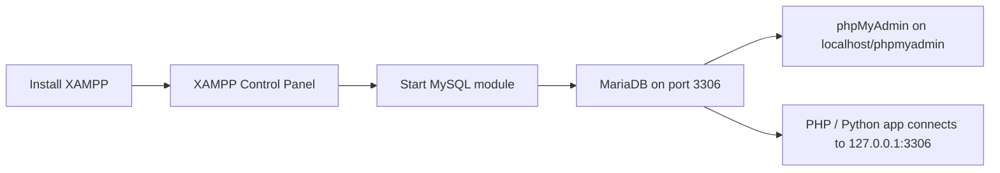

# How to Set Up MySQL with XAMPP for Local Development

Author: [nawazdhandala](https://www.github.com/nawazdhandala)

Tags: MySQL, XAMPP, Installation, Development, Window

Description: Install XAMPP on Windows or Linux, start the bundled MySQL server, configure phpMyAdmin, and connect from PHP or Python for local development.

---

## How It Works

XAMPP is a free, cross-platform development stack that bundles Apache, MariaDB (MySQL-compatible), PHP, and phpMyAdmin in a single installer. The MySQL component in XAMPP is actually MariaDB, which is fully compatible with most MySQL applications.



## Prerequisites

- Windows 10/11, Linux (Ubuntu/Debian/RHEL), or macOS
- ~600 MB disk space
- No other MySQL or MariaDB instance running on port 3306

## Step 1 - Download XAMPP

Visit [https://www.apachefriends.org/download.html](https://www.apachefriends.org/download.html) and download the installer for your OS.

## Step 2 - Install XAMPP

### Windows

1. Run the downloaded `.exe` installer.
2. Uncheck components you don't need (Tomcat, Perl, etc.) to keep the install lean.
3. Choose an installation directory such as `C:\xampp`.
4. Complete the wizard and launch the XAMPP Control Panel.

### Linux

```bash
chmod +x xampp-linux-x64-8.2.x-installer.run
sudo ./xampp-linux-x64-8.2.x-installer.run
```

Follow the graphical wizard. XAMPP installs to `/opt/lampp`.

## Step 3 - Start the MySQL Service

### Windows - XAMPP Control Panel

1. Open the XAMPP Control Panel.
2. Click **Start** next to **MySQL**.
3. The status indicator turns green and shows the port (3306).

### Linux - Command Line

```bash
sudo /opt/lampp/lampp startmysql
```

Or start the full stack:

```bash
sudo /opt/lampp/lampp start
```

Check the status:

```bash
sudo /opt/lampp/lampp status
```

```text
Version: XAMPP 8.2.x
Apache is running.
MySQL is running.
```

## Step 4 - Access phpMyAdmin

Open a browser and navigate to:

```text
http://localhost/phpmyadmin
```

The default root account has no password in XAMPP. This is intentional for local development but must be secured before any internet-facing deployment.

## Step 5 - Set a Root Password (Recommended Even for Local Dev)

Open phpMyAdmin, click **User accounts**, click **Edit privileges** for `root@localhost`, go to **Change password**, set a password, and click **Go**.

Or from the command line:

```bash
# Windows
C:\xampp\mysql\bin\mysql.exe -u root
```

```bash
# Linux
/opt/lampp/bin/mysql -u root
```

```sql
ALTER USER 'root'@'localhost' IDENTIFIED BY 'DevRootPassword1!';
FLUSH PRIVILEGES;
EXIT;
```

After setting the password, update the phpMyAdmin configuration.

```bash
# Windows: C:\xampp\phpMyAdmin\config.inc.php
# Linux:   /opt/lampp/phpmyadmin/config.inc.php
```

Find and update:

```php
$cfg['Servers'][$i]['password'] = 'DevRootPassword1!';
```

## Step 6 - Create a Development Database

In phpMyAdmin, click **New**, enter a database name, select `utf8mb4_unicode_ci` as the collation, and click **Create**.

Or from the MySQL command line:

```sql
CREATE DATABASE devproject CHARACTER SET utf8mb4 COLLATE utf8mb4_unicode_ci;
CREATE USER 'devuser'@'localhost' IDENTIFIED BY 'DevPass1!';
GRANT ALL PRIVILEGES ON devproject.* TO 'devuser'@'localhost';
FLUSH PRIVILEGES;
```

## Step 7 - Connect from PHP

```php
<?php
$pdo = new PDO(
    'mysql:host=127.0.0.1;port=3306;dbname=devproject;charset=utf8mb4',
    'devuser',
    'DevPass1!',
    [PDO::ATTR_ERRMODE => PDO::ERRMODE_EXCEPTION]
);

$stmt = $pdo->query("SELECT VERSION()");
echo $stmt->fetchColumn();
```

## Step 8 - Connect from Python

```python
import mysql.connector

conn = mysql.connector.connect(
    host="127.0.0.1",
    port=3306,
    user="devuser",
    password="DevPass1!",
    database="devproject"
)

cursor = conn.cursor()
cursor.execute("SELECT VERSION()")
print(cursor.fetchone()[0])
conn.close()
```

## Key File Locations

### Windows

```text
C:\xampp\mysql\bin\mysqld.exe    Server binary
C:\xampp\mysql\data\             Data directory
C:\xampp\mysql\bin\my.ini        Configuration file
C:\xampp\apache\logs\            Apache logs
```

### Linux

```text
/opt/lampp/bin/mysqld             Server binary
/opt/lampp/var/mysql/             Data directory
/opt/lampp/etc/my.cnf             Configuration file
```

## Stopping MySQL

### Windows

Click **Stop** next to MySQL in the XAMPP Control Panel.

### Linux

```bash
sudo /opt/lampp/lampp stopmysql
```

## Summary

XAMPP bundles MariaDB (MySQL-compatible) with Apache and PHP in a single installer that requires no manual configuration to start developing locally. Start the MySQL module from the Control Panel or command line, then access databases through phpMyAdmin or directly via any MySQL client library. Set a root password even for local development to build secure habits and avoid accidental exposure if the machine is on a shared network.
