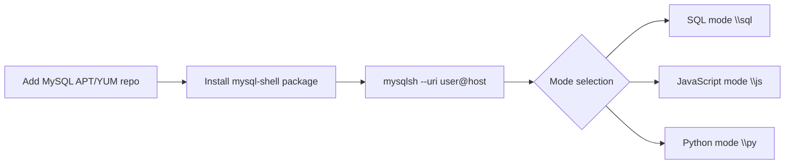

# How to Install MySQL Shell (mysqlsh) on Linux

Author: [OneUptime](https://oneuptime.com)

Tags: MySQL, Shell, Installation, Linux, Database

Description: Install MySQL Shell (mysqlsh) on Ubuntu, Debian, Rocky Linux, or AlmaLinux using the official MySQL repository, and connect in SQL, JavaScript, and Python modes.

---

## How It Works

MySQL Shell is the next-generation command-line client for MySQL, replacing the classic `mysql` client for many administrative tasks. It supports SQL, JavaScript, and Python scripting modes, the AdminAPI for InnoDB Cluster management, and the X DevAPI for document store operations.



## Prerequisites

- Linux server with internet access
- User with `sudo` privileges
- MySQL server accessible locally or remotely

## Ubuntu and Debian

### Add the MySQL APT Repository

```bash
wget https://dev.mysql.com/get/mysql-apt-config_0.8.29-1_all.deb
sudo dpkg -i mysql-apt-config_0.8.29-1_all.deb
sudo apt update
```

### Install MySQL Shell

```bash
sudo apt install -y mysql-shell
```

Verify the installation.

```bash
mysqlsh --version
```

```text
MySQL Shell 8.0.x
```

## RHEL / CentOS Stream / Rocky Linux / AlmaLinux

### Add the MySQL Yum Repository

```bash
sudo dnf install -y https://dev.mysql.com/get/mysql84-community-release-el9-1.noarch.rpm
```

### Install MySQL Shell

```bash
sudo dnf install -y mysql-shell
```

## Fedora

```bash
sudo dnf install -y https://dev.mysql.com/get/mysql84-community-release-fc40-1.noarch.rpm
sudo dnf install -y mysql-shell
```

## Connecting to MySQL

### Connect with URI syntax

```bash
mysqlsh root@localhost:3306
```

### Connect specifying individual options

```bash
mysqlsh --host=127.0.0.1 --port=3306 --user=root --password
```

### Connect using a Unix socket

```bash
mysqlsh root@localhost --socket=/run/mysqld/mysqld.sock
```

On successful connection, you see:

```text
MySQL Shell 8.0.x
...
Server version: 8.0.x MySQL Community Server - GPL
mysql>
```

## Switching Between Modes

Inside `mysqlsh`, switch modes with backslash commands.

```text
\sql    Switch to SQL mode
\js     Switch to JavaScript mode
\py     Switch to Python mode
\?      Show help
\quit   Exit
```

## SQL Mode

The default mode after connecting.

```sql
SHOW DATABASES;
USE myapp;
SELECT user, host FROM mysql.user;
```

## JavaScript Mode

```text
\js
```

```javascript
// List all schemas
shell.getSession().getSchemas().forEach(s => print(s.name));

// Run a query
var result = session.runSql("SELECT COUNT(*) AS cnt FROM users");
var row = result.fetchOne();
print("User count:", row.cnt);
```

## Python Mode

```text
\py
```

```python
# List schemas
for schema in session.get_schemas():
    print(schema.name)

# Execute SQL
result = session.run_sql("SELECT VERSION()")
row = result.fetch_one()
print("MySQL version:", row[0])
```

## Running Scripts from Files

```bash
mysqlsh root@localhost --sql --file=/path/to/script.sql
mysqlsh root@localhost --js --file=/path/to/script.js
```

## Using MySQL Shell for Admin Tasks

Check InnoDB Cluster status:

```text
\js
dba.getCluster().status()
```

Dump and load a database:

```javascript
// Dump
util.dumpSchemas(['myapp'], '/backup/myapp-dump', {threads: 4});

// Load
util.loadDump('/backup/myapp-dump', {threads: 4});
```

## Tab Completion

MySQL Shell supports tab completion for SQL keywords, schema names, table names, and column names. Press `Tab` twice to see suggestions.

```text
mysql> SELECT * FROM use<TAB>
users   user_roles
```

## Key Configuration File

MySQL Shell stores its configuration at:

```text
~/.mysqlsh/options.json
```

Set the default scripting mode:

```bash
mysqlsh --option default-mode=sql
```

## Summary

MySQL Shell provides a modern alternative to the classic `mysql` client with multi-language scripting, InnoDB Cluster management, and enhanced dump/load utilities. Install it from the official MySQL repository for your distribution, connect with `mysqlsh user@host`, and switch between SQL, JavaScript, and Python modes using backslash commands. For new projects, MySQL Shell's `util.dumpSchemas` and `util.loadDump` are significantly faster than `mysqldump` for large databases.
