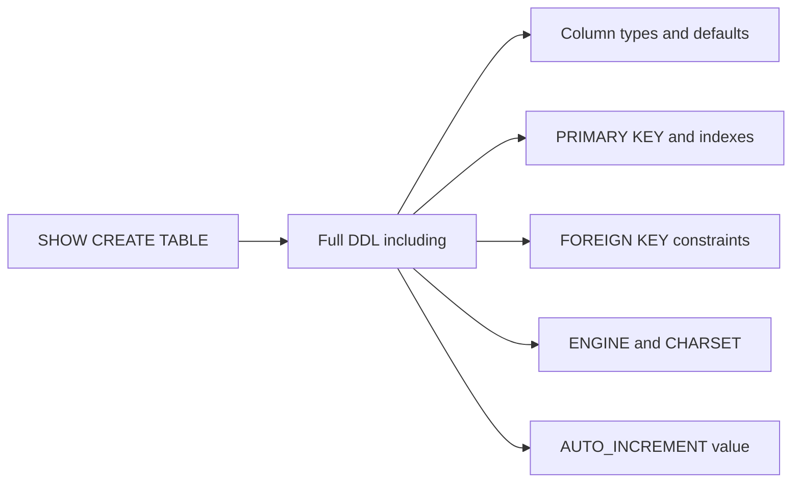

# How to Use MySQL SHOW CREATE TABLE and SHOW CREATE VIEW

Author: [nawazdhandala](https://www.github.com/nawazdhandala)

Tags: MySQL, SQL, SHOW CREATE TABLE, DDL, Database Administration

Description: Learn how to use MySQL SHOW CREATE TABLE and SHOW CREATE VIEW to retrieve the exact DDL statement for tables and views for documentation and migrations.

---

## How SHOW CREATE TABLE Works

`SHOW CREATE TABLE` returns the complete `CREATE TABLE` DDL statement that MySQL would use to recreate the table. This includes column definitions, data types, defaults, indexes, foreign keys, engine, charset, and auto-increment offset. It is the canonical way to inspect a table's full definition and is the basis for MySQL backups (`mysqldump` uses it internally).



## Setup: Sample Schema

```sql
CREATE DATABASE shop;
USE shop;

CREATE TABLE categories (
    id          INT AUTO_INCREMENT PRIMARY KEY,
    name        VARCHAR(50) NOT NULL,
    slug        VARCHAR(50) NOT NULL UNIQUE,
    created_at  DATETIME NOT NULL DEFAULT NOW(),
    CONSTRAINT uq_categories_name UNIQUE (name)
) ENGINE=InnoDB DEFAULT CHARSET=utf8mb4 COLLATE=utf8mb4_unicode_ci;

CREATE TABLE products (
    id          INT AUTO_INCREMENT PRIMARY KEY,
    category_id INT NOT NULL,
    name        VARCHAR(100) NOT NULL COMMENT 'Product display name',
    price       DECIMAL(10,2) NOT NULL DEFAULT 0.00,
    stock       INT NOT NULL DEFAULT 0,
    is_active   TINYINT(1) NOT NULL DEFAULT 1,
    created_at  DATETIME NOT NULL DEFAULT NOW(),
    INDEX idx_price (price),
    INDEX idx_category_active (category_id, is_active),
    CONSTRAINT fk_products_category
        FOREIGN KEY (category_id) REFERENCES categories(id)
        ON DELETE RESTRICT ON UPDATE CASCADE
) ENGINE=InnoDB DEFAULT CHARSET=utf8mb4;

CREATE VIEW active_products AS
    SELECT p.id, p.name, p.price, c.name AS category
    FROM products p
    JOIN categories c ON p.category_id = c.id
    WHERE p.is_active = 1;
```

## SHOW CREATE TABLE

```sql
SHOW CREATE TABLE products\G
```

```text
*************************** 1. row ***************************
       Table: products
Create Table: CREATE TABLE `products` (
  `id` int NOT NULL AUTO_INCREMENT,
  `category_id` int NOT NULL,
  `name` varchar(100) NOT NULL COMMENT 'Product display name',
  `price` decimal(10,2) NOT NULL DEFAULT '0.00',
  `stock` int NOT NULL DEFAULT '0',
  `is_active` tinyint(1) NOT NULL DEFAULT '1',
  `created_at` datetime NOT NULL DEFAULT CURRENT_TIMESTAMP,
  PRIMARY KEY (`id`),
  KEY `idx_price` (`price`),
  KEY `idx_category_active` (`category_id`,`is_active`),
  CONSTRAINT `fk_products_category` FOREIGN KEY (`category_id`)
      REFERENCES `categories` (`id`)
      ON DELETE RESTRICT ON UPDATE CASCADE
) ENGINE=InnoDB DEFAULT CHARSET=utf8mb4 COLLATE=utf8mb4_0900_ai_ci
```

The `\G` modifier prints the result vertically, which is easier to read for wide outputs. Without it, the output is a two-column table.

## SHOW CREATE VIEW

```sql
SHOW CREATE VIEW active_products\G
```

```text
*************************** 1. row ***************************
                View: active_products
         Create View: CREATE ALGORITHM=UNDEFINED
                      DEFINER=`root`@`localhost`
                      SQL SECURITY DEFINER
                      VIEW `active_products` AS
                      select `p`.`id` AS `id`,`p`.`name` AS `name`,
                             `p`.`price` AS `price`,`c`.`name` AS `category`
                      from (`products` `p`
                      join `categories` `c` on((`p`.`category_id` = `c`.`id`)))
                      where (`p`.`is_active` = 1)
character_set_client: utf8mb4
collation_connection: utf8mb4_0900_ai_ci
```

## SHOW CREATE DATABASE

```sql
SHOW CREATE DATABASE shop;
```

```text
+----------+---------------------------------------------------------------+
| Database | Create Database                                               |
+----------+---------------------------------------------------------------+
| shop     | CREATE DATABASE `shop` DEFAULT CHARACTER SET utf8mb4 ...      |
+----------+---------------------------------------------------------------+
```

## SHOW CREATE PROCEDURE / FUNCTION

```sql
SHOW CREATE PROCEDURE procedure_name\G
SHOW CREATE FUNCTION function_name\G
```

## Capturing DDL for Documentation

To extract DDL from the mysql client to a file:

```bash
mysql -u root -p -e "SHOW CREATE TABLE shop.products\G" > products_ddl.sql
```

Using `mysqldump` for full schema export:

```bash
mysqldump --no-data --routines shop > shop_schema.sql
```

## Comparing DDL Across Environments

A common DevOps practice is comparing SHOW CREATE TABLE output between staging and production to detect schema drift:

```bash
# Capture staging schema:
mysql -h staging -u root -p -e "SHOW CREATE TABLE mydb.users\G" > staging_users.sql

# Capture production schema:
mysql -h prod -u root -p -e "SHOW CREATE TABLE mydb.users\G" > prod_users.sql

# Diff them:
diff staging_users.sql prod_users.sql
```

## Using INFORMATION_SCHEMA for DDL Details

`SHOW CREATE TABLE` is not filterable. For querying multiple tables programmatically:

```sql
SELECT TABLE_NAME,
       GROUP_CONCAT(
           CONCAT(COLUMN_NAME, ' ', COLUMN_TYPE,
                  IF(IS_NULLABLE='NO', ' NOT NULL', ''),
                  IF(COLUMN_DEFAULT IS NOT NULL, CONCAT(' DEFAULT ', COLUMN_DEFAULT), ''))
           ORDER BY ORDINAL_POSITION SEPARATOR ', '
       ) AS column_summary
FROM information_schema.COLUMNS
WHERE TABLE_SCHEMA = 'shop'
GROUP BY TABLE_NAME;
```

## Best Practices

- Always use `SHOW CREATE TABLE` (rather than relying on memory) when writing migration scripts that need to match current production schemas.
- Use `\G` in the MySQL CLI to format the output vertically - it is much easier to read for tables with many columns or long constraints.
- Pipe `SHOW CREATE TABLE` output to diff tools as part of a deployment verification step.
- Compare `SHOW CREATE TABLE` output before and after `ALTER TABLE` operations to confirm the change applied as expected.
- Use `mysqldump --no-data` for full schema exports instead of manually collecting `SHOW CREATE TABLE` statements.

## Summary

`SHOW CREATE TABLE` returns the exact, runnable DDL for a table including all columns, indexes, foreign keys, charset, and engine. `SHOW CREATE VIEW` returns the full view definition including security context. These commands are essential for schema documentation, migration scripting, and environment comparison. Use the `\G` modifier for readable vertical output in the MySQL CLI. For scripted multi-table comparisons, `INFORMATION_SCHEMA` provides the same data in a queryable form.
