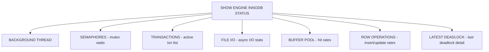

# How to Use MySQL SHOW ENGINE INNODB STATUS

Author: [nawazdhandala](https://www.github.com/nawazdhandala)

Tags: MySQL, SQL, InnoDB, Performance, Database Administration, Deadlock

Description: Learn how to read and interpret MySQL SHOW ENGINE INNODB STATUS output to diagnose deadlocks, lock waits, buffer pool usage, and I/O performance.

---

## How SHOW ENGINE INNODB STATUS Works

`SHOW ENGINE INNODB STATUS` prints a detailed snapshot of the InnoDB storage engine's internal state at the moment of execution. The output covers transactions, lock waits, deadlocks, the buffer pool, I/O activity, and background thread status. It is the primary diagnostic tool for InnoDB-specific performance and correctness issues.



## Running the Command

```sql
SHOW ENGINE INNODB STATUS\G
```

The `\G` modifier formats the output vertically, which is essential because the output is a very long single-column string.

## Output Sections Explained

The output is divided into labeled sections separated by dashed lines. Below are the most important sections with examples.

### SEMAPHORES

Shows wait counts for internal mutexes and rw-locks. High waiter counts indicate CPU or I/O pressure.

```text
----------
SEMAPHORES
----------
OS WAIT ARRAY INFO: reservation count 12345, signal count 12344
RW-shared spins 0, rounds 0, OS waits 0
RW-excl spins 0, rounds 0, OS waits 0
```

### TRANSACTIONS

Lists all active InnoDB transactions and what locks they hold:

```text
------------
TRANSACTIONS
------------
Trx id counter 4321
Purge done for trx's n:o < 4320 undo n:o < 0 state: running but idle
History list length 8
Total number of lock structs in row lock hash table 2
LIST OF TRANSACTIONS FOR EACH SESSION:
---TRANSACTION 4320, ACTIVE 5 sec
2 lock struct(s), heap size 1136, 1 row lock(s)
MySQL thread id 13, OS thread handle 123456, query id 456 10.0.0.2 app update
UPDATE orders SET status = 'done' WHERE id = 100
---TRANSACTION 4319, ACTIVE 7 sec starting index read
```

### LATEST DETECTED DEADLOCK

This section only appears if a deadlock has occurred since server start (or since the last deadlock):

```text
------------------------
LATEST DETECTED DEADLOCK
------------------------
*** (1) TRANSACTION:
TRANSACTION 4318, ACTIVE 3 sec starting index read
MySQL thread id 12, query id 450
UPDATE orders SET status='processing' WHERE id=101
*** (1) WAITING FOR THIS LOCK TO BE GRANTED:
RECORD LOCKS space id 45 page no 3 n bits 80 index PRIMARY
of table `myapp`.`orders` trx id 4318 lock_mode X locks rec but not gap waiting

*** (2) TRANSACTION:
TRANSACTION 4317, ACTIVE 4 sec
UPDATE orders SET status='done' WHERE id=100
*** (2) HOLDS THE LOCK(S):
RECORD LOCKS space id 45 page no 3 n bits 80 index PRIMARY trx id 4317 lock_mode X

*** WE ROLL BACK TRANSACTION (1)
```

This tells you exactly which queries were involved, which locks each held, and which transaction was rolled back.

### BUFFER POOL

```text
----------------------
BUFFER POOL AND MEMORY
----------------------
Total large memory allocated 137363456
Dictionary memory allocated 425063
Buffer pool size   8192
Free buffers       1024
Database pages     7120
Old database pages 2615
Modified db pages  200
Pending reads      0
Pending writes: LRU 0, flush list 0, single page 0
Pages made young 12345, not young 6789
0.00 youngs/s, 0.00 non-youngs/s
Pages read 5000, created 1000, written 3000
0.00 reads/s, 0.00 creates/s, 0.00 writes/s
Buffer pool hit rate 997 / 1000, young-making rate 0 / 1000
```

Key metrics:

```text
Buffer pool hit rate     - 997/1000 means 99.7% of reads served from cache
                           Below 990/1000 suggests buffer pool is too small
Modified db pages        - Dirty pages waiting to be flushed
                           High numbers indicate I/O backlog
Pages made young         - Pages moved to the head of the LRU (good)
```

### FILE I/O

```text
--------
FILE I/O
--------
I/O thread 0 state: waiting for completed aio requests (insert buffer thread)
I/O thread 1 state: waiting for completed aio requests (log thread)
Pending normal aio reads: [0, 0, 0, 0], aio writes: [0, 0, 0, 0],
 ibuf aio reads: [0], log i/o's: [0], sync i/o's: [0]
Pending flushes (fsync) log: 0; buffer pool: 0
2000 OS file reads, 1000 OS file writes, 800 OS fsyncs
0.00 reads/s, 0 avg bytes/read, 0.00 writes/s, 0.00 fsyncs/s
```

### ROW OPERATIONS

```text
--------------
ROW OPERATIONS
--------------
0 queries inside InnoDB, 0 queries in queue
0 read views open inside InnoDB
Process ID=12345, Main thread ID=123456, state=sleeping
Number of rows inserted 5000, updated 2000, deleted 500, read 100000
0.00 inserts/s, 0.00 updates/s, 0.00 deletes/s, 0.00 reads/s
```

## Diagnosing Deadlocks

After a deadlock is detected:

```sql
SHOW ENGINE INNODB STATUS\G
```

Look for the `LATEST DETECTED DEADLOCK` section. It shows:
1. Which two transactions were involved
2. What locks each held
3. What lock each was waiting for
4. Which transaction MySQL chose to roll back

**Common deadlock causes:**

```text
Pattern                     Fix
-------                     ---
UPDATE in opposite order    Always lock rows in the same order
Full table scan + FOR UPDATE Add an index so fewer rows are locked
Gap lock conflicts          Use READ COMMITTED isolation level
```

## Enabling Deadlock Logging

```sql
SET GLOBAL innodb_print_all_deadlocks = ON;
```

This writes every deadlock to the MySQL error log, providing a historical record beyond the last one shown by `SHOW ENGINE INNODB STATUS`.

## Checking Lock Waits with sys Schema

```sql
-- Current lock waits (more readable than INNODB STATUS):
SELECT * FROM sys.innodb_lock_waits\G

-- Full lock detail:
SELECT
    r.trx_id               AS waiting_trx_id,
    r.trx_mysql_thread_id  AS waiting_thread,
    r.trx_query            AS waiting_query,
    b.trx_id               AS blocking_trx_id,
    b.trx_mysql_thread_id  AS blocking_thread,
    b.trx_query            AS blocking_query
FROM information_schema.INNODB_LOCK_WAITS w
JOIN information_schema.INNODB_TRX r ON r.trx_id = w.requesting_trx_id
JOIN information_schema.INNODB_TRX b ON b.trx_id = w.blocking_trx_id;
```

## Best Practices

- Run `SHOW ENGINE INNODB STATUS\G` immediately after observing slowness or a deadlock error.
- Enable `innodb_print_all_deadlocks = ON` in production to log deadlocks historically.
- Monitor the buffer pool hit rate; anything consistently below 99% suggests increasing `innodb_buffer_pool_size`.
- Check the history list length - values above a few hundred thousand indicate the purge thread is falling behind, often due to a long-running transaction.
- Set `innodb_lock_wait_timeout` to a value appropriate for your SLA (default 50 seconds) to prevent indefinite blocking.

## Summary

`SHOW ENGINE INNODB STATUS\G` is the primary command for diagnosing InnoDB internals. The TRANSACTIONS section shows active transactions and locks. LATEST DETECTED DEADLOCK shows the exact queries and locks involved in the most recent deadlock. BUFFER POOL shows cache hit rates and dirty page counts. FILE I/O shows pending disk operations. Together these sections expose the root cause of most InnoDB performance issues including deadlocks, lock waits, buffer pool pressure, and I/O bottlenecks.
