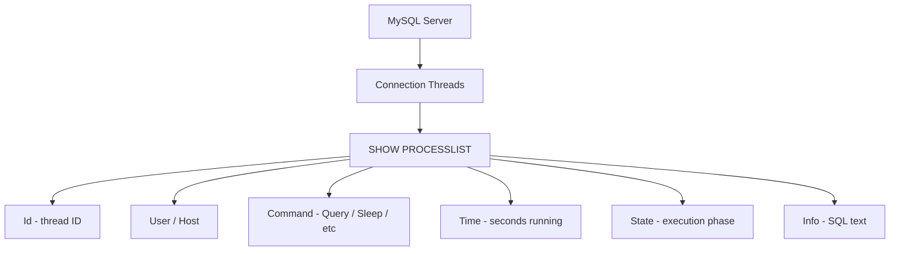

# How to Use MySQL SHOW PROCESSLIST to Monitor Connections

Author: [nawazdhandala](https://www.github.com/nawazdhandala)

Tags: MySQL, SQL, SHOW PROCESSLIST, Performance, Database Administration, Monitoring

Description: Learn how to use MySQL SHOW PROCESSLIST and INFORMATION_SCHEMA.PROCESSLIST to monitor active connections, identify slow queries, and kill blocking sessions.

---

## How SHOW PROCESSLIST Works

`SHOW PROCESSLIST` returns a snapshot of all threads currently connected to the MySQL server. Each row represents one connection and shows what command it is executing, which database it is using, how long the command has been running, and what SQL statement is active. This is an essential tool for diagnosing connection pile-ups, slow queries, and lock contention in real time.



## SHOW PROCESSLIST vs SHOW FULL PROCESSLIST

`SHOW PROCESSLIST` truncates the `Info` column (the SQL text) to 100 characters. `SHOW FULL PROCESSLIST` shows the complete statement.

```sql
SHOW PROCESSLIST;
SHOW FULL PROCESSLIST;
```

## Sample Output

```text
+-----+------+-----------+--------+---------+------+-------+----------------------------------+
| Id  | User | Host      | db     | Command | Time | State | Info                             |
+-----+------+-----------+--------+---------+------+-------+----------------------------------+
| 1   | root | localhost | myapp  | Query   | 0    | ...   | SHOW FULL PROCESSLIST            |
| 12  | app  | 10.0.0.2  | myapp  | Sleep   | 45   |       | NULL                             |
| 13  | app  | 10.0.0.3  | myapp  | Query   | 120  | wait  | UPDATE orders SET status='done'  |
| 14  | app  | 10.0.0.4  | myapp  | Query   | 122  | lock  | SELECT * FROM orders FOR UPDATE  |
+-----+------+-----------+--------+---------+------+-------+----------------------------------+
```

Column meanings:

```text
Id       - Thread ID (use with KILL)
User     - MySQL user
Host     - Client IP and port
db       - Current database
Command  - Query, Sleep, Connect, Binlog Dump, etc.
Time     - Seconds the thread has been in current state
State    - Execution phase (Copying to tmp table, Waiting for lock, etc.)
Info     - SQL text (NULL for sleeping threads)
```

## Querying via INFORMATION_SCHEMA

`INFORMATION_SCHEMA.PROCESSLIST` exposes the same data as a queryable view, enabling filtering and sorting:

```sql
-- Find queries running longer than 10 seconds:
SELECT id, user, host, db, command, time, state, LEFT(info, 100) AS query_preview
FROM information_schema.PROCESSLIST
WHERE command != 'Sleep'
  AND time > 10
ORDER BY time DESC;
```

**Find sleeping connections older than 5 minutes:**

```sql
SELECT id, user, host, time
FROM information_schema.PROCESSLIST
WHERE command = 'Sleep'
  AND time > 300
ORDER BY time DESC;
```

**Find connections waiting for locks:**

```sql
SELECT id, user, host, time, state, LEFT(info, 200) AS sql_text
FROM information_schema.PROCESSLIST
WHERE state LIKE '%lock%'
ORDER BY time DESC;
```

**Count connections per user:**

```sql
SELECT user, COUNT(*) AS connections
FROM information_schema.PROCESSLIST
GROUP BY user
ORDER BY connections DESC;
```

## Using performance_schema.processlist (MySQL 8.0+)

MySQL 8.0 recommends `performance_schema.processlist` over `INFORMATION_SCHEMA.PROCESSLIST` for better accuracy:

```sql
SELECT
    id,
    user,
    host,
    db,
    command,
    time,
    state,
    LEFT(info, 200) AS current_query
FROM performance_schema.processlist
WHERE command != 'Sleep'
ORDER BY time DESC;
```

## KILL - Terminate a Connection

Use the `Id` from PROCESSLIST to kill a query or connection:

```sql
-- Kill just the current query (connection stays):
KILL QUERY 13;

-- Kill the entire connection:
KILL 13;
KILL CONNECTION 13;
```

**Script to kill all sleeping connections older than 5 minutes:**

```sql
-- Generate KILL statements:
SELECT CONCAT('KILL ', id, ';') AS kill_cmd
FROM information_schema.PROCESSLIST
WHERE command = 'Sleep'
  AND time > 300;

-- Review the output, then run each KILL manually.
```

## Common States and Their Meanings

```text
State                         Meaning
-----------                   -------
NULL / empty                  Idle
Sending data                  Reading and filtering result rows
Sorting result                ORDER BY sort in memory or on disk
Copying to tmp table          Materializing subquery or GROUP BY
Waiting for lock              Blocked on table-level lock
Waiting for metadata lock     DDL conflicting with a DML query
Locked                        Row-level lock contention
Opening tables                Loading table definitions
Writing to net                Sending rows to client (slow network)
```

## Enabling PERFORMANCE_SCHEMA Process Monitoring

On MySQL 8.0+, if `performance_schema.processlist` is empty, enable the consumer:

```sql
UPDATE performance_schema.setup_consumers
SET ENABLED = 'YES'
WHERE NAME = 'events_statements_current';

UPDATE performance_schema.setup_instruments
SET ENABLED = 'YES', TIMED = 'YES'
WHERE NAME LIKE 'statement/%';
```

## Monitoring with sys Schema

```sql
-- Active sessions only (no sleeping connections):
SELECT * FROM sys.session WHERE command != 'Sleep' ORDER BY time DESC;

-- Full detail with source file:
SELECT thd_id, conn_id, user, db, current_statement, time, rows_examined
FROM sys.processlist
WHERE command != 'Sleep'
ORDER BY time DESC;
```

## Best Practices

- Monitor `SHOW PROCESSLIST` during slow application response to identify blocking queries quickly.
- Set `wait_timeout` and `interactive_timeout` in `my.cnf` to automatically kill idle connections: typically `wait_timeout=600` (10 minutes).
- Never kill the thread with `Id=1` (main thread) or replication threads (`Command=Binlog Dump`).
- Use `KILL QUERY id` to cancel a query but preserve the connection; use `KILL id` to fully disconnect.
- Query `information_schema.PROCESSLIST` from a monitoring script or dashboard for automated alerting on long-running queries.

## Summary

`SHOW PROCESSLIST` and `SHOW FULL PROCESSLIST` display all active MySQL connections with their current command, elapsed time, and SQL text. `INFORMATION_SCHEMA.PROCESSLIST` enables filtered, sorted queries against the same data. On MySQL 8.0+, `performance_schema.processlist` provides the most accurate view. Use `KILL QUERY id` to cancel a specific query without disconnecting the client, or `KILL id` to fully terminate a connection. These tools are essential for diagnosing connection saturation, slow queries, and lock contention in real time.
