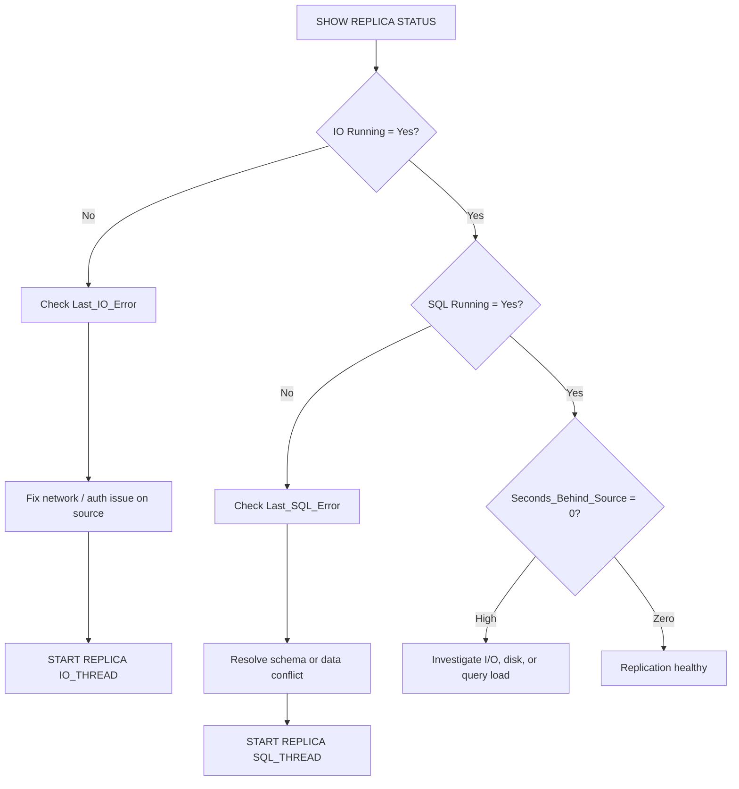

# How to Monitor MySQL Replication with SHOW REPLICA STATUS

Author: [nawazdhandala](https://www.github.com/nawazdhandala)

Tags: MySQL, Replication, Monitoring, Administration

Description: Learn how to interpret SHOW REPLICA STATUS output to monitor replication health, measure lag, detect errors, and confirm GTID synchronization in MySQL.

---

## Introduction

`SHOW REPLICA STATUS` (called `SHOW SLAVE STATUS` before MySQL 8.0.22) is the primary command for inspecting the health of a MySQL replica. It returns a single row with dozens of fields covering thread states, lag, error messages, GTID positions, and SSL configuration. Knowing which fields matter most is essential for effective replication monitoring.

## Running the command

```sql
-- Current syntax (MySQL 8.0.22+)
SHOW REPLICA STATUS\G

-- Legacy syntax (MySQL 5.7 and older)
SHOW SLAVE STATUS\G

-- For a specific channel in multi-source replication
SHOW REPLICA STATUS FOR CHANNEL 'ch_shard1'\G
```

The `\G` vertical format is almost always easier to read than the default horizontal table output.

## Critical fields to check first

```sql
SHOW REPLICA STATUS\G
```

| Field | Healthy value | What to investigate |
|---|---|---|
| `Replica_IO_Running` | `Yes` | IO thread stopped; check `Last_IO_Error` |
| `Replica_SQL_Running` | `Yes` | SQL thread stopped; check `Last_SQL_Error` |
| `Seconds_Behind_Source` | 0 or low | High value means replica is lagging |
| `Last_IO_Error` | empty | Network or auth problem |
| `Last_SQL_Error` | empty | Schema mismatch, duplicate key, etc. |
| `Last_IO_Errno` | 0 | Non-zero = error code |
| `Last_SQL_Errno` | 0 | Non-zero = error code |

## Quick health check query

```sql
SELECT
  Replica_IO_Running,
  Replica_SQL_Running,
  Seconds_Behind_Source,
  Last_IO_Errno,
  Last_IO_Error,
  Last_SQL_Errno,
  Last_SQL_Error
FROM (
  SELECT * FROM performance_schema.replication_connection_status
  UNION ALL
  SELECT * FROM performance_schema.replication_applier_status_by_worker
  LIMIT 0
) dummy -- use SHOW REPLICA STATUS for actual data
;
-- Practical: just run SHOW REPLICA STATUS\G and grep key fields
```

A simpler scripted check:

```bash
mysql -u monitor -p -e "SHOW REPLICA STATUS\G" 2>/dev/null | grep -E \
  "Replica_IO_Running|Replica_SQL_Running|Seconds_Behind_Source|Last_.*Error[^_]"
```

## GTID-related fields

When GTID replication is enabled, these fields are essential:

| Field | Meaning |
|---|---|
| `Executed_Gtid_Set` | All GTIDs applied on this replica |
| `Retrieved_Gtid_Set` | All GTIDs received from the source (may not be applied yet) |
| `Auto_Position` | `1` = GTID auto-positioning is active |
| `Source_UUID` | UUID of the source server |

```sql
-- Compare replica's GTID set against the source
-- Run on the source:
SHOW BINARY LOG STATUS\G
-- Look at: Executed_Gtid_Set

-- Run on the replica:
SHOW REPLICA STATUS\G
-- Look at: Executed_Gtid_Set, Retrieved_Gtid_Set

-- Calculate GTID lag (run on source, substitute replica's UUID and set)
SELECT GTID_SUBTRACT(
  '3E11FA47-71CA-11E1-9E33-C80AA9429562:1-100',  -- source Executed_Gtid_Set
  '3E11FA47-71CA-11E1-9E33-C80AA9429562:1-95'    -- replica Executed_Gtid_Set
) AS missing_gtids;
```

## Replication coordinates (non-GTID)

For position-based replication:

| Field | Meaning |
|---|---|
| `Source_Log_File` | Binlog file currently being read from source |
| `Read_Source_Log_Pos` | Position in that file the IO thread has reached |
| `Relay_Source_Log_File` | Binlog file the SQL thread is applying |
| `Exec_Source_Log_Pos` | Position the SQL thread has applied |
| `Relay_Log_File` | Current relay log file on the replica |
| `Relay_Log_Pos` | Position in the current relay log |

## Measuring lag precisely

`Seconds_Behind_Source` is a rough estimate based on the timestamp in the binlog event being applied. For more precision:

```sql
-- Performance Schema: lag in seconds and nanoseconds
SELECT
  CHANNEL_NAME,
  LAST_QUEUED_TRANSACTION_START_QUEUE_TIMESTAMP,
  LAST_APPLIED_TRANSACTION_END_APPLY_TIMESTAMP,
  TIMESTAMPDIFF(SECOND,
    LAST_APPLIED_TRANSACTION_ORIGINAL_COMMIT_TIMESTAMP,
    NOW()) AS lag_seconds
FROM performance_schema.replication_applier_status_by_worker
ORDER BY lag_seconds DESC;
```

## Interpreting common error states

```sql
-- Error: IO thread stopped
Last_IO_Errno: 1045
Last_IO_Error: error connecting to master 'repl@192.168.1.10:3306' - Authentication failed

-- Fix: check credentials and user host permissions on the source
-- Source: SELECT user, host FROM mysql.user WHERE user='repl';
```

```sql
-- Error: SQL thread stopped - duplicate key
Last_SQL_Errno: 1062
Last_SQL_Error: Could not execute Write_rows event on table myapp.orders;
               Duplicate entry '42' for key 'PRIMARY'

-- Options: skip this transaction (see skip replication errors guide)
-- or investigate why the primary key already exists on the replica
```

## Performance Schema replication tables

For a richer view than `SHOW REPLICA STATUS`:

```sql
-- IO thread connection status
SELECT * FROM performance_schema.replication_connection_status\G

-- SQL applier thread status
SELECT * FROM performance_schema.replication_applier_status\G

-- Per-worker thread detail (with parallel replication)
SELECT * FROM performance_schema.replication_applier_status_by_worker\G

-- Configuration
SELECT * FROM performance_schema.replication_connection_configuration\G
SELECT * FROM performance_schema.replication_applier_configuration\G
```

## Replication monitoring flow



## Alerting thresholds (example)

```bash
#!/bin/bash
# Simple replication monitor script

STATUS=$(mysql -u monitor -p'secret' -e "SHOW REPLICA STATUS\G" 2>/dev/null)

IO=$(echo "$STATUS" | grep "Replica_IO_Running:" | awk '{print $2}')
SQL=$(echo "$STATUS" | grep "Replica_SQL_Running:" | awk '{print $2}')
LAG=$(echo "$STATUS" | grep "Seconds_Behind_Source:" | awk '{print $2}')

if [ "$IO" != "Yes" ] || [ "$SQL" != "Yes" ]; then
  echo "CRITICAL: Replication threads stopped! IO=$IO SQL=$SQL"
  exit 2
fi

if [ "$LAG" -gt 300 ]; then
  echo "WARNING: Replication lag is ${LAG}s (threshold: 300s)"
  exit 1
fi

echo "OK: Replication healthy, lag=${LAG}s"
```

## Summary

`SHOW REPLICA STATUS\G` provides a comprehensive snapshot of replication health. The most important fields are `Replica_IO_Running`, `Replica_SQL_Running`, `Seconds_Behind_Source`, and the `Last_*_Error` fields. With GTIDs enabled, `Executed_Gtid_Set` and `Retrieved_Gtid_Set` reveal whether the replica has received and applied all transactions. For deeper inspection, query the Performance Schema `replication_*` tables, which provide per-worker and nanosecond-precision timing data beyond what `SHOW REPLICA STATUS` exposes.
