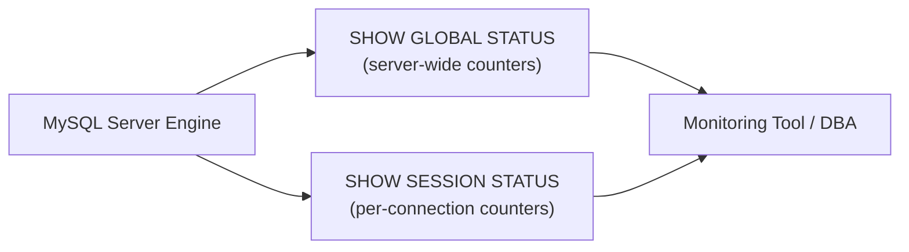

# How to Monitor MySQL with SHOW STATUS

Author: [nawazdhandala](https://www.github.com/nawazdhandala)

Tags: MySQL, Monitoring, SHOW STATUS, Performance, Database Administration

Description: Learn how to use MySQL SHOW STATUS to monitor connections, query rates, InnoDB health, replication lag, and other key metrics for performance troubleshooting.

---

## How SHOW STATUS Works

`SHOW STATUS` returns MySQL server status variables - counters and gauges that reflect the server's current operational state. These are cumulative counters (reset on restart) or current values (reset each second for rates).

There are two scopes:
- `SHOW GLOBAL STATUS` - server-wide metrics since startup
- `SHOW SESSION STATUS` - metrics for the current session only



## Basic Usage

```sql
-- Show all global status variables
SHOW GLOBAL STATUS;

-- Filter by pattern
SHOW GLOBAL STATUS LIKE 'Connections';
SHOW GLOBAL STATUS LIKE 'Innodb%';
SHOW GLOBAL STATUS LIKE 'Com_%';
SHOW GLOBAL STATUS LIKE '%thread%';
```

## Connection Monitoring

```sql
-- Current and historical connection stats
SHOW GLOBAL STATUS LIKE 'Connections';          -- Total connection attempts
SHOW GLOBAL STATUS LIKE 'Max_used_connections'; -- Historical peak connections
SHOW GLOBAL STATUS LIKE 'Threads_connected';    -- Current open connections
SHOW GLOBAL STATUS LIKE 'Threads_running';      -- Currently executing queries
SHOW GLOBAL STATUS LIKE 'Connection_errors%';   -- Connection error counts
SHOW GLOBAL STATUS LIKE 'Aborted_connects';     -- Failed connection attempts
SHOW GLOBAL STATUS LIKE 'Aborted_clients';      -- Clients disconnected abnormally
```

Compare with limits:

```sql
SELECT variable_value AS max_connections
FROM   performance_schema.global_variables
WHERE  variable_name = 'max_connections';
```

If `Threads_connected` is close to `max_connections`, you need to increase the limit or add connection pooling.

## Query Volume and Types

```sql
-- Total queries per second (compare snapshots 60 seconds apart)
SHOW GLOBAL STATUS LIKE 'Questions';
SHOW GLOBAL STATUS LIKE 'Queries';

-- Query type breakdown
SHOW GLOBAL STATUS LIKE 'Com_select';
SHOW GLOBAL STATUS LIKE 'Com_insert';
SHOW GLOBAL STATUS LIKE 'Com_update';
SHOW GLOBAL STATUS LIKE 'Com_delete';
SHOW GLOBAL STATUS LIKE 'Com_commit';
SHOW GLOBAL STATUS LIKE 'Com_rollback';
```

Calculate QPS between two snapshots:

```sql
-- Snapshot 1
SELECT variable_value INTO @q1 FROM performance_schema.global_status WHERE variable_name = 'Questions';

-- Wait 60 seconds, then:
SELECT (variable_value - @q1) / 60 AS qps FROM performance_schema.global_status WHERE variable_name = 'Questions';
```

## InnoDB Buffer Pool Health

```sql
-- Buffer pool metrics
SHOW GLOBAL STATUS LIKE 'Innodb_buffer_pool_pages%';
SHOW GLOBAL STATUS LIKE 'Innodb_buffer_pool_reads';
SHOW GLOBAL STATUS LIKE 'Innodb_buffer_pool_read_requests';

-- Calculate hit rate
SELECT
    ROUND(
        (1 - (
            (SELECT variable_value FROM performance_schema.global_status WHERE variable_name = 'Innodb_buffer_pool_reads') /
            NULLIF(
                (SELECT variable_value FROM performance_schema.global_status WHERE variable_name = 'Innodb_buffer_pool_read_requests'),
                0
            )
        )) * 100, 2
    ) AS buffer_pool_hit_rate_pct;
```

Target: 99%+ hit rate. Below 95% suggests the buffer pool is too small.

## InnoDB I/O and Writes

```sql
SHOW GLOBAL STATUS LIKE 'Innodb_data_reads';
SHOW GLOBAL STATUS LIKE 'Innodb_data_writes';
SHOW GLOBAL STATUS LIKE 'Innodb_data_fsyncs';
SHOW GLOBAL STATUS LIKE 'Innodb_rows_read';
SHOW GLOBAL STATUS LIKE 'Innodb_rows_inserted';
SHOW GLOBAL STATUS LIKE 'Innodb_rows_updated';
SHOW GLOBAL STATUS LIKE 'Innodb_rows_deleted';
```

## InnoDB Lock and Wait Metrics

```sql
SHOW GLOBAL STATUS LIKE 'Innodb_row_lock%';
```

Key metrics:

| Variable | Meaning |
|----------|---------|
| `Innodb_row_lock_current_waits` | Sessions currently waiting for row locks |
| `Innodb_row_lock_time` | Total time waiting for row locks (ms) |
| `Innodb_row_lock_time_avg` | Average lock wait time (ms) |
| `Innodb_row_lock_time_max` | Maximum lock wait time (ms) |
| `Innodb_row_lock_waits` | Total lock wait events |

Alert if `Innodb_row_lock_time_avg` is above 50ms or `Innodb_row_lock_current_waits` is above 5.

## Table Cache and Open Files

```sql
SHOW GLOBAL STATUS LIKE 'Open_tables';
SHOW GLOBAL STATUS LIKE 'Opened_tables';
SHOW GLOBAL STATUS LIKE 'Table_open_cache_hits';
SHOW GLOBAL STATUS LIKE 'Table_open_cache_misses';
```

If `Opened_tables` grows rapidly, consider increasing `table_open_cache`.

## Temporary Tables

```sql
SHOW GLOBAL STATUS LIKE 'Created_tmp_tables';
SHOW GLOBAL STATUS LIKE 'Created_tmp_disk_tables';
```

A high ratio of `Created_tmp_disk_tables / Created_tmp_tables` indicates queries are spilling to disk for temporary tables. Increase `tmp_table_size` and `max_heap_table_size`.

## Sorting and Full Scans

```sql
SHOW GLOBAL STATUS LIKE 'Sort_merge_passes';  -- High = increase sort_buffer_size
SHOW GLOBAL STATUS LIKE 'Sort_rows';
SHOW GLOBAL STATUS LIKE 'Select_full_join';   -- Joins without indexes
SHOW GLOBAL STATUS LIKE 'Select_scan';        -- Full table scans
```

## Binary Log Status

```sql
SHOW GLOBAL STATUS LIKE 'Binlog%';
```

## Replication Lag (on Replicas)

```sql
SHOW REPLICA STATUS\G
```

Monitor `Seconds_Behind_Source`. Also check:

```sql
SHOW GLOBAL STATUS LIKE 'Slave_running';  -- older versions
SHOW GLOBAL STATUS LIKE 'Replica_running'; -- MySQL 8.0+
```

## Creating a Status Snapshot Script

Capture a status baseline and compare:

```bash
#!/bin/bash
mysql -u root -p -e "SHOW GLOBAL STATUS;" > /tmp/mysql_status_$(date +%Y%m%d_%H%M%S).txt
```

## Best Practices

- Compare `SHOW GLOBAL STATUS` snapshots taken 60 seconds apart to calculate rates.
- Alert on: `Threads_running > 50`, `Innodb_row_lock_current_waits > 5`, buffer pool hit rate < 99%.
- Monitor `Aborted_clients` - high values indicate connection timeout or application bugs.
- Use `performance_schema.global_status` for scripted monitoring (returns a result set).
- Export metrics to Prometheus or Datadog via `mysqld_exporter` for dashboards and alerting.
- Reset global status counters after server changes with `FLUSH STATUS`.

## Summary

`SHOW GLOBAL STATUS` is MySQL's built-in performance counter system, exposing connection counts, query rates, InnoDB buffer pool efficiency, lock wait times, and much more. By comparing two snapshots taken seconds apart, you can calculate per-second rates for any counter. Key metrics to monitor continuously are connection utilization, buffer pool hit rate, row lock wait time, and temporary disk tables.
