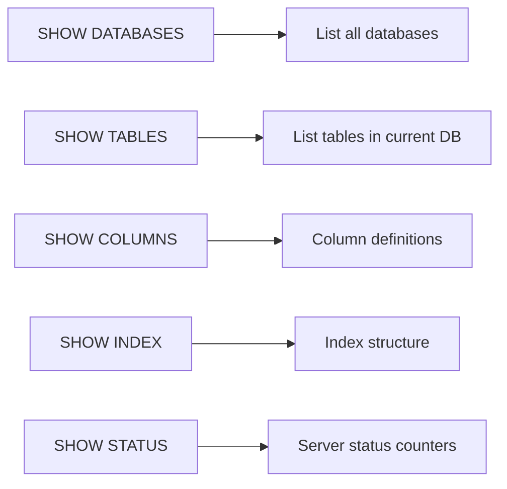

# How to Use MySQL SHOW TABLES, SHOW COLUMNS, SHOW INDEX

Author: [nawazdhandala](https://www.github.com/nawazdhandala)

Tags: MySQL, SQL, SHOW Statement, Database Administration, Metadata

Description: Learn how to use MySQL SHOW TABLES, SHOW COLUMNS, and SHOW INDEX commands to inspect schema structure, column definitions, and index configurations.

---

## How SHOW Statements Work

MySQL `SHOW` statements are shorthand commands that return metadata from the server as result sets. They are primarily useful for interactive schema exploration in the MySQL client. For scripted or application queries, the corresponding `INFORMATION_SCHEMA` views provide the same data with more filtering power.



## Setup: Sample Schema

```sql
CREATE DATABASE demo;
USE demo;

CREATE TABLE categories (
    id   INT AUTO_INCREMENT PRIMARY KEY,
    name VARCHAR(50) NOT NULL UNIQUE
);

CREATE TABLE products (
    id          INT AUTO_INCREMENT PRIMARY KEY,
    category_id INT NOT NULL,
    name        VARCHAR(100) NOT NULL,
    sku         VARCHAR(20) NOT NULL UNIQUE,
    price       DECIMAL(10,2) NOT NULL,
    stock       INT NOT NULL DEFAULT 0,
    is_active   TINYINT(1) NOT NULL DEFAULT 1,
    created_at  DATETIME NOT NULL DEFAULT NOW(),
    FOREIGN KEY (category_id) REFERENCES categories(id)
);

CREATE INDEX idx_products_price    ON products(price);
CREATE INDEX idx_products_category ON products(category_id, is_active);
```

## SHOW DATABASES

```sql
SHOW DATABASES;
SHOW DATABASES LIKE 'my%';     -- Filter with LIKE
```

## SHOW TABLES

```sql
USE demo;
SHOW TABLES;
```

```text
+----------------+
| Tables_in_demo |
+----------------+
| categories     |
| products       |
+----------------+
```

**Filter by pattern:**

```sql
SHOW TABLES LIKE 'prod%';
SHOW TABLES FROM demo LIKE '%cat%';  -- Query another database
```

**Show table type (BASE TABLE vs VIEW):**

```sql
SHOW FULL TABLES;
SHOW FULL TABLES WHERE Table_type = 'VIEW';
```

## SHOW COLUMNS

`SHOW COLUMNS` (also `DESCRIBE` or `DESC`) displays column definitions for a table.

```sql
SHOW COLUMNS FROM products;
-- Equivalent shortcuts:
DESCRIBE products;
DESC products;
```

```text
+-------------+--------------+------+-----+-------------------+-------------------+
| Field       | Type         | Null | Key | Default           | Extra             |
+-------------+--------------+------+-----+-------------------+-------------------+
| id          | int          | NO   | PRI | NULL              | auto_increment    |
| category_id | int          | NO   | MUL | NULL              |                   |
| name        | varchar(100) | NO   |     | NULL              |                   |
| sku         | varchar(20)  | NO   | UNI | NULL              |                   |
| price       | decimal(10,2)| NO   | MUL | NULL              |                   |
| stock       | int          | NO   |     | 0                 |                   |
| is_active   | tinyint(1)   | NO   |     | 1                 |                   |
| created_at  | datetime     | NO   |     | CURRENT_TIMESTAMP | DEFAULT_GENERATED |
+-------------+--------------+------+-----+-------------------+-------------------+
```

**SHOW FULL COLUMNS** - includes collation and comment:

```sql
SHOW FULL COLUMNS FROM products;
```

**Filter by column name pattern:**

```sql
SHOW COLUMNS FROM products LIKE '%at';   -- columns ending in 'at'
```

## SHOW INDEX

`SHOW INDEX` (also `SHOW KEYS`) displays all indexes on a table including the primary key.

```sql
SHOW INDEX FROM products;
```

```text
+----------+------------+--------------------------+--------------+-------------+-----------+
| Table    | Non_unique | Key_name                 | Seq_in_index | Column_name | Cardinality|
+----------+------------+--------------------------+--------------+-------------+-----------+
| products | 0          | PRIMARY                  | 1            | id          | 0         |
| products | 0          | sku                      | 1            | sku         | 0         |
| products | 1          | idx_products_price       | 1            | price       | 0         |
| products | 1          | idx_products_category    | 1            | category_id | 0         |
| products | 1          | idx_products_category    | 2            | is_active   | 0         |
| products | 1          | category_id              | 1            | category_id | 0         |
+----------+------------+--------------------------+--------------+-------------+-----------+
```

Key columns explained:

```text
Non_unique    - 0 means unique index; 1 means non-unique
Seq_in_index  - Column position within a composite index
Cardinality   - Estimated distinct values (updated by ANALYZE TABLE)
Index_type    - BTREE, FULLTEXT, SPATIAL, HASH
```

**Filter by index name:**

```sql
SHOW INDEX FROM products WHERE Key_name = 'idx_products_category';
```

## SHOW STATUS

```sql
SHOW STATUS LIKE 'Questions';          -- Total queries executed
SHOW STATUS LIKE 'Threads_connected';  -- Active connections
SHOW STATUS LIKE 'Slow_queries';       -- Queries exceeding long_query_time
SHOW STATUS LIKE 'Innodb_buffer%';     -- Buffer pool stats
```

## SHOW VARIABLES

```sql
SHOW VARIABLES LIKE 'max_connections';
SHOW VARIABLES LIKE 'innodb_buffer_pool_size';
SHOW VARIABLES LIKE '%timeout%';
```

## SHOW WARNINGS

After a query that generates implicit conversion warnings:

```sql
SELECT CAST('not-a-number' AS DECIMAL);
SHOW WARNINGS;
```

## Differences Between SHOW and INFORMATION_SCHEMA

```text
SHOW COLUMNS FROM t          ==  SELECT * FROM information_schema.COLUMNS WHERE TABLE_NAME='t'
SHOW INDEX FROM t            ==  SELECT * FROM information_schema.STATISTICS WHERE TABLE_NAME='t'
SHOW TABLES FROM db          ==  SELECT TABLE_NAME FROM information_schema.TABLES WHERE TABLE_SCHEMA='db'
```

Use `SHOW` for quick interactive inspection; use `INFORMATION_SCHEMA` for queries with filters, JOINs, and WHERE conditions.

## Best Practices

- Use `DESCRIBE table_name` as the fastest way to check column types during development.
- Use `SHOW FULL COLUMNS` when you need to see character set and collation information for string columns.
- Use `SHOW INDEX` to verify that expected indexes exist after running migrations.
- Query `INFORMATION_SCHEMA.STATISTICS` instead of `SHOW INDEX` when scripting schema checks across many tables.
- After running `ANALYZE TABLE`, refresh `SHOW INDEX` to see updated cardinality estimates.

## Summary

`SHOW TABLES`, `SHOW COLUMNS` (and its alias `DESCRIBE`), and `SHOW INDEX` are quick interactive commands for inspecting MySQL schema metadata. `SHOW TABLES` lists tables in the current database with optional LIKE filtering. `SHOW COLUMNS` shows each column's type, nullability, key membership, and default. `SHOW INDEX` shows every index on a table including composite index column order and cardinality. For programmatic or multi-table metadata queries, the `INFORMATION_SCHEMA` views offer equivalent data with full SQL filtering power.
