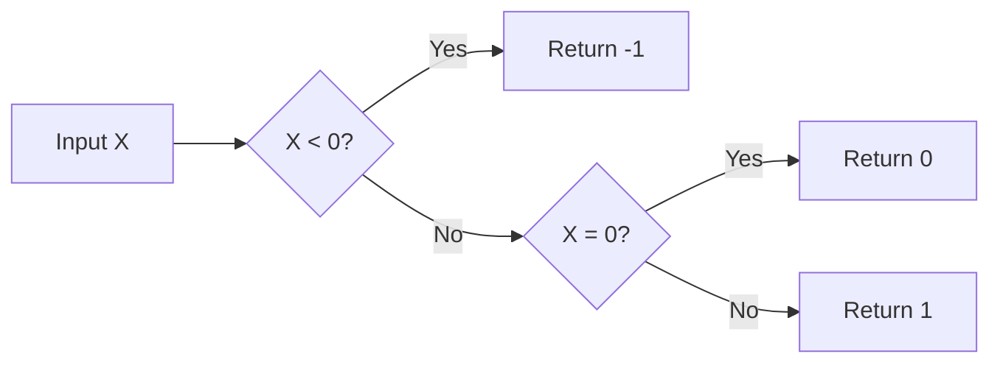

# How to Use SIGN() Function in MySQL

Author: [nawazdhandala](https://www.github.com/nawazdhandala)

Tags: MySQL, SQL, Numeric Function, Database

Description: Learn how to use MySQL SIGN() to return the sign of a number as -1, 0, or 1, for conditional logic, change detection, and numeric classification.

---

## What Is the SIGN() Function?

`SIGN()` returns the sign of a numeric value:

- `-1` if the value is negative.
- `0` if the value is zero.
- `1` if the value is positive.
- `NULL` if the value is `NULL`.

**Syntax:**

```sql
SIGN(X)
```

---

## Basic Examples

```sql
SELECT SIGN(-42);
-- Returns: -1

SELECT SIGN(0);
-- Returns: 0

SELECT SIGN(42);
-- Returns: 1

SELECT SIGN(-0.001);
-- Returns: -1

SELECT SIGN(0.001);
-- Returns: 1

SELECT SIGN(NULL);
-- Returns: NULL

SELECT SIGN(-999999.99);
-- Returns: -1
```

---

## How SIGN() Categorizes Numbers



---

## Detecting Positive, Negative, and Zero Values

```sql
CREATE TABLE financial_results (
    id INT AUTO_INCREMENT PRIMARY KEY,
    period VARCHAR(20),
    profit DECIMAL(12, 2)
);

INSERT INTO financial_results (period, profit) VALUES
('Q1 2026',  15000.00),
('Q2 2026', -3200.00),
('Q3 2026',  0.00),
('Q4 2026',  22000.00);

SELECT
    period,
    profit,
    SIGN(profit) AS sign_val,
    CASE SIGN(profit)
        WHEN  1 THEN 'Profit'
        WHEN  0 THEN 'Break-even'
        WHEN -1 THEN 'Loss'
    END AS result_type
FROM financial_results;
```

Result:

| period   | profit    | sign_val | result_type |
|----------|-----------|----------|-------------|
| Q1 2026  | 15000.00  | 1        | Profit      |
| Q2 2026  | -3200.00  | -1       | Loss        |
| Q3 2026  | 0.00      | 0        | Break-even  |
| Q4 2026  | 22000.00  | 1        | Profit      |

---

## Counting Positive, Negative, and Zero Values

```sql
SELECT
    SUM(CASE WHEN SIGN(profit) =  1 THEN 1 ELSE 0 END) AS profitable_quarters,
    SUM(CASE WHEN SIGN(profit) = -1 THEN 1 ELSE 0 END) AS loss_quarters,
    SUM(CASE WHEN SIGN(profit) =  0 THEN 1 ELSE 0 END) AS breakeven_quarters
FROM financial_results;
```

---

## Change Direction Detection

`SIGN()` is ideal for detecting whether a value increased, decreased, or stayed the same between two periods:

```sql
CREATE TABLE stock_prices (
    id INT AUTO_INCREMENT PRIMARY KEY,
    symbol VARCHAR(10),
    trade_date DATE,
    close_price DECIMAL(10, 2)
);

INSERT INTO stock_prices VALUES
(1, 'ACME', '2026-03-28', 150.00),
(2, 'ACME', '2026-03-29', 152.50),
(3, 'ACME', '2026-03-30', 152.50),
(4, 'ACME', '2026-03-31', 148.00);

-- Detect daily price movement direction
SELECT
    trade_date,
    close_price,
    close_price - LAG(close_price) OVER (PARTITION BY symbol ORDER BY trade_date) AS change,
    SIGN(close_price - LAG(close_price) OVER (PARTITION BY symbol ORDER BY trade_date)) AS direction,
    CASE SIGN(close_price - LAG(close_price) OVER (PARTITION BY symbol ORDER BY trade_date))
        WHEN  1 THEN 'Up'
        WHEN  0 THEN 'Flat'
        WHEN -1 THEN 'Down'
        ELSE 'N/A'
    END AS trend
FROM stock_prices;
```

---

## Using SIGN() for Absolute Value Without ABS()

```sql
-- Equivalent to ABS(X) = X * SIGN(X)
SELECT -42 * SIGN(-42);
-- Returns: 42
```

This identity (`X * SIGN(X) = ABS(X)`) is occasionally useful in complex expressions where `ABS()` cannot be nested but `SIGN()` can.

---

## Sorting: Negatives Last

```sql
-- Show positive values first, then zeros, then negatives
SELECT period, profit
FROM financial_results
ORDER BY SIGN(profit) DESC, ABS(profit) DESC;
```

---

## Separating Debits and Credits

```sql
CREATE TABLE ledger (
    id INT AUTO_INCREMENT PRIMARY KEY,
    description VARCHAR(100),
    amount DECIMAL(10, 2)
);

INSERT INTO ledger (description, amount) VALUES
('Sale',    250.00),
('Refund',  -50.00),
('Fee',     -10.00),
('Payment', 500.00);

-- Separate debits (negative) from credits (positive)
SELECT
    description,
    amount,
    CASE SIGN(amount)
        WHEN 1  THEN amount
        ELSE 0
    END AS credit,
    CASE SIGN(amount)
        WHEN -1 THEN ABS(amount)
        ELSE 0
    END AS debit
FROM ledger;
```

---

## SIGN() in UPDATE Logic

```sql
-- Add a penalty column: negative profit periods get a flag
ALTER TABLE financial_results ADD COLUMN flag TINYINT DEFAULT 0;

UPDATE financial_results
SET flag = CASE WHEN SIGN(profit) = -1 THEN 1 ELSE 0 END;
```

---

## SIGN() vs ABS() vs CASE

| Use Case                    | Recommended Function            |
|-----------------------------|---------------------------------|
| Classify as +1/0/-1         | `SIGN()`                        |
| Get the magnitude           | `ABS()`                         |
| Custom positive/negative logic | `CASE WHEN x > 0 THEN ...`  |

---

## NULL Behavior

```sql
SELECT SIGN(NULL);
-- Returns: NULL

-- Safe default with COALESCE
SELECT COALESCE(SIGN(profit), 0) AS sign_safe
FROM financial_results;
```

---

## Summary

`SIGN()` returns `-1`, `0`, or `1` depending on whether its argument is negative, zero, or positive. It is a compact, readable alternative to `CASE WHEN X > 0` constructs for sign-based classification. Common applications include profit/loss labeling, stock movement direction detection, debit/credit separation, and conditional sorting. The relationship `X * SIGN(X) = ABS(X)` is occasionally useful in complex expressions. `SIGN()` returns `NULL` for `NULL` input, so use `COALESCE()` when a default value is needed.
