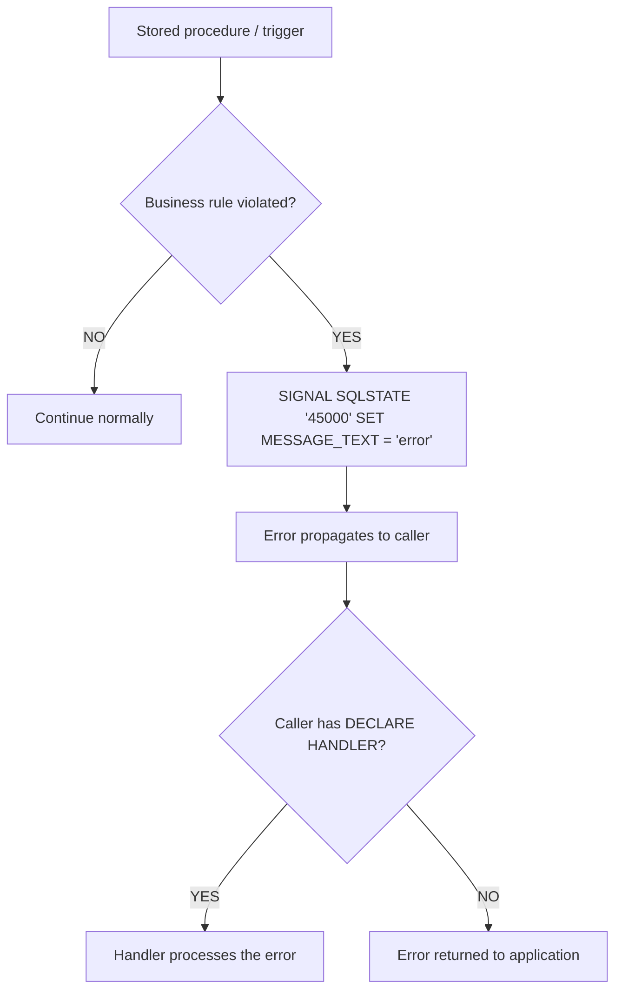

# How to Use SIGNAL in MySQL to Raise Custom Errors

Author: [nawazdhandala](https://www.github.com/nawazdhandala)

Tags: MySQL, Stored Procedure, Error Handling, SQL, Database

Description: Learn how to use SIGNAL and RESIGNAL in MySQL stored procedures and triggers to raise custom errors with meaningful SQLSTATE codes and error messages.

---

## What is SIGNAL?

`SIGNAL` is a MySQL statement that explicitly raises an error condition from within a stored program (procedure, function, trigger, or event). It is the MySQL equivalent of `RAISE` or `THROW` in other languages.



## SIGNAL Syntax

```sql
SIGNAL SQLSTATE 'sqlstate_value'
    [SET signal_information_item = value [, ...]];
```

Common `signal_information_item` options:
- `MESSAGE_TEXT` - human-readable error description
- `MYSQL_ERRNO` - MySQL error number (1000 to 65535)
- `CLASS_ORIGIN`, `SUBCLASS_ORIGIN` - for standards compliance
- `CONSTRAINT_NAME`, `TABLE_NAME`, `COLUMN_NAME` - for constraint violation context

## Custom SQLSTATE Values

SQLSTATE codes starting with `'45'` are reserved for user-defined conditions. Using `'45000'` is the standard convention for generic application-level errors.

## Setup: Sample Tables

```sql
CREATE TABLE accounts (
    id      INT PRIMARY KEY AUTO_INCREMENT,
    owner   VARCHAR(100) NOT NULL,
    balance DECIMAL(12,2) NOT NULL DEFAULT 0.00,
    status  VARCHAR(20) DEFAULT 'active'
);

INSERT INTO accounts (owner, balance, status) VALUES
    ('Alice', 5000.00, 'active'),
    ('Bob',   1000.00, 'active'),
    ('Carol',    0.00, 'frozen');
```

## Basic SIGNAL: Input Validation

Raise an error when the caller passes an invalid parameter.

```sql
DELIMITER $$

CREATE PROCEDURE Withdraw (
    IN p_account_id INT,
    IN p_amount     DECIMAL(12,2)
)
BEGIN
    DECLARE v_balance DECIMAL(12,2);
    DECLARE v_status  VARCHAR(20);

    -- Validate input
    IF p_amount <= 0 THEN
        SIGNAL SQLSTATE '45000'
            SET MESSAGE_TEXT = 'Withdrawal amount must be greater than zero';
    END IF;

    SELECT balance, status INTO v_balance, v_status
    FROM accounts
    WHERE id = p_account_id;

    IF v_status = 'frozen' THEN
        SIGNAL SQLSTATE '45000'
            SET MESSAGE_TEXT = 'Account is frozen and cannot process withdrawals';
    END IF;

    IF v_balance < p_amount THEN
        SIGNAL SQLSTATE '45000'
            SET MESSAGE_TEXT = 'Insufficient funds';
    END IF;

    UPDATE accounts SET balance = balance - p_amount WHERE id = p_account_id;
END$$

DELIMITER ;
```

```sql
-- Valid withdrawal
CALL Withdraw(1, 100.00);

-- Amount <= 0
CALL Withdraw(1, -50.00);
-- ERROR 1644 (45000): Withdrawal amount must be greater than zero

-- Frozen account
CALL Withdraw(3, 10.00);
-- ERROR 1644 (45000): Account is frozen and cannot process withdrawals

-- Insufficient funds
CALL Withdraw(2, 9999.00);
-- ERROR 1644 (45000): Insufficient funds
```

## SIGNAL with MYSQL_ERRNO

Provide a specific error number alongside the SQLSTATE for finer error classification.

```sql
DELIMITER $$

CREATE PROCEDURE CreateAccount (
    IN p_owner   VARCHAR(100),
    IN p_balance DECIMAL(12,2)
)
BEGIN
    IF p_owner IS NULL OR TRIM(p_owner) = '' THEN
        SIGNAL SQLSTATE '45000'
            SET MYSQL_ERRNO = 1001,
                MESSAGE_TEXT = 'Account owner name cannot be empty';
    END IF;

    IF p_balance < 0 THEN
        SIGNAL SQLSTATE '45001'
            SET MYSQL_ERRNO = 1002,
                MESSAGE_TEXT = 'Initial balance cannot be negative';
    END IF;

    INSERT INTO accounts (owner, balance) VALUES (p_owner, p_balance);
END$$

DELIMITER ;
```

## SIGNAL in Triggers

SIGNAL is commonly used in BEFORE triggers to enforce business rules that cannot be expressed as CHECK constraints.

```sql
DELIMITER $$

CREATE TRIGGER before_account_update
BEFORE UPDATE ON accounts
FOR EACH ROW
BEGIN
    IF NEW.balance < 0 THEN
        SIGNAL SQLSTATE '45000'
            SET MESSAGE_TEXT = 'Account balance cannot go below zero';
    END IF;

    IF OLD.status = 'frozen' AND NEW.status != 'active' AND NEW.balance != OLD.balance THEN
        SIGNAL SQLSTATE '45000'
            SET MESSAGE_TEXT = 'Cannot modify balance on a frozen account';
    END IF;
END$$

DELIMITER ;
```

```sql
-- Triggers the SIGNAL
UPDATE accounts SET balance = -100.00 WHERE id = 1;
-- ERROR 1644 (45000): Account balance cannot go below zero
```

## DECLARE CONDITION + SIGNAL

Define a named condition and signal it by name for cleaner code.

```sql
DELIMITER $$

CREATE PROCEDURE TransferFunds (
    IN p_from_id INT,
    IN p_to_id   INT,
    IN p_amount  DECIMAL(12,2)
)
BEGIN
    DECLARE insufficient_funds CONDITION FOR SQLSTATE '45100';
    DECLARE frozen_account     CONDITION FOR SQLSTATE '45101';

    DECLARE v_balance DECIMAL(12,2);
    DECLARE v_status  VARCHAR(20);

    SELECT balance, status INTO v_balance, v_status
    FROM accounts WHERE id = p_from_id;

    IF v_status = 'frozen' THEN
        SIGNAL frozen_account
            SET MESSAGE_TEXT = 'Source account is frozen';
    END IF;

    IF v_balance < p_amount THEN
        SIGNAL insufficient_funds
            SET MESSAGE_TEXT = 'Insufficient funds for transfer';
    END IF;

    START TRANSACTION;
    UPDATE accounts SET balance = balance - p_amount WHERE id = p_from_id;
    UPDATE accounts SET balance = balance + p_amount WHERE id = p_to_id;
    COMMIT;
END$$

DELIMITER ;
```

## RESIGNAL: Re-raise Inside a Handler

`RESIGNAL` re-raises the current condition from within a handler, optionally modifying its attributes. This is useful for adding context before re-throwing.

```sql
DELIMITER $$

CREATE PROCEDURE SafeInsert (
    IN p_owner   VARCHAR(100),
    IN p_balance DECIMAL(12,2)
)
BEGIN
    DECLARE CONTINUE HANDLER FOR SQLEXCEPTION
    BEGIN
        -- Add context to the error before re-raising
        RESIGNAL SET
            MESSAGE_TEXT = CONCAT('SafeInsert failed for owner: ', p_owner);
    END;

    INSERT INTO accounts (owner, balance) VALUES (p_owner, p_balance);
END$$

DELIMITER ;
```

## Catching SIGNAL Errors in Application Code

When a stored procedure raises a SIGNAL, the application receives a standard database error.

```sql
-- Python (mysql-connector-python)
-- except mysql.connector.Error as err:
--     print(f"SQLSTATE: {err.sqlstate}, Message: {err.msg}")

-- Node.js (mysql2)
-- try { await conn.query('CALL Withdraw(1, -50)'); }
-- catch (err) { console.log(err.sqlState, err.message); }
```

## Best Practices

- Use SQLSTATE `'45000'` through `'45999'` for application-defined errors.
- Always set `MESSAGE_TEXT` to a clear, actionable description.
- Use `DECLARE CONDITION` to give meaningful names to custom SQLSTATE codes.
- Raise errors early in the procedure (guard clauses) to avoid partial data modifications.
- Document the SQLSTATE codes a procedure can raise so application code can handle them specifically.

## Summary

`SIGNAL` raises custom error conditions from MySQL stored programs with a specific SQLSTATE code and message. Use `SQLSTATE '45000'` for general application errors, define named conditions with `DECLARE CONDITION` for clarity, and use SIGNAL in triggers to enforce business rules that CHECK constraints cannot express. `RESIGNAL` re-raises an existing condition from within a handler, optionally enriching it with additional context.
