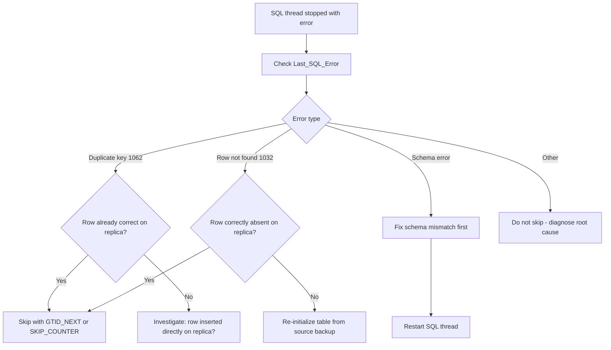

# How to Skip Replication Errors in MySQL

Author: [OneUptime](https://oneuptime.com)

Tags: MySQL, Replication, Error Handling, Administration, Troubleshooting

Description: Learn how to safely skip replication errors in MySQL using GTID-based and position-based methods, and when skipping is appropriate versus fixing the root cause.

---

## Introduction

When a replication SQL thread encounters an error it cannot resolve (duplicate key, missing row, schema mismatch), it stops and the replica falls behind until the problem is addressed. Sometimes the safest fix is to skip the offending transaction; other times, skipping will cause permanent data divergence.

This guide covers how to skip errors using both GTID and position-based replication, and how to decide which approach is appropriate.

## When to skip vs. when to fix

| Situation | Action |
|---|---|
| Duplicate key because the row was inserted directly on the replica | Skip - the data is already present |
| Missing row because the row was deleted directly on the replica | Skip (usually safe if row is gone) |
| Schema mismatch (extra column, wrong type) | Fix the schema first, then retry |
| Data inconsistency that will cascade | Do NOT skip; re-initialize from backup |
| Transient networking glitch (connection error) | Just restart the IO thread |

## Viewing the error

```sql
SHOW REPLICA STATUS\G
/*
...
Last_SQL_Errno: 1062
Last_SQL_Error: Could not execute Write_rows event on table myapp.orders;
               Duplicate entry '101' for key 'PRIMARY', Error_code: 1062;
               handler error HA_ERR_FOUND_DUPP_KEY
...
Executing_Gtid: 3E11FA47-71CA-11E1-9E33-C80AA9429562:55
...
*/
```

## Method 1 - Skip with GTID replication (recommended)

With GTIDs, inject an empty transaction with the offending GTID to tell MySQL "I acknowledge this GTID was executed":

```sql
-- Step 1: Stop the SQL thread
STOP REPLICA SQL_THREAD;

-- Step 2: Note the failing GTID from SHOW REPLICA STATUS
-- Executing_Gtid: 3E11FA47-71CA-11E1-9E33-C80AA9429562:55

-- Step 3: Set gtid_next to the failing GTID
SET GTID_NEXT = '3E11FA47-71CA-11E1-9E33-C80AA9429562:55';

-- Step 4: Commit an empty transaction (this marks the GTID as executed)
BEGIN;
COMMIT;

-- Step 5: Reset gtid_next to automatic
SET GTID_NEXT = 'AUTOMATIC';

-- Step 6: Restart the SQL thread
START REPLICA SQL_THREAD;

-- Step 7: Verify replication resumed
SHOW REPLICA STATUS\G
```

## Method 2 - Skip with position-based replication

When GTIDs are not enabled, use `SQL_SKIP_COUNTER` to skip one event:

```sql
-- Stop the SQL thread
STOP REPLICA SQL_THREAD;

-- Skip one event (the failing transaction)
SET GLOBAL SQL_SLAVE_SKIP_COUNTER = 1;

-- Restart the SQL thread
START REPLICA SQL_THREAD;

-- Verify
SHOW REPLICA STATUS\G
```

To skip multiple events:

```sql
STOP REPLICA SQL_THREAD;
SET GLOBAL SQL_SLAVE_SKIP_COUNTER = 3; -- skip next 3 events
START REPLICA SQL_THREAD;
```

## Method 3 - Skip specific error codes permanently

Use `replica_skip_errors` to automatically skip specific error codes on restart. This is a blunt instrument and should be used only in tightly controlled environments:

```ini
# /etc/mysql/mysql.conf.d/mysqld.cnf

[mysqld]
# Skip duplicate key errors automatically (use with caution)
replica_skip_errors = 1062

# Skip multiple error codes
# replica_skip_errors = 1062,1032

# Skip ALL errors (STRONGLY discouraged in production)
# replica_skip_errors = all
```

```sql
-- Verify at runtime
SHOW VARIABLES LIKE 'replica_skip_errors';
```

## Verifying data after skipping

After skipping a transaction, always verify the replica has the correct data for the affected table:

```sql
-- On the source
SELECT * FROM orders WHERE id = 101;

-- On the replica (compare result)
SELECT * FROM orders WHERE id = 101;

-- If they differ, you have data divergence
-- Consider using pt-table-checksum to find all divergent rows
```

```bash
# pt-table-checksum detects diverged tables between source and replica
pt-table-checksum --user=root --password=secret \
  --databases myapp \
  --replicate myapp.checksums
```

## Re-syncing a diverged table with pt-table-sync

```bash
# After pt-table-checksum identifies divergent rows, sync them
pt-table-sync --execute \
  --sync-to-master h=replica_host,u=root,p=secret,D=myapp,t=orders
```

## Skipping errors in a multi-source setup

```sql
-- Stop the specific channel's SQL thread
STOP REPLICA SQL_THREAD FOR CHANNEL 'ch_shard1';

-- With GTID:
SET GTID_NEXT = 'source_uuid:failing_gtid_number';
BEGIN;
COMMIT;
SET GTID_NEXT = 'AUTOMATIC';

-- Restart the channel
START REPLICA SQL_THREAD FOR CHANNEL 'ch_shard1';
```

## Decision flowchart



## Common error codes

| Error code | Error message | Typical cause |
|---|---|---|
| 1062 | Duplicate entry for key | Row already exists on replica |
| 1032 | Can't find record | Row deleted directly on replica |
| 1051 | Unknown table | DROP TABLE on a table that doesn't exist on replica |
| 1146 | Table doesn't exist | Schema out of sync |

## Summary

To skip a failing GTID transaction: stop the SQL thread, set `GTID_NEXT` to the offending GTID, commit an empty transaction, reset `GTID_NEXT` to `AUTOMATIC`, and restart the SQL thread. For position-based replication use `SET GLOBAL SQL_SLAVE_SKIP_COUNTER = 1` instead. Always verify that the skipped data is consistent on the replica after the skip, using `pt-table-checksum` to detect any divergence. Avoid using `replica_skip_errors` in production as it silently hides data integrity issues.
