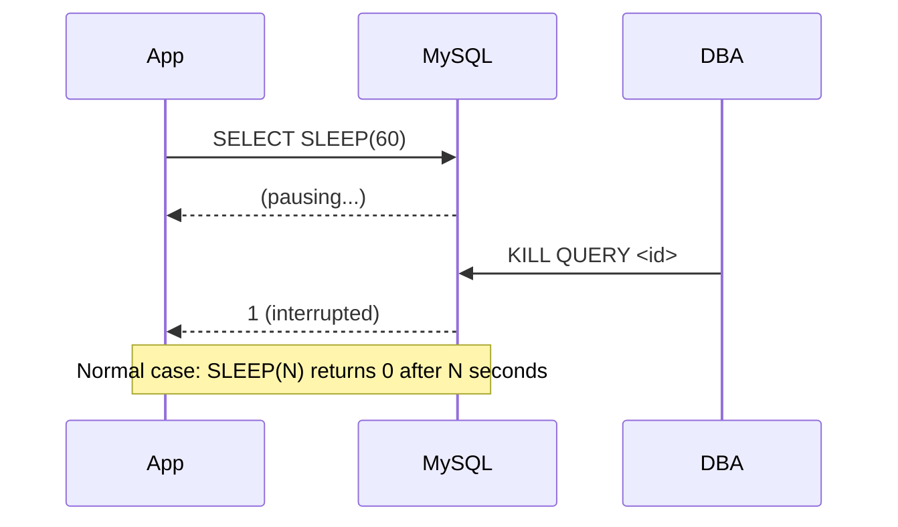
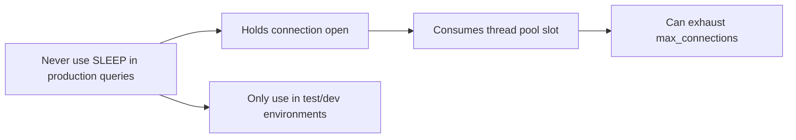

# How to Use SLEEP() Function in MySQL for Testing

Author: [nawazdhandala](https://www.github.com/nawazdhandala)

Tags: MySQL, Function, Testing, Performance, Timeout

Description: Learn how to use MySQL SLEEP() to simulate delays in testing, reproduce timeout scenarios, benchmark lock contention, and test query-kill and monitoring tooling.

---

## Introduction

`SLEEP(N)` causes the current session to pause for `N` seconds (fractional seconds are supported) and then returns `0`. If interrupted by a `KILL QUERY` command, it returns `1` instead. It is a purely testing and diagnostic function and should never be used in production query paths.

## Basic syntax

```sql
SELECT SLEEP(seconds);
```

- `seconds` can be a decimal, e.g. `0.5` for 500 ms.
- Returns `0` on normal completion, `1` if interrupted.

## Simple delay examples

```sql
-- Pause for 2 seconds
SELECT SLEEP(2);

-- Pause for 500 milliseconds
SELECT SLEEP(0.5);

-- Check what it returns
SELECT SLEEP(1) AS result;
-- result: 0
```

## Testing query timeouts

Use `SLEEP()` to trigger the `MAX_EXECUTION_TIME` query hint or `wait_timeout` / `interactive_timeout` settings:

```sql
-- Test MAX_EXECUTION_TIME hint (MySQL 5.7.4+)
SELECT /*+ MAX_EXECUTION_TIME(2000) */ SLEEP(5) AS result;
-- Error 3024: Query execution was interrupted, maximum statement execution time exceeded

-- Test application-level timeout handling
SELECT SLEEP(30); -- leave application's read timeout to fire
```

## Simulating slow queries for monitoring tests

SLEEP is ideal for generating artificial slow queries to validate slow-query-log thresholds and monitoring alerts:

```sql
-- In one session: simulate a 10-second slow query
SELECT SLEEP(10), 'slow query simulation' AS label;
```

```bash
# Verify it appears in the slow query log (long_query_time must be <= 10)
tail -f /var/log/mysql/mysql-slow.log
```

## Testing lock contention

```sql
-- Session A: hold a row lock for 5 seconds
START TRANSACTION;
SELECT id FROM orders WHERE id = 1 FOR UPDATE;
SELECT SLEEP(5);
COMMIT;

-- Session B (run concurrently): will block until Session A commits
UPDATE orders SET status = 'shipped' WHERE id = 1;
-- This shows lock wait behavior without needing a real workload
```

## Testing KILL QUERY behavior

```sql
-- Session A: start a long sleep
SELECT SLEEP(60) AS result;

-- Session B: find and kill the query
SELECT ID, USER, TIME, INFO
FROM information_schema.PROCESSLIST
WHERE INFO LIKE '%SLEEP%';

KILL QUERY <id_from_above>;

-- Session A will return:
-- result: 1  (interrupted)
```

## Using SLEEP() inside a stored procedure for retry simulation

```sql
DELIMITER $$

CREATE PROCEDURE retry_with_backoff(IN p_attempt INT)
BEGIN
  DECLARE delay DECIMAL(5,2);
  SET delay = LEAST(p_attempt * 0.5, 5.0); -- cap at 5 seconds

  SELECT CONCAT('Attempt ', p_attempt, ': waiting ', delay, 's') AS status;
  DO SLEEP(delay);
END$$

DELIMITER ;

CALL retry_with_backoff(1); -- waits 0.5s
CALL retry_with_backoff(3); -- waits 1.5s
CALL retry_with_backoff(10); -- waits 5s (capped)
```

## Testing connection-timeout settings

```bash
# Check current timeout values
mysql -u root -p -e "SHOW VARIABLES LIKE '%timeout%';"
```

```sql
-- Set a short interactive timeout for the session
SET SESSION interactive_timeout = 5;
SET SESSION wait_timeout = 5;

-- Now do nothing (or SLEEP) longer than 5 seconds
-- The connection will be closed by the server
SELECT SLEEP(10); -- connection will be killed at 5s
```

## SLEEP() return value reference

| Condition | Return value |
|---|---|
| Sleep completed normally | 0 |
| Interrupted by KILL QUERY | 1 |
| Server shutdown during sleep | 1 |

## Flow diagram



## Security warning



## Summary

`SLEEP(N)` pauses the current MySQL session for `N` seconds and returns `0` on success or `1` if interrupted by `KILL QUERY`. Its primary uses are testing timeout behavior, generating synthetic slow queries for monitoring validation, simulating lock contention, and verifying `KILL` and alerting workflows. It should never appear in production query paths as it holds a connection and thread open for the duration of the sleep.
