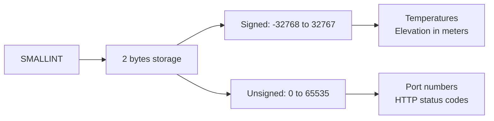

# How to Use SMALLINT Data Type in MySQL

Author: [nawazdhandala](https://www.github.com/nawazdhandala)

Tags: MySQL, SQL, Data Type, Integer, Database

Description: Learn how to use the SMALLINT data type in MySQL, covering its 2-byte storage, signed and unsigned ranges, and common use cases for medium-range integers.

---

## What Is SMALLINT

`SMALLINT` is a 2-byte integer type in MySQL suited for columns that need a wider range than `TINYINT` but do not require the full size of `INT`. Common uses include port numbers, HTTP status codes, year values, and small quantity counters.



## Storage and Value Range

| Type | Storage | Minimum | Maximum |
|---|---|---|---|
| `SMALLINT` (signed) | 2 bytes | -32,768 | 32,767 |
| `SMALLINT UNSIGNED` | 2 bytes | 0 | 65,535 |

## Syntax

```sql
column_name SMALLINT [(display_width)] [UNSIGNED] [ZEROFILL] [NOT NULL] [DEFAULT value]
```

## Basic Usage

```sql
CREATE TABLE network_services (
    id          INT AUTO_INCREMENT PRIMARY KEY,
    service     VARCHAR(50) NOT NULL,
    port        SMALLINT UNSIGNED NOT NULL,
    http_status SMALLINT UNSIGNED NOT NULL DEFAULT 200
);

INSERT INTO network_services (service, port, http_status) VALUES
('HTTP',  80,  200),
('HTTPS', 443, 200),
('FTP',   21,  0),
('SSH',   22,  0);
```

## Storing Temperature Data

```sql
CREATE TABLE weather_readings (
    id          INT AUTO_INCREMENT PRIMARY KEY,
    station_id  INT NOT NULL,
    recorded_at DATETIME NOT NULL,
    temp_c      SMALLINT NOT NULL   -- degrees Celsius, allows negatives
);

INSERT INTO weather_readings (station_id, recorded_at, temp_c) VALUES
(1, '2025-01-10 08:00:00', -15),
(1, '2025-07-15 14:00:00',  38),
(2, '2025-01-10 08:00:00',   2);

SELECT station_id,
       MIN(temp_c) AS min_temp,
       MAX(temp_c) AS max_temp,
       AVG(temp_c) AS avg_temp
FROM weather_readings
GROUP BY station_id;
```

```text
+------------+----------+----------+----------+
| station_id | min_temp | max_temp | avg_temp |
+------------+----------+----------+----------+
|          1 |      -15 |       38 |  11.5000 |
|          2 |        2 |        2 |   2.0000 |
+------------+----------+----------+----------+
```

## HTTP Status Code Column

```sql
CREATE TABLE api_request_log (
    id          BIGINT AUTO_INCREMENT PRIMARY KEY,
    endpoint    VARCHAR(200) NOT NULL,
    status_code SMALLINT UNSIGNED NOT NULL,
    response_ms SMALLINT UNSIGNED NOT NULL,
    logged_at   DATETIME NOT NULL DEFAULT CURRENT_TIMESTAMP
);

INSERT INTO api_request_log (endpoint, status_code, response_ms) VALUES
('/api/users',    200,  45),
('/api/orders',   404,  12),
('/api/payments', 500, 230);

SELECT status_code, COUNT(*) AS count
FROM api_request_log
GROUP BY status_code
ORDER BY status_code;
```

```text
+-------------+-------+
| status_code | count |
+-------------+-------+
|         200 |     1 |
|         404 |     1 |
|         500 |     1 |
+-------------+-------+
```

## ALTER TABLE: Adding a SMALLINT Column

```sql
ALTER TABLE weather_readings
    ADD COLUMN humidity SMALLINT UNSIGNED COMMENT 'Relative humidity 0-100';
```

## Comparing Integer Types

```sql
CREATE TABLE int_type_comparison (
    tinyint_col   TINYINT,       -- 1 byte, -128 to 127
    smallint_col  SMALLINT,      -- 2 bytes, -32768 to 32767
    mediumint_col MEDIUMINT,     -- 3 bytes, -8388608 to 8388607
    int_col       INT,           -- 4 bytes, -2147483648 to 2147483647
    bigint_col    BIGINT         -- 8 bytes, very large range
);
```

## Out of Range Handling

```sql
-- Strict mode (default in MySQL 8.0): raises an error
INSERT INTO network_services (service, port, http_status)
VALUES ('CUSTOM', 70000, 200);
-- ERROR 1264 (22003): Out of range value for column 'port' at row 1
-- SMALLINT UNSIGNED max is 65535; 70000 exceeds it
```

## Inspecting Column Metadata

```sql
SELECT column_name, column_type, is_nullable, column_default
FROM information_schema.columns
WHERE table_schema = DATABASE()
  AND table_name = 'network_services';
```

## Best Practices

- Choose `SMALLINT UNSIGNED` for columns that store port numbers (0-65535), HTTP status codes, or any count that naturally fits within 0-65535.
- Prefer `SMALLINT` over `INT` when the data range fits to save 2 bytes per row; on large tables this adds up significantly.
- Use signed `SMALLINT` for temperatures, elevations, and financial deltas that can go negative.
- Avoid `SMALLINT` for primary keys of tables that might grow; use `INT` or `BIGINT` to avoid future migration pain.

## Summary

`SMALLINT` uses 2 bytes and covers -32,768 to 32,767 (signed) or 0 to 65,535 (unsigned). It is the right choice for port numbers, HTTP status codes, temperatures, and any integer column whose values comfortably fit within this range. When you need more range, step up to `MEDIUMINT` (3 bytes) or `INT` (4 bytes).
