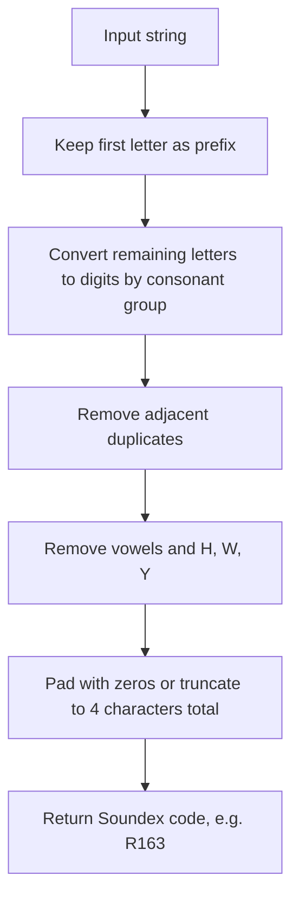

# How to Use SOUNDEX() and SOUNDS LIKE in MySQL

Author: [nawazdhandala](https://www.github.com/nawazdhandala)

Tags: MySQL, SQL, String Function, Full-Text Search, Database

Description: Learn how to use MySQL SOUNDEX() and SOUNDS LIKE for phonetic matching to find names and words that sound similar regardless of spelling.

---

## What Is SOUNDEX()?

`SOUNDEX()` returns a phonetic encoding string of a word based on the Soundex algorithm. Words that sound similar when spoken out loud produce the same or similar Soundex codes. This is useful for finding names with different spellings but similar pronunciation.

**Syntax:**

```sql
SOUNDEX(str)
```

The Soundex code starts with the first letter of the string followed by three digits that encode the consonant sounds.

---

## What Is SOUNDS LIKE?

`SOUNDS LIKE` is a MySQL operator that compares two expressions using their `SOUNDEX()` codes. It is equivalent to writing `SOUNDEX(a) = SOUNDEX(b)`.

**Syntax:**

```sql
expression1 SOUNDS LIKE expression2
```

---

## Basic Examples

```sql
SELECT SOUNDEX('Robert');
-- Returns: R163

SELECT SOUNDEX('Rupert');
-- Returns: R163

SELECT SOUNDEX('Smith');
-- Returns: S530

SELECT SOUNDEX('Smyth');
-- Returns: S530

SELECT 'Robert' SOUNDS LIKE 'Rupert';
-- Returns: 1 (true)

SELECT 'Smith' SOUNDS LIKE 'Smyth';
-- Returns: 1 (true)

SELECT 'Alice' SOUNDS LIKE 'Bob';
-- Returns: 0 (false)
```

---

## How the Soundex Algorithm Works



The digit encoding groups are:

| Digit | Letters              |
|-------|----------------------|
| 1     | B, F, P, V           |
| 2     | C, G, J, K, Q, S, X, Z |
| 3     | D, T                 |
| 4     | L                    |
| 5     | M, N                 |
| 6     | R                    |

Vowels (A, E, I, O, U), H, W, and Y are ignored.

---

## Phonetic Search in a Customer Table

```sql
CREATE TABLE customers (
    id INT AUTO_INCREMENT PRIMARY KEY,
    name VARCHAR(100)
);

INSERT INTO customers (name) VALUES
('Robert'), ('Rupert'), ('Robin'), ('Alice'), ('Alicia'),
('Johnson'), ('Jonson'), ('Smith'), ('Smythe');

-- Find all customers whose name sounds like 'Robert'
SELECT id, name, SOUNDEX(name) AS code
FROM customers
WHERE name SOUNDS LIKE 'Robert';
```

Result:

| id | name   | code |
|----|--------|------|
| 1  | Robert | R163 |
| 2  | Rupert | R163 |

---

## Using SOUNDS LIKE for Name Deduplication

```sql
-- Find potential duplicate customer names
SELECT a.id AS id1, a.name AS name1,
       b.id AS id2, b.name AS name2
FROM customers a
JOIN customers b
    ON a.id < b.id
    AND a.name SOUNDS LIKE b.name;
```

---

## Comparing SOUNDEX Codes Directly

```sql
SELECT name, SOUNDEX(name) AS soundex_code
FROM customers
WHERE SOUNDEX(name) = SOUNDEX('Jonson');
```

---

## Case Insensitivity

`SOUNDEX()` is case-insensitive:

```sql
SELECT SOUNDEX('alice') = SOUNDEX('ALICE');
-- Returns: 1

SELECT 'alice' SOUNDS LIKE 'ALICE';
-- Returns: 1
```

---

## Limitations of SOUNDEX()

- Designed for English phonetics; performs poorly with non-English names.
- Only the first letter plus three coded digits are used, so longer names may have collisions.
- Homophones in other languages may not match.
- Numbers and special characters at the start can produce unexpected codes.

```sql
SELECT SOUNDEX('Mueller');
-- Returns: M460  (German umlaut handling is limited)
```

---

## SOUNDEX() vs LIKE vs Full-Text Search

| Method         | Use Case                                              |
|----------------|-------------------------------------------------------|
| `SOUNDS LIKE`  | Phonetically similar words, name variations           |
| `LIKE '%..%'`  | Substring matching, wildcard patterns                 |
| `FULLTEXT`     | Relevance-based natural language text search          |

```sql
-- LIKE: find names containing 'rob'
SELECT name FROM customers WHERE name LIKE '%rob%';

-- SOUNDS LIKE: find names that sound like 'Robert'
SELECT name FROM customers WHERE name SOUNDS LIKE 'Robert';
```

---

## Practical Example: Search Form with Fuzzy Name Matching

```sql
-- User searches for 'Thomson', but data has 'Thompson', 'Tomson', etc.
SELECT id, name
FROM customers
WHERE name SOUNDS LIKE 'Thomson'
ORDER BY name;
```

---

## Performance Considerations

- `SOUNDEX()` is computed at query runtime per row; it cannot use a standard B-tree index on the original column.
- For large tables, consider storing a precomputed Soundex code column with an index:

```sql
ALTER TABLE customers ADD COLUMN soundex_name VARCHAR(10) GENERATED ALWAYS AS (SOUNDEX(name)) STORED;
CREATE INDEX idx_soundex_name ON customers (soundex_name);

-- Now this query can use the index
SELECT id, name
FROM customers
WHERE soundex_name = SOUNDEX('Thomson');
```

---

## Summary

`SOUNDEX()` and `SOUNDS LIKE` give MySQL the ability to match strings phonetically, making them valuable for fuzzy name searches where spelling variations are common. They work best with English names and short words. For production use on large datasets, pre-compute and index the Soundex code to avoid full table scans. For multilingual phonetic matching, consider application-level libraries that support broader algorithms like Metaphone or Double Metaphone.
