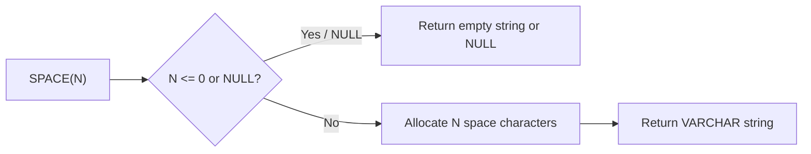

# How to Use SPACE() Function in MySQL

Author: [nawazdhandala](https://www.github.com/nawazdhandala)

Tags: MySQL, SQL, String Function, Database

Description: Learn how to use MySQL SPACE() to generate a string of N blank spaces for padding, alignment, and string construction in SQL queries.

---

## What Is the SPACE() Function?

`SPACE(N)` returns a string consisting of `N` space characters. It is a simple utility function useful for padding strings, formatting text output, or building indented structures within SQL.

**Syntax:**

```sql
SPACE(N)
```

- `N` is an integer specifying the number of spaces to return.
- Returns an empty string if `N` is `0` or negative.
- Returns `NULL` if `N` is `NULL`.

---

## Basic Examples

```sql
SELECT SPACE(5);
-- Returns: '     '  (5 spaces)

SELECT LENGTH(SPACE(10));
-- Returns: 10

SELECT SPACE(0);
-- Returns: ''  (empty string)

SELECT SPACE(-3);
-- Returns: ''  (empty string)

SELECT SPACE(NULL);
-- Returns: NULL
```

---

## Combining SPACE() with CONCAT()

The primary use of `SPACE()` is in combination with `CONCAT()` to align text or create padding:

```sql
SELECT CONCAT('Name:', SPACE(5), 'Alice');
-- Returns: 'Name:     Alice'

SELECT CONCAT(SPACE(3), 'indented item');
-- Returns: '   indented item'
```

---

## Text Alignment in Reports

```sql
CREATE TABLE employees (
    id INT AUTO_INCREMENT PRIMARY KEY,
    first_name VARCHAR(50),
    last_name VARCHAR(50),
    department VARCHAR(50)
);

INSERT INTO employees (first_name, last_name, department) VALUES
('Alice', 'Smith', 'Engineering'),
('Bob', 'Jones', 'Marketing'),
('Carol', 'Williams', 'HR');

-- Fixed-width-style output using SPACE() for padding
SELECT
    CONCAT(first_name, SPACE(15 - LENGTH(first_name)), last_name) AS padded_name,
    department
FROM employees;
```

---

## Generating Indented Hierarchical Output

`SPACE()` is handy when displaying tree structures in plain text:

```sql
CREATE TABLE categories (
    id INT AUTO_INCREMENT PRIMARY KEY,
    name VARCHAR(100),
    depth INT DEFAULT 0
);

INSERT INTO categories (name, depth) VALUES
('Electronics', 0),
('Computers', 1),
('Laptops', 2),
('Gaming Laptops', 3);

SELECT CONCAT(SPACE(depth * 4), name) AS tree_view
FROM categories;
```

Result:

```
Electronics
    Computers
        Laptops
            Gaming Laptops
```

---

## How SPACE() Works



---

## Using SPACE() in Dynamic SQL Generation

Some DBA tasks involve generating formatted SQL scripts. `SPACE()` can be used to indent output:

```sql
SELECT CONCAT(
    'SELECT ', SPACE(1), column_name, CHAR(10),
    'FROM ', SPACE(1), table_name, ';'
) AS generated_sql
FROM information_schema.columns
WHERE table_schema = 'mydb'
LIMIT 5;
```

---

## SPACE() vs REPEAT()

`SPACE(N)` is equivalent to `REPEAT(' ', N)`:

```sql
SELECT SPACE(5) = REPEAT(' ', 5);
-- Returns: 1 (true)
```

Use `REPEAT()` when you need to repeat any character, and `SPACE()` when you specifically need spaces for readability.

| Function        | Use Case                    |
|-----------------|-----------------------------|
| `SPACE(N)`      | Generate N space characters |
| `REPEAT(s, N)`  | Repeat any string N times   |

---

## SPACE() with LPAD() and RPAD()

For more controlled padding (left or right), `LPAD()` and `RPAD()` are typically preferred, but `SPACE()` can complement them:

```sql
-- Right-pad with spaces to width 20
SELECT RPAD(first_name, 20, ' ') AS padded FROM employees;

-- Same effect for right padding using CONCAT + SPACE
SELECT CONCAT(first_name, SPACE(20 - LENGTH(first_name))) AS padded FROM employees;
```

---

## Summary

`SPACE(N)` is a simple but useful MySQL function that returns a string of `N` blank spaces. Its primary applications are in text formatting, column alignment within `CONCAT()` expressions, and generating indented hierarchical output. For most padding needs, `LPAD()` and `RPAD()` offer more control, but `SPACE()` provides a clean shorthand when working specifically with blank space characters.
