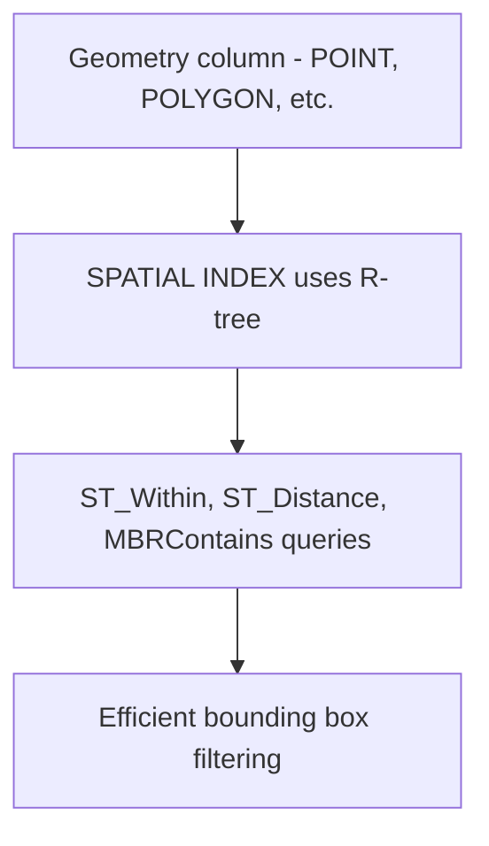

# How to Create a Spatial Index in MySQL

Author: [nawazdhandala](https://www.github.com/nawazdhandala)

Tags: MySQL, SQL, Spatial Index, GIS, Geometry, Database

Description: Learn how to create spatial indexes in MySQL on geometry columns to efficiently query geographic data using spatial functions like ST_Distance and ST_Within.

---

## How Spatial Indexes Work

A spatial index is built on geometry-type columns (`POINT`, `LINESTRING`, `POLYGON`, etc.) and uses an R-tree data structure to efficiently answer spatial queries like "find all locations within this area" or "find the nearest points." Without a spatial index, spatial queries require scanning every row and computing geometry comparisons.

Spatial indexes in MySQL require InnoDB (MySQL 5.7.5+) or MyISAM, and geometry columns must be declared `NOT NULL` for the index to be used.



## Syntax

```sql
-- Inline during CREATE TABLE
CREATE TABLE locations (
    id INT PRIMARY KEY AUTO_INCREMENT,
    name VARCHAR(100),
    coordinates POINT NOT NULL SRID 4326,
    SPATIAL INDEX spatial_idx (coordinates)
);

-- Add to existing table
ALTER TABLE locations ADD SPATIAL INDEX spatial_idx (coordinates);

-- Using CREATE INDEX
CREATE SPATIAL INDEX spatial_idx ON locations (coordinates);
```

## Examples

### Setup: Create a Locations Table with Spatial Index

```sql
CREATE TABLE stores (
    id INT PRIMARY KEY AUTO_INCREMENT,
    name VARCHAR(100) NOT NULL,
    city VARCHAR(100),
    location POINT NOT NULL SRID 4326,
    SPATIAL INDEX idx_location (location)
);

-- Insert store locations as (longitude, latitude) POINT values
INSERT INTO stores (name, city, location) VALUES
    ('Downtown Store',    'New York',    ST_GeomFromText('POINT(-74.006 40.7128)',  4326)),
    ('Midtown Store',     'New York',    ST_GeomFromText('POINT(-73.985 40.7580)',  4326)),
    ('Hollywood Store',   'Los Angeles', ST_GeomFromText('POINT(-118.3435 34.0928)', 4326)),
    ('Santa Monica Store','Los Angeles', ST_GeomFromText('POINT(-118.4912 34.0195)', 4326)),
    ('Loop Store',        'Chicago',     ST_GeomFromText('POINT(-87.6298 41.8781)',  4326)),
    ('Lincoln Park Store','Chicago',     ST_GeomFromText('POINT(-87.6443 41.9214)',  4326));
```

### Retrieve Coordinates from a POINT Column

```sql
SELECT
    name,
    city,
    ST_X(location) AS longitude,
    ST_Y(location) AS latitude
FROM stores
ORDER BY city, name;
```

```text
+---------------------+-------------+------------+----------+
| name                | city        | longitude  | latitude |
+---------------------+-------------+------------+----------+
| Loop Store          | Chicago     | -87.629800 | 41.87810 |
| Lincoln Park Store  | Chicago     | -87.644300 | 41.92140 |
| Hollywood Store     | Los Angeles | -118.343500| 34.09280 |
| Santa Monica Store  | Los Angeles | -118.491200| 34.01950 |
| Downtown Store      | New York    | -74.006000 | 40.71280 |
| Midtown Store       | New York    | -73.985000 | 40.75800 |
+---------------------+-------------+------------+----------+
```

### Find Stores Within a Bounding Box

Use `MBRContains` to find stores within a rectangular bounding box. MBRContains uses the spatial index.

```sql
-- Bounding box: New York area (approximate)
SET @bbox = ST_GeomFromText(
    'POLYGON((-74.1 40.6, -73.9 40.6, -73.9 40.8, -74.1 40.8, -74.1 40.6))',
    4326
);

SELECT name, city,
       ST_X(location) AS longitude,
       ST_Y(location) AS latitude
FROM stores
WHERE MBRContains(@bbox, location);
```

```text
+----------------+----------+------------+----------+
| name           | city     | longitude  | latitude |
+----------------+----------+------------+----------+
| Downtown Store | New York | -74.006000 | 40.71280 |
| Midtown Store  | New York | -73.985000 | 40.75800 |
+----------------+----------+------------+----------+
```

### Find Stores Within a Radius

Use `ST_Distance_Sphere` to filter by distance from a reference point. Note: distance filtering alone does not use the spatial index; combine with `ST_Within` or `MBRContains` for index-assisted queries.

```sql
-- Reference point: Times Square, New York
SET @ref_point = ST_GeomFromText('POINT(-73.9855 40.7580)', 4326);

SELECT
    name,
    city,
    ROUND(ST_Distance_Sphere(location, @ref_point)) AS distance_meters
FROM stores
ORDER BY distance_meters
LIMIT 3;
```

```text
+----------------+----------+-----------------+
| name           | city     | distance_meters |
+----------------+----------+-----------------+
| Midtown Store  | New York | 0               |
| Downtown Store | New York | 5267            |
| Loop Store     | Chicago  | 1197792         |
+----------------+----------+-----------------+
```

### Combining Bounding Box and Distance for Indexed Queries

For optimal performance: first narrow results with a spatial-indexed bounding box, then apply exact distance filtering.

```sql
SET @ref_point = ST_GeomFromText('POINT(-74.006 40.7128)', 4326);
SET @radius_degrees = 0.5;  -- approx 55km

-- Create a bounding box around the reference point
SET @bbox = ST_Envelope(
    ST_Buffer(@ref_point, @radius_degrees)
);

SELECT name, city,
       ROUND(ST_Distance_Sphere(location, @ref_point)) AS distance_meters
FROM stores
WHERE MBRContains(@bbox, location)
  AND ST_Distance_Sphere(location, @ref_point) <= 60000  -- 60 km
ORDER BY distance_meters;
```

### Check Spatial Index Usage

```sql
EXPLAIN SELECT name FROM stores WHERE MBRContains(
    ST_GeomFromText('POLYGON((-74.1 40.6, -73.9 40.6, -73.9 40.8, -74.1 40.8, -74.1 40.6))', 4326),
    location
);
```

Look for `key: idx_location` and `type: range` to confirm the spatial index is used.

## Best Practices

- Declare geometry columns as `NOT NULL` - MySQL cannot use a spatial index on nullable geometry columns.
- Specify an SRID (Spatial Reference ID) on the column definition (e.g., SRID 4326 for WGS84 lat/lon) to enable SRID-aware spatial functions.
- Use `MBRContains` or `ST_Within` for bounding box queries - these use the spatial index. `ST_Distance_Sphere` alone does not.
- Combine a bounding-box filter (index-supported) with an exact distance filter for radius searches.
- Use `ST_GeomFromText('POINT(lon lat)', 4326)` - note longitude first, latitude second in WKT format.
- Use `ST_X()` to get longitude and `ST_Y()` to get latitude from a stored POINT.

## Summary

Spatial indexes in MySQL use an R-tree structure to accelerate queries on geometry columns. They are created with `SPATIAL INDEX` and work on `POINT`, `LINESTRING`, and `POLYGON` columns declared `NOT NULL`. Functions like `MBRContains` and `ST_Within` leverage the spatial index for bounding box queries. For radius searches, combine a spatial-indexed bounding box filter with an exact `ST_Distance_Sphere` filter to get both correctness and performance.
