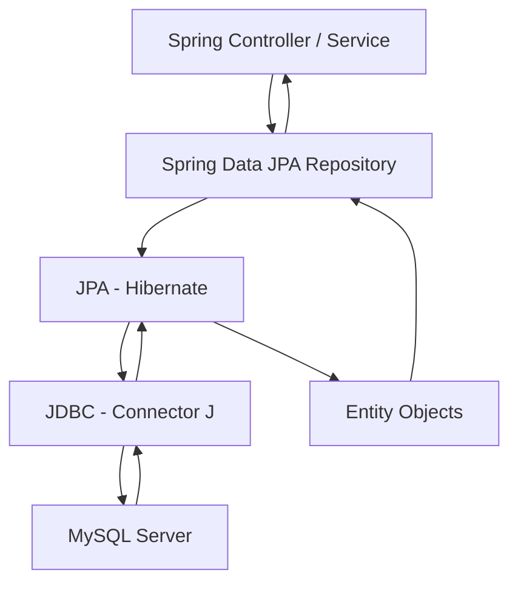

# How to Use MySQL with Spring Data JPA

Author: [nawazdhandala](https://www.github.com/nawazdhandala)

Tags: MySQL, Java, Spring Boot, Spring Data JPA, ORM, Database

Description: Learn how to use Spring Data JPA with MySQL in a Spring Boot application to define repositories, run queries, and manage transactions with minimal boilerplate.

---

## How Spring Data JPA Works with MySQL

Spring Data JPA sits on top of JPA (typically Hibernate) and generates repository implementations automatically from interface method signatures. Spring Boot auto-configures the DataSource, EntityManagerFactory, and transaction management when the right dependencies are on the classpath.



## Maven Dependencies

```xml
<dependencies>
    <dependency>
        <groupId>org.springframework.boot</groupId>
        <artifactId>spring-boot-starter-data-jpa</artifactId>
    </dependency>
    <dependency>
        <groupId>com.mysql</groupId>
        <artifactId>mysql-connector-j</artifactId>
        <scope>runtime</scope>
    </dependency>
</dependencies>
```

## application.properties

```properties
spring.datasource.url=jdbc:mysql://localhost:3306/myapp?serverTimezone=UTC&characterEncoding=utf8mb4
spring.datasource.username=appuser
spring.datasource.password=secret
spring.datasource.driver-class-name=com.mysql.cj.jdbc.Driver

spring.jpa.database-platform=org.hibernate.dialect.MySQLDialect
spring.jpa.hibernate.ddl-auto=validate
spring.jpa.show-sql=false
spring.jpa.properties.hibernate.format_sql=true

spring.datasource.hikari.maximum-pool-size=10
spring.datasource.hikari.minimum-idle=2
```

## Entity Class

```java
package com.example.model;

import jakarta.persistence.*;
import java.time.LocalDateTime;
import java.util.List;

@Entity
@Table(name = "users")
public class User {

    @Id
    @GeneratedValue(strategy = GenerationType.IDENTITY)
    private Long id;

    @Column(nullable = false, length = 100)
    private String name;

    @Column(nullable = false, unique = true, length = 150)
    private String email;

    @Column(nullable = false, length = 20)
    private String role = "user";

    @Column(name = "created_at", nullable = false, updatable = false)
    private LocalDateTime createdAt = LocalDateTime.now();

    @OneToMany(mappedBy = "user", fetch = FetchType.LAZY, cascade = CascadeType.ALL)
    private List<Post> posts;

    // Constructors
    public User() {}
    public User(String name, String email) {
        this.name = name;
        this.email = email;
    }
    // Getters and setters omitted for brevity
    public Long getId() { return id; }
    public String getName() { return name; }
    public void setName(String name) { this.name = name; }
    public String getEmail() { return email; }
    public String getRole() { return role; }
    public void setRole(String role) { this.role = role; }
}
```

## Repository Interface

Spring Data JPA generates implementation at runtime:

```java
package com.example.repository;

import com.example.model.User;
import org.springframework.data.jpa.repository.JpaRepository;
import org.springframework.data.jpa.repository.Query;
import org.springframework.data.repository.query.Param;

import java.util.List;
import java.util.Optional;

public interface UserRepository extends JpaRepository<User, Long> {

    // Derived query methods - Spring generates SQL from method name:
    Optional<User> findByEmail(String email);
    List<User> findByRole(String role);
    List<User> findByNameContainingIgnoreCase(String keyword);
    long countByRole(String role);
    void deleteByEmail(String email);

    // Custom JPQL query:
    @Query("SELECT u FROM User u WHERE u.role = :role ORDER BY u.name")
    List<User> findAdmins(@Param("role") String role);

    // Native SQL query:
    @Query(value = "SELECT * FROM users WHERE email LIKE :pattern", nativeQuery = true)
    List<User> findByEmailPattern(@Param("pattern") String pattern);

    // Projection (return only selected fields):
    @Query("SELECT u.id AS id, u.name AS name, u.email AS email FROM User u WHERE u.role = :role")
    List<UserSummary> findSummaryByRole(@Param("role") String role);
}
```

## Projection Interface

```java
package com.example.repository;

public interface UserSummary {
    Long getId();
    String getName();
    String getEmail();
}
```

## Service Layer with Transactions

```java
package com.example.service;

import com.example.model.User;
import com.example.repository.UserRepository;
import org.springframework.stereotype.Service;
import org.springframework.transaction.annotation.Transactional;

import java.util.List;
import java.util.Optional;

@Service
public class UserService {

    private final UserRepository userRepository;

    public UserService(UserRepository userRepository) {
        this.userRepository = userRepository;
    }

    @Transactional
    public User createUser(String name, String email) {
        if (userRepository.findByEmail(email).isPresent()) {
            throw new IllegalArgumentException("Email already registered: " + email);
        }
        return userRepository.save(new User(name, email));
    }

    @Transactional(readOnly = true)
    public Optional<User> findById(Long id) {
        return userRepository.findById(id);
    }

    @Transactional(readOnly = true)
    public List<User> listByRole(String role) {
        return userRepository.findByRole(role);
    }

    @Transactional
    public User updateRole(Long id, String newRole) {
        User user = userRepository.findById(id)
                .orElseThrow(() -> new RuntimeException("User not found: " + id));
        user.setRole(newRole);
        return userRepository.save(user);
    }

    @Transactional
    public void deleteUser(Long id) {
        userRepository.deleteById(id);
    }
}
```

## Pagination and Sorting

```java
import org.springframework.data.domain.Page;
import org.springframework.data.domain.PageRequest;
import org.springframework.data.domain.Sort;

// Page 0, 20 items per page, sorted by name ascending:
PageRequest pageable = PageRequest.of(0, 20, Sort.by("name").ascending());
Page<User> page = userRepository.findAll(pageable);

System.out.println("Total: " + page.getTotalElements());
page.getContent().forEach(u -> System.out.println(u.getName()));
```

## Custom Query with @Modifying

For UPDATE and DELETE JPQL queries:

```java
@Modifying
@Query("UPDATE User u SET u.role = :newRole WHERE u.role = :oldRole")
int bulkUpdateRole(@Param("oldRole") String oldRole, @Param("newRole") String newRole);
```

Call with `@Transactional` on the service method.

## REST Controller Example

```java
@RestController
@RequestMapping("/api/users")
public class UserController {

    private final UserService userService;

    public UserController(UserService userService) {
        this.userService = userService;
    }

    @PostMapping
    public ResponseEntity<User> create(@RequestBody Map<String, String> body) {
        User user = userService.createUser(body.get("name"), body.get("email"));
        return ResponseEntity.status(HttpStatus.CREATED).body(user);
    }

    @GetMapping("/{id}")
    public ResponseEntity<User> getById(@PathVariable Long id) {
        return userService.findById(id)
                .map(ResponseEntity::ok)
                .orElse(ResponseEntity.notFound().build());
    }
}
```

## Best Practices

- Use `@Transactional(readOnly = true)` on read-only service methods to enable Hibernate read optimizations.
- Prefer `JpaRepository.save()` over `EntityManager.merge()` - it handles both INSERT and UPDATE correctly.
- Use projections (interface-based) to fetch only the columns you need, reducing network and memory overhead.
- Set `spring.jpa.hibernate.ddl-auto=validate` in production - never `create` or `update`.
- Use `@Query` with JPQL for complex queries rather than composing method names from many conditions.
- Enable `spring.jpa.open-in-view=false` (or remove the OSIV filter) in production to avoid lazy loading in the view layer.

## Summary

Spring Data JPA with MySQL in Spring Boot requires only configuration in `application.properties` and repository interfaces extending `JpaRepository`. Spring generates repository implementations at startup from method name conventions. Custom queries use `@Query` with JPQL or native SQL. The service layer uses `@Transactional` for atomic operations. Pagination is built in via `Pageable`. Spring Boot auto-configures HikariCP, the EntityManagerFactory, and transaction management, eliminating nearly all boilerplate code.
