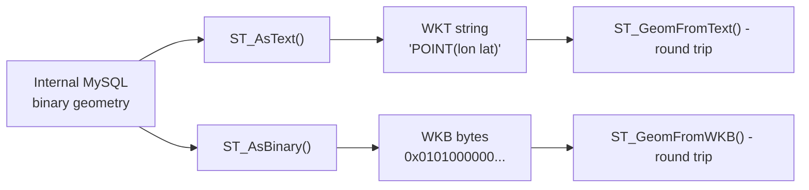

# How to Use ST_AsText() and ST_AsBinary() in MySQL

Author: [OneUptime](https://www.github.com/OneUptime)

Tags: MySQL, SQL, Spatial, GIS, Geometry, Database

Description: Learn how to use ST_AsText() and ST_AsBinary() in MySQL to convert geometry values to human-readable WKT and standard WKB binary formats for output and interoperability.

---

## What Are ST_AsText and ST_AsBinary

MySQL stores geometry values in an internal binary format. `ST_AsText()` and `ST_AsBinary()` convert that internal representation into standardized output formats:

- `ST_AsText()` converts a geometry to a Well-Known Text (WKT) string that is human-readable and understood by most GIS tools.
- `ST_AsBinary()` converts a geometry to a Well-Known Binary (WKB) byte sequence that is compact, portable, and suitable for binary transmission or storage outside MySQL.

Both functions are inverses of their counterparts: `ST_GeomFromText()` and `ST_GeomFromWKB()`.



## Syntax

```sql
ST_AsText(geometry)         -- returns WKT string
ST_AsWKT(geometry)          -- alias for ST_AsText

ST_AsBinary(geometry)       -- returns WKB blob
ST_AsWKB(geometry)          -- alias for ST_AsBinary

-- Reverse operations
ST_GeomFromText(wkt_string [, srid])
ST_GeomFromWKB(wkb_blob [, srid])
```

## Examples

### Basic Conversion to WKT

```sql
CREATE TABLE poi (
    id       INT   PRIMARY KEY AUTO_INCREMENT,
    name     VARCHAR(100),
    location POINT NOT NULL SRID 4326
);

INSERT INTO poi (name, location) VALUES
    ('Eiffel Tower',    ST_GeomFromText('POINT(2.2945 48.8584)',   4326)),
    ('Big Ben',         ST_GeomFromText('POINT(-0.1246 51.5007)', 4326)),
    ('Colosseum',       ST_GeomFromText('POINT(12.4922 41.8902)', 4326));

-- Convert geometry to WKT for display
SELECT name, ST_AsText(location) AS wkt
FROM poi;
```

```text
+---------------+-----------------------------+
| name          | wkt                         |
+---------------+-----------------------------+
| Eiffel Tower  | POINT(2.2945 48.8584)       |
| Big Ben       | POINT(-0.1246 51.5007)      |
| Colosseum     | POINT(12.4922 41.8902)      |
+---------------+-----------------------------+
```

### Convert to WKB for Binary Output

```sql
-- Returns a binary blob (HEX shown for readability)
SELECT name, HEX(ST_AsBinary(location)) AS wkb_hex
FROM poi
LIMIT 2;
```

```text
+---------------+------------------------------------------+
| name          | wkb_hex                                  |
+---------------+------------------------------------------+
| Eiffel Tower  | 010100000070CE88D2DE0B024023DBDE02098448 |
| Big Ben       | 0101000000D7A3703D0ACF3FBF000000A05D4940 |
+---------------+------------------------------------------+
```

### Round-Trip: ST_AsText then ST_GeomFromText

```sql
SELECT
    name,
    ST_AsText(
        ST_GeomFromText(
            ST_AsText(location),
            ST_SRID(location)
        )
    ) AS round_trip_wkt
FROM poi;
```

```text
+---------------+-----------------------------+
| name          | round_trip_wkt              |
+---------------+-----------------------------+
| Eiffel Tower  | POINT(2.2945 48.8584)       |
| Big Ben       | POINT(-0.1246 51.5007)      |
| Colosseum     | POINT(12.4922 41.8902)      |
+---------------+-----------------------------+
```

### ST_AsText for Complex Geometry Types

```sql
CREATE TABLE zones (
    id       INT     PRIMARY KEY AUTO_INCREMENT,
    name     VARCHAR(100),
    boundary POLYGON NOT NULL SRID 4326
);

INSERT INTO zones (name, boundary) VALUES
(
    'NYC Zone',
    ST_GeomFromText(
        'POLYGON((-74.02 40.70, -73.97 40.70, -73.97 40.73, -74.02 40.73, -74.02 40.70))',
        4326
    )
);

SELECT name, ST_AsText(boundary) AS boundary_wkt
FROM zones;
```

```text
+----------+--------------------------------------------------------------+
| name     | boundary_wkt                                                 |
+----------+--------------------------------------------------------------+
| NYC Zone | POLYGON((-74.02 40.7,-73.97 40.7,-73.97 40.73,-74.02 40.73,-74.02 40.7)) |
+----------+--------------------------------------------------------------+
```

### Use ST_AsBinary for Data Export

WKB is the standard binary format for exporting geometry data to GIS applications (QGIS, PostGIS, Shapefile exporters):

```sql
-- Export geometry as WKB for use in an external GIS tool
SELECT
    id,
    name,
    ST_AsBinary(location) AS wkb,
    ST_SRID(location)     AS srid
FROM poi;
```

### Use ST_AsText in WHERE Clause Debugging

```sql
-- Check what is stored in a row by converting to text
SELECT id, name, ST_AsText(location) AS coords
FROM poi
WHERE ST_AsText(location) LIKE 'POINT(2%';
```

```text
+----+---------------+----------------------------+
| id | name          | coords                     |
+----+---------------+----------------------------+
|  1 | Eiffel Tower  | POINT(2.2945 48.8584)      |
+----+---------------+----------------------------+
```

### GeoJSON Export (MySQL 8.0+)

For web and API use, `ST_AsGeoJSON` is often preferred over WKT:

```sql
SELECT name, ST_AsGeoJSON(location) AS geojson
FROM poi;
```

```text
+---------------+----------------------------------------------------------+
| name          | geojson                                                  |
+---------------+----------------------------------------------------------+
| Eiffel Tower  | {"type": "Point", "coordinates": [2.2945, 48.8584]}      |
| Big Ben       | {"type": "Point", "coordinates": [-0.1246, 51.5007]}     |
| Colosseum     | {"type": "Point", "coordinates": [12.4922, 41.8902]}     |
+---------------+----------------------------------------------------------+
```

## Output Format Comparison

| Function        | Output         | Human Readable | Standard  | Best For                       |
|-----------------|----------------|----------------|-----------|-------------------------------|
| ST_AsText       | WKT string     | Yes            | OGC WKT   | Debugging, display, round-trip|
| ST_AsBinary     | WKB blob       | No             | OGC WKB   | Binary export, GIS tools      |
| ST_AsGeoJSON    | GeoJSON string | Yes            | GeoJSON   | Web APIs, JavaScript maps     |

## Best Practices

- Use `ST_AsText` in `SELECT` statements when you want readable geometry output for debugging or display.
- Use `ST_AsBinary` when exchanging geometry data with external GIS systems that accept WKB.
- Do not compare geometry columns using string equality on `ST_AsText` output -- use spatial functions like `ST_Equals` for geometry equality checks.
- Use `ST_AsGeoJSON` for REST API responses when building map-based web applications.

## Summary

`ST_AsText(geom)` converts a geometry to a WKT string such as `POINT(2.29 48.86)`, making it readable and interoperable with any OGC-compatible tool. `ST_AsBinary(geom)` converts to compact WKB bytes suitable for binary exchange and export. Both can be reversed with `ST_GeomFromText` and `ST_GeomFromWKB`. Use `ST_AsGeoJSON` for web API output in GeoJSON format.
