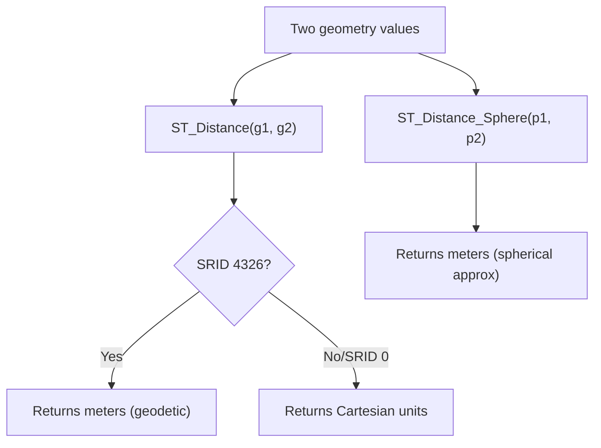

# How to Use ST_Distance() in MySQL for Distance Calculations

Author: [OneUptime](https://www.github.com/OneUptime)

Tags: MySQL, SQL, Spatial, GIS, ST_Distance, Database

Description: Learn how to use ST_Distance() and ST_Distance_Sphere() in MySQL to calculate distances between geometry values in meters and degrees with practical examples.

---

## What Is ST_Distance

`ST_Distance()` is a MySQL spatial function that returns the minimum distance between two geometry values. The behavior depends on the SRID of the geometries:

- With SRID 0 (Cartesian): returns the distance in the same linear units as the coordinates.
- With SRID 4326 (WGS84): MySQL 8.0+ returns the distance in meters along the geodetic ellipsoid.

`ST_Distance_Sphere()` calculates the great-circle distance in meters between two POINT values using the spherical earth model, and is available without requiring SRID 4326.



## Syntax

```sql
-- Geodetic distance (meters for SRID 4326, MySQL 8.0+)
ST_Distance(geometry1, geometry2)

-- Spherical approximation, always meters (accepts any SRID)
ST_Distance_Sphere(point1, point2)
ST_Distance_Sphere(point1, point2, radius)  -- custom sphere radius

-- Unit conversion
ST_Distance(g1, g2, 'metre')     -- explicit unit (MySQL 8.0.14+)
ST_Distance(g1, g2, 'foot')
ST_Distance(g1, g2, 'mile')
```

## Examples

### Setup: Cities Table

```sql
CREATE TABLE cities (
    id       INT          PRIMARY KEY AUTO_INCREMENT,
    name     VARCHAR(100) NOT NULL,
    location POINT        NOT NULL SRID 4326,
    SPATIAL INDEX idx_location (location)
);

INSERT INTO cities (name, location) VALUES
    ('New York',     ST_GeomFromText('POINT(-74.0060 40.7128)', 4326)),
    ('Los Angeles',  ST_GeomFromText('POINT(-118.2437 34.0522)', 4326)),
    ('Chicago',      ST_GeomFromText('POINT(-87.6298 41.8781)', 4326)),
    ('Houston',      ST_GeomFromText('POINT(-95.3698 29.7604)', 4326)),
    ('London',       ST_GeomFromText('POINT(-0.1276 51.5074)', 4326)),
    ('Paris',        ST_GeomFromText('POINT(2.3522 48.8566)', 4326));
```

### Calculate Distance Between All City Pairs

```sql
SELECT
    c1.name AS city_1,
    c2.name AS city_2,
    ROUND(ST_Distance_Sphere(c1.location, c2.location) / 1000, 1) AS distance_km
FROM cities c1
JOIN cities c2 ON c1.id < c2.id
ORDER BY distance_km;
```

```text
+-------------+-------------+-------------+
| city_1      | city_2      | distance_km |
+-------------+-------------+-------------+
| London      | Paris       |       341.5 |
| New York    | Chicago     |      1148.5 |
| Chicago     | Houston     |      1515.2 |
| New York    | Houston     |      2273.5 |
| New York    | Los Angeles |      3935.7 |
| Houston     | Los Angeles |      2206.5 |
| New York    | London      |      5570.2 |
| New York    | Paris       |      5836.3 |
| London      | Los Angeles |      8749.3 |
| Paris       | Los Angeles |      9082.6 |
+-------------+-------------+-------------+
```

### Find Cities Within a Radius

```sql
-- Find all cities within 2000 km of New York
SET @new_york = ST_GeomFromText('POINT(-74.0060 40.7128)', 4326);

SELECT
    name,
    ROUND(ST_Distance_Sphere(location, @new_york) / 1000, 1) AS distance_km
FROM cities
WHERE ST_Distance_Sphere(location, @new_york) <= 2000000  -- 2000 km in meters
ORDER BY distance_km;
```

```text
+----------+-------------+
| name     | distance_km |
+----------+-------------+
| New York |         0.0 |
| Chicago  |      1148.5 |
+----------+-------------+
```

### Use ST_Distance with SRID 4326 (MySQL 8.0+)

With SRID 4326 columns, `ST_Distance` returns meters using the geodetic ellipsoid model (slightly more accurate than the spherical model):

```sql
SELECT
    c1.name AS from_city,
    c2.name AS to_city,
    ROUND(ST_Distance(c1.location, c2.location) / 1000, 1) AS geodetic_km,
    ROUND(ST_Distance_Sphere(c1.location, c2.location) / 1000, 1) AS spherical_km
FROM cities c1
JOIN cities c2 ON c1.name = 'London' AND c2.name = 'Paris';
```

```text
+-----------+---------+-------------+--------------+
| from_city | to_city | geodetic_km | spherical_km |
+-----------+---------+-------------+--------------+
| London    | Paris   |       341.5 |        341.5 |
+-----------+---------+-------------+--------------+
```

### Distance in Different Units

```sql
-- Distance between New York and London in miles
SELECT
    ROUND(ST_Distance(
        ST_GeomFromText('POINT(-74.006 40.7128)', 4326),
        ST_GeomFromText('POINT(-0.1276 51.5074)', 4326),
        'mile'
    ), 1) AS distance_miles;
```

```text
+----------------+
| distance_miles |
+----------------+
|         3462.0 |
+----------------+
```

### Performance Pattern: Bounding Box + Exact Distance

`ST_Distance_Sphere` does not use a spatial index. For efficient radius queries, first narrow results with a spatial-indexed bounding box, then filter by exact distance:

```sql
SET @center = ST_GeomFromText('POINT(-74.006 40.7128)', 4326);
SET @radius_m = 1500000;  -- 1500 km

-- Rough bounding box: 1 degree latitude ~ 111 km
SET @lat_deg  = @radius_m / 111000;
SET @lon_deg  = @radius_m / (111000 * COS(RADIANS(40.7128)));

SET @bbox = ST_GeomFromText(CONCAT(
    'POLYGON((',
        -74.006 - @lon_deg, ' ', 40.7128 - @lat_deg, ',',
        -74.006 + @lon_deg, ' ', 40.7128 - @lat_deg, ',',
        -74.006 + @lon_deg, ' ', 40.7128 + @lat_deg, ',',
        -74.006 - @lon_deg, ' ', 40.7128 + @lat_deg, ',',
        -74.006 - @lon_deg, ' ', 40.7128 - @lat_deg,
    '))'
), 4326);

SELECT name,
       ROUND(ST_Distance_Sphere(location, @center) / 1000) AS distance_km
FROM cities
WHERE MBRContains(@bbox, location)
  AND ST_Distance_Sphere(location, @center) <= @radius_m
ORDER BY distance_km;
```

### Distance Between Non-Point Geometries

`ST_Distance` also works between LINESTRINGs and POLYGONs, returning the shortest distance between them:

```sql
SELECT ROUND(ST_Distance(
    ST_GeomFromText('LINESTRING(0 0, 1 0)', 0),
    ST_GeomFromText('POINT(0.5 1)', 0)
), 4) AS distance_from_line_to_point;
```

```text
+-----------------------------+
| distance_from_line_to_point |
+-----------------------------+
|                      1.0000 |
+-----------------------------+
```

## ST_Distance vs ST_Distance_Sphere

| Function              | Model         | Input       | Output Units          | Notes                    |
|-----------------------|---------------|-------------|----------------------|--------------------------|
| ST_Distance           | Geodetic (8.0)| Any geometry| Meters (SRID 4326)   | Most accurate for earth  |
| ST_Distance_Sphere    | Spherical     | POINT only  | Meters               | Faster, ~0.3% less accurate |
| ST_Distance (SRID 0)  | Cartesian     | Any geometry| Coordinate units     | For flat/planar data     |

## Best Practices

- Use `ST_Distance_Sphere` for fast proximity queries where a small error margin is acceptable.
- Use `ST_Distance` with SRID 4326 columns in MySQL 8.0+ for geodetically accurate measurements.
- Never rely solely on `ST_Distance_Sphere` for index-assisted queries; combine with a bounding box and spatial index.
- Divide meter results by 1000 to get kilometers, or use the `'mile'` unit parameter.

## Summary

`ST_Distance(g1, g2)` returns the minimum distance between two geometries. With SRID 4326 in MySQL 8.0+, it returns meters using the geodetic ellipsoid. `ST_Distance_Sphere(p1, p2)` gives a faster spherical approximation in meters for POINT values. For large-table radius searches, combine a `MBRContains` bounding box (spatial index) with `ST_Distance_Sphere` to get both performance and accuracy.
