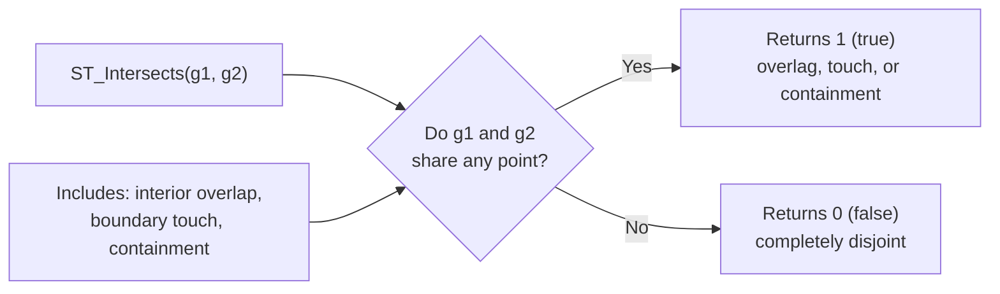

# How to Use ST_Intersects() in MySQL

Author: [nawazdhandala](https://www.github.com/nawazdhandala)

Tags: MySQL, SQL, Spatial, GIS, ST_Intersects, Database

Description: Learn how to use ST_Intersects() in MySQL to test whether two geometries share any common point, with overlap detection, route crossing, and spatial index examples.

---

## What Is ST_Intersects

`ST_Intersects(g1, g2)` is a MySQL spatial function that returns 1 (true) if geometries `g1` and `g2` have at least one point in common -- they overlap, touch, or one contains the other. It returns 0 if the geometries are completely disjoint (no common points at all).

`ST_Intersects` is the logical negation of `ST_Disjoint`: `ST_Intersects(a, b) = NOT ST_Disjoint(a, b)`.

Typical use cases include finding routes that cross a city boundary, detecting overlapping service areas, and identifying lines that pass through a region.



## Syntax

```sql
ST_Intersects(geometry1, geometry2)

-- Returns 1 if geometries share at least one point
-- Returns 0 if completely disjoint
-- Returns NULL if either argument is NULL

-- Related predicates
ST_Disjoint(g1, g2)   -- opposite: returns 1 if NO common points
ST_Overlaps(g1, g2)   -- stricter: same dimension, partial overlap
ST_Touches(g1, g2)    -- touch only on boundary, interiors disjoint
ST_Contains(g1, g2)   -- g1 completely contains g2
```

## Examples

### Setup: Regions and Routes

```sql
CREATE TABLE regions (
    id       INT          PRIMARY KEY AUTO_INCREMENT,
    name     VARCHAR(100) NOT NULL,
    boundary POLYGON      NOT NULL SRID 4326,
    SPATIAL INDEX idx_boundary (boundary)
);

CREATE TABLE routes (
    id      INT             PRIMARY KEY AUTO_INCREMENT,
    name    VARCHAR(100)    NOT NULL,
    path    LINESTRING      NOT NULL SRID 4326,
    SPATIAL INDEX idx_path (path)
);

INSERT INTO regions (name, boundary) VALUES
(
    'Zone A',
    ST_GeomFromText('POLYGON((-74.020 40.700, -73.970 40.700, -73.970 40.740, -74.020 40.740, -74.020 40.700))', 4326)
),
(
    'Zone B',
    ST_GeomFromText('POLYGON((-73.980 40.750, -73.940 40.750, -73.940 40.780, -73.980 40.780, -73.980 40.750))', 4326)
);

INSERT INTO routes (name, path) VALUES
(
    'Route 1',
    ST_GeomFromText('LINESTRING(-74.030 40.710, -73.960 40.720)', 4326)
),
(
    'Route 2',
    ST_GeomFromText('LINESTRING(-73.970 40.760, -73.950 40.770)', 4326)
),
(
    'Route 3',
    ST_GeomFromText('LINESTRING(-74.050 40.800, -74.030 40.820)', 4326)
);
```

### Find Routes That Cross a Region

```sql
SELECT r.name AS route, z.name AS zone
FROM routes r
JOIN regions z ON ST_Intersects(r.path, z.boundary)
ORDER BY r.name;
```

```text
+---------+--------+
| route   | zone   |
+---------+--------+
| Route 1 | Zone A |
| Route 2 | Zone B |
+---------+--------+
```

Route 3 is entirely outside both zones and does not appear.

### Test Two Geometries Directly

```sql
-- Do two polygons overlap?
SET @zone_a = ST_GeomFromText(
    'POLYGON((-74.020 40.700, -73.970 40.700, -73.970 40.740, -74.020 40.740, -74.020 40.700))',
    4326
);
SET @zone_b = ST_GeomFromText(
    'POLYGON((-73.980 40.720, -73.940 40.720, -73.940 40.760, -73.980 40.760, -73.980 40.720))',
    4326
);

SELECT ST_Intersects(@zone_a, @zone_b) AS zones_overlap;
```

```text
+---------------+
| zones_overlap |
+---------------+
| 1             |
+---------------+
```

### Find Overlapping Service Zones

```sql
-- Find pairs of regions that intersect each other
SELECT a.name AS region_1, b.name AS region_2
FROM regions a
JOIN regions b ON a.id < b.id
               AND ST_Intersects(a.boundary, b.boundary);
```

### ST_Intersects vs ST_Within vs ST_Overlaps

```sql
SET @point_in_zone_a = ST_GeomFromText('POINT(-74.000 40.715)', 4326);
SET @zone_a = (SELECT boundary FROM regions WHERE name = 'Zone A');

SELECT
    ST_Intersects(@point_in_zone_a, @zone_a)  AS intersects,
    ST_Within(@point_in_zone_a, @zone_a)      AS within,
    ST_Contains(@zone_a, @point_in_zone_a)    AS contains;
```

```text
+------------+--------+----------+
| intersects | within | contains |
+------------+--------+----------+
| 1          | 1      | 1        |
+------------+--------+----------+
```

For a point inside a polygon, all three return 1. The difference appears when geometries only touch boundaries or partially overlap.

### Boundary Touch Case

```sql
-- Point exactly on the boundary of Zone A
SET @boundary_point = ST_GeomFromText('POINT(-74.020 40.720)', 4326);
SET @zone = (SELECT boundary FROM regions WHERE name = 'Zone A');

SELECT
    ST_Intersects(@boundary_point, @zone) AS intersects,
    ST_Within(@boundary_point, @zone)     AS within;
```

```text
+------------+--------+
| intersects | within |
+------------+--------+
| 1          | 0      |
+------------+--------+
```

`ST_Intersects` returns 1 for boundary touches, while `ST_Within` requires the point to be strictly inside the interior.

### Detect No-Overlap (Disjoint Check)

```sql
-- Find routes that do NOT intersect any zone
SELECT r.name AS route
FROM routes r
WHERE NOT EXISTS (
    SELECT 1 FROM regions z
    WHERE ST_Intersects(r.path, z.boundary)
);
```

```text
+---------+
| route   |
+---------+
| Route 3 |
+---------+
```

### Use MBRIntersects for Index-Assisted Pre-filter

`MBRIntersects` uses the spatial index to check bounding box overlap, and can be combined with `ST_Intersects` for a two-step approach:

```sql
SELECT r.name, z.name
FROM routes r
JOIN regions z
ON MBRIntersects(r.path, z.boundary)        -- bounding box pre-filter (uses index)
   AND ST_Intersects(r.path, z.boundary);   -- exact test
```

## Predicate Comparison

| Predicate      | Returns 1 When                                     | Spatial Index |
|----------------|----------------------------------------------------|---------------|
| ST_Intersects  | Geometries share any point (overlap, touch, inside)| Yes           |
| ST_Within      | g1 is entirely inside g2's interior                | Yes           |
| ST_Contains    | g1 entirely contains g2                            | Yes           |
| ST_Disjoint    | Geometries share no points                         | Yes           |
| ST_Overlaps    | Same dimension, partial interior overlap           | Yes           |
| ST_Touches     | Only boundary contact, interiors disjoint          | Yes           |

## Best Practices

- Add `SPATIAL INDEX` on geometry columns used in `ST_Intersects` queries.
- Use `ST_Intersects` when you want boundary touches and containment both to count as matches.
- Use `ST_Within` when you need strict interior containment.
- For negative tests (find disjoint rows), use `NOT EXISTS` with `ST_Intersects` rather than `ST_Disjoint` for better readability.

## Summary

`ST_Intersects(g1, g2)` returns 1 whenever two geometries share at least one point, including interior overlap, boundary touch, and full containment. It is the most permissive spatial predicate and is backed by a spatial index. Use it for route-region crossing detection, overlap analysis, and geofencing where boundary contact should count as a hit. Use `ST_Within` for strict containment and `ST_Disjoint` to find non-intersecting pairs.
