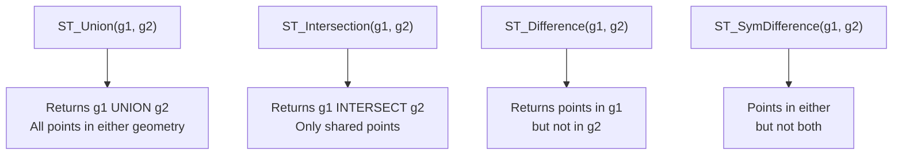

# How to Use ST_Union() and ST_Intersection() in MySQL

Author: [OneUptime](https://www.github.com/OneUptime)

Tags: MySQL, SQL, Spatial, GIS, Geometry, Database

Description: Learn how to use ST_Union() and ST_Intersection() in MySQL to merge and intersect geometry values for spatial analysis and area computation.

---

## What Are ST_Union and ST_Intersection

`ST_Union(g1, g2)` and `ST_Intersection(g1, g2)` are MySQL spatial functions that perform set-theoretic operations on geometry values:

- `ST_Union(g1, g2)` returns a geometry representing the combined area or shape of both inputs. The result includes all points that belong to either `g1` or `g2`.
- `ST_Intersection(g1, g2)` returns a geometry representing only the points that belong to both `g1` and `g2` simultaneously (the overlap region).

These functions are useful for computing merged delivery zones, finding overlapping service areas, and computing shared territory.



## Syntax

```sql
ST_Union(geometry1, geometry2)          -- combined area (OR)
ST_Intersection(geometry1, geometry2)   -- overlap area (AND)
ST_Difference(geometry1, geometry2)     -- g1 minus g2
ST_SymDifference(geometry1, geometry2)  -- exclusive OR

-- Check if there is an overlap before calling ST_Intersection
ST_Intersects(g1, g2)   -- returns 1 if any shared point exists
```

## Examples

### Setup: Two Overlapping Zones

```sql
-- Two rectangular zones that partially overlap
SET @zone_a = ST_GeomFromText(
    'POLYGON((0 0, 10 0, 10 10, 0 10, 0 0))',
    0
);

SET @zone_b = ST_GeomFromText(
    'POLYGON((5 5, 15 5, 15 15, 5 15, 5 5))',
    0
);
```

### Compute the Union of Two Zones

```sql
SET @union_result = ST_Union(@zone_a, @zone_b);

SELECT
    ST_GeometryType(@union_result)   AS type,
    ROUND(ST_Area(@union_result), 2) AS union_area,
    ROUND(ST_Area(@zone_a), 2)       AS area_a,
    ROUND(ST_Area(@zone_b), 2)       AS area_b;
```

```text
+----------+------------+--------+--------+
| type     | union_area | area_a | area_b |
+----------+------------+--------+--------+
| Polygon  |     175.00 | 100.00 | 100.00 |
+----------+------------+--------+--------+
```

Area A + Area B = 200, union = 175 because 25 units of overlap are counted once.

### Compute the Intersection of Two Zones

```sql
SET @intersection_result = ST_Intersection(@zone_a, @zone_b);

SELECT
    ST_GeometryType(@intersection_result)          AS type,
    ROUND(ST_Area(@intersection_result), 2)        AS overlap_area,
    ST_AsText(@intersection_result)                AS overlap_wkt;
```

```text
+----------+--------------+-----------------------------------+
| type     | overlap_area | overlap_wkt                       |
+----------+--------------+-----------------------------------+
| Polygon  |        25.00 | POLYGON((5 5,10 5,10 10,5 10,5 5))|
+----------+--------------+-----------------------------------+
```

The 5x5 square where both zones overlap has area = 25.

### Compute the Difference

```sql
-- What part of Zone A is NOT in Zone B?
SET @diff_result = ST_Difference(@zone_a, @zone_b);

SELECT
    ST_GeometryType(@diff_result)   AS type,
    ROUND(ST_Area(@diff_result), 2) AS exclusive_area_a;
```

```text
+----------+------------------+
| type     | exclusive_area_a |
+----------+------------------+
| Polygon  |            75.00 |
+----------+------------------+
```

### Real-World Example: Merged Delivery Zones

```sql
CREATE TABLE service_areas (
    id       INT          PRIMARY KEY AUTO_INCREMENT,
    company  VARCHAR(100) NOT NULL,
    region   POLYGON      NOT NULL SRID 0
);

INSERT INTO service_areas (company, region) VALUES
(
    'Courier Alpha',
    ST_GeomFromText('POLYGON((0 0, 40 0, 40 30, 0 30, 0 0))', 0)
),
(
    'Courier Beta',
    ST_GeomFromText('POLYGON((20 15, 60 15, 60 45, 20 45, 20 15))', 0)
);

-- Merged coverage area of both companies
SELECT
    ROUND(ST_Area(
        ST_Union(a.region, b.region)
    ), 2) AS combined_coverage,
    ROUND(ST_Area(
        ST_Intersection(a.region, b.region)
    ), 2) AS overlap_area
FROM service_areas a, service_areas b
WHERE a.company = 'Courier Alpha'
  AND b.company = 'Courier Beta';
```

```text
+--------------------+--------------+
| combined_coverage  | overlap_area |
+--------------------+--------------+
|            2900.00 |       250.00 |
+--------------------+--------------+
```

### Find Overlap Percentage Between Two Zones

```sql
SELECT
    ROUND(
        100.0 * ST_Area(ST_Intersection(a.region, b.region))
              / ST_Area(ST_Union(a.region, b.region)),
        2
    ) AS overlap_pct
FROM service_areas a, service_areas b
WHERE a.company = 'Courier Alpha'
  AND b.company = 'Courier Beta';
```

```text
+-------------+
| overlap_pct |
+-------------+
|        8.62 |
+-------------+
```

### Use ST_Intersection to Clip a Route to a Zone

```sql
-- Clip a road segment to only the portion inside a zone
SET @road = ST_GeomFromText('LINESTRING(-5 5, 50 5)', 0);
SET @zone = ST_GeomFromText('POLYGON((0 0, 30 0, 30 20, 0 20, 0 0))', 0);

SELECT
    ST_AsText(ST_Intersection(@road, @zone))   AS clipped_road,
    ROUND(ST_Length(ST_Intersection(@road, @zone)), 2) AS clipped_length;
```

```text
+-----------------------------+----------------+
| clipped_road                | clipped_length |
+-----------------------------+----------------+
| LINESTRING(0 5,30 5)        |          30.00 |
+-----------------------------+----------------+
```

### Check Before Intersecting

`ST_Intersection` on disjoint geometries returns an empty geometry. Always check with `ST_Intersects` first:

```sql
SET @g1 = ST_GeomFromText('POLYGON((0 0, 5 0, 5 5, 0 5, 0 0))', 0);
SET @g2 = ST_GeomFromText('POLYGON((10 10, 15 10, 15 15, 10 15, 10 10))', 0);

SELECT
    ST_Intersects(@g1, @g2) AS has_overlap,
    ST_IsEmpty(ST_Intersection(@g1, @g2)) AS intersection_empty;
```

```text
+-------------+--------------------+
| has_overlap | intersection_empty |
+-------------+--------------------+
| 0           | 1                  |
+-------------+--------------------+
```

## Operation Summary

| Function              | Returns                              | Use Case                           |
|-----------------------|--------------------------------------|-------------------------------------|
| ST_Union(a, b)        | All points in a OR b                 | Merge zones, combined coverage      |
| ST_Intersection(a, b) | Points in a AND b                    | Find overlap, clip geometries       |
| ST_Difference(a, b)   | Points in a but NOT b                | Exclusive zone, subtract area       |
| ST_SymDifference(a,b) | Points in a OR b but NOT both        | Exclusive regions, non-overlap area |

## Best Practices

- Always check `ST_Intersects(g1, g2)` before calling `ST_Intersection` to avoid operating on disjoint geometries.
- Use `ST_Area(ST_Intersection(a, b))` to compute the overlap area between two polygons.
- Combine `ST_Union` with aggregation using `ST_Collect` to merge many geometries.
- For SRID 4326, ensure both geometries use the same SRID before calling set operations.

## Summary

`ST_Union(g1, g2)` returns a geometry combining all points from both inputs. `ST_Intersection(g1, g2)` returns only the shared points. Use them to merge delivery zones, compute overlap areas, clip routes to regions, and measure coverage. Check `ST_Intersects` before calling `ST_Intersection` to handle disjoint geometries gracefully. Related functions `ST_Difference` and `ST_SymDifference` handle subtraction and exclusive regions.
