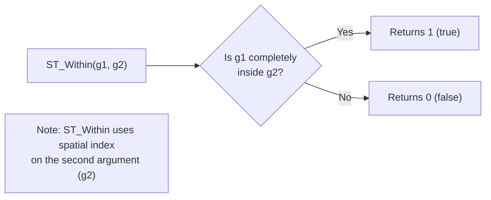

# How to Use ST_Within() in MySQL for Containment Queries

Author: [OneUptime](https://www.github.com/OneUptime)

Tags: MySQL, SQL, Spatial, GIS, ST_Within, Database

Description: Learn how to use ST_Within() in MySQL to test whether a geometry falls entirely inside another, with geofencing examples and spatial index usage.

---

## What Is ST_Within

`ST_Within(g1, g2)` is a MySQL spatial function that returns 1 (true) if geometry `g1` is completely inside geometry `g2`, and 0 (false) otherwise. A geometry is "within" another if every point of `g1` lies in the interior or boundary of `g2`, and at least one point of `g1` lies in the interior (not just on the boundary) of `g2`.

Common use cases include geofencing (is this delivery inside my zone?), geographic filtering (which stores are in this region?), and territory assignment.



## Syntax

```sql
ST_Within(geometry1, geometry2)

-- Returns 1 if geometry1 is completely inside geometry2
-- Returns 0 otherwise
-- Returns NULL if either argument is NULL

-- Related functions
ST_Contains(g1, g2)   -- opposite: g1 contains g2 (ST_Contains(g2,g1) == ST_Within(g1,g2))
MBRWithin(g1, g2)     -- bounding box version; uses spatial index, less precise
```

## Examples

### Setup: Stores and Delivery Zones

```sql
CREATE TABLE stores (
    id       INT          PRIMARY KEY AUTO_INCREMENT,
    name     VARCHAR(100) NOT NULL,
    location POINT        NOT NULL SRID 4326,
    SPATIAL INDEX idx_location (location)
);

CREATE TABLE delivery_zones (
    id       INT          PRIMARY KEY AUTO_INCREMENT,
    zone     VARCHAR(50)  NOT NULL,
    boundary POLYGON      NOT NULL SRID 4326,
    SPATIAL INDEX idx_boundary (boundary)
);

INSERT INTO stores (name, location) VALUES
    ('Store A', ST_GeomFromText('POINT(-74.000 40.715)', 4326)),
    ('Store B', ST_GeomFromText('POINT(-73.975 40.755)', 4326)),
    ('Store C', ST_GeomFromText('POINT(-87.630 41.878)', 4326)),
    ('Store D', ST_GeomFromText('POINT(-73.940 40.680)', 4326));

INSERT INTO delivery_zones (zone, boundary) VALUES
(
    'NYC Downtown',
    ST_GeomFromText('POLYGON((-74.020 40.700, -73.960 40.700, -73.960 40.730, -74.020 40.730, -74.020 40.700))', 4326)
),
(
    'NYC Midtown',
    ST_GeomFromText('POLYGON((-74.010 40.740, -73.960 40.740, -73.960 40.770, -74.010 40.770, -74.010 40.740))', 4326)
),
(
    'Chicago Loop',
    ST_GeomFromText('POLYGON((-87.645 41.868, -87.620 41.868, -87.620 41.890, -87.645 41.890, -87.645 41.868))', 4326)
);
```

### Check Which Zone a Store Is In

```sql
SELECT s.name AS store, d.zone
FROM stores s
JOIN delivery_zones d ON ST_Within(s.location, d.boundary)
ORDER BY s.name;
```

```text
+---------+--------------+
| store   | zone         |
+---------+--------------+
| Store A | NYC Downtown |
| Store B | NYC Midtown  |
| Store C | Chicago Loop |
+---------+--------------+
```

Store D (`-73.940 40.680`) falls outside all zones and does not appear.

### Test a Single Point Against a Polygon

```sql
-- Is a specific coordinate inside the NYC Downtown zone?
SET @delivery_point = ST_GeomFromText('POINT(-73.990 40.718)', 4326);
SET @downtown_zone  = (SELECT boundary FROM delivery_zones WHERE zone = 'NYC Downtown');

SELECT ST_Within(@delivery_point, @downtown_zone) AS is_in_downtown;
```

```text
+----------------+
| is_in_downtown |
+----------------+
| 1              |
+----------------+
```

### Find All Stores Inside a Region

```sql
-- Find all stores within a rough bounding area (cross-country delivery study)
SET @east_coast = ST_GeomFromText(
    'POLYGON((-80.000 38.000, -70.000 38.000, -70.000 45.000, -80.000 45.000, -80.000 38.000))',
    4326
);

SELECT name, ST_X(location) AS lon, ST_Y(location) AS lat
FROM stores
WHERE ST_Within(location, @east_coast);
```

```text
+---------+----------+---------+
| name    | lon      | lat     |
+---------+----------+---------+
| Store A | -74.000  | 40.715  |
| Store B | -73.975  | 40.755  |
+---------+----------+---------+
```

### ST_Within vs ST_Contains

`ST_Within(a, b)` and `ST_Contains(b, a)` are equivalent but use the spatial index differently:

```sql
-- These two queries are logically equivalent
-- ST_Within: spatial index on delivery_zones.boundary (second argument)
SELECT s.name FROM stores s
JOIN delivery_zones d ON ST_Within(s.location, d.boundary);

-- ST_Contains: spatial index on stores.location (second argument)
SELECT s.name FROM stores s
JOIN delivery_zones d ON ST_Contains(d.boundary, s.location);
```

MySQL can use the spatial index on the second argument of `ST_Within` and `ST_Contains`. If your large table is the zone table, use `ST_Within(point, zone)`. If the large table holds the points, use `ST_Contains(zone, point)`.

### Geofence Check in Application Logic

```sql
DELIMITER $$

CREATE FUNCTION is_in_delivery_zone(p_location POINT) RETURNS VARCHAR(50)
READS SQL DATA
BEGIN
    DECLARE zone_name VARCHAR(50);

    SELECT zone INTO zone_name
    FROM delivery_zones
    WHERE ST_Within(p_location, boundary)
    LIMIT 1;

    RETURN IFNULL(zone_name, 'No Zone');
END$$

DELIMITER ;

-- Test the function
SELECT is_in_delivery_zone(
    ST_GeomFromText('POINT(-74.000 40.715)', 4326)
) AS assigned_zone;
```

```text
+---------------+
| assigned_zone |
+---------------+
| NYC Downtown  |
+---------------+
```

### Handle Boundary Edge Cases

A point exactly on the boundary of a polygon returns 0 with `ST_Within` (the point must be in the interior):

```sql
-- Corner point of the NYC Downtown polygon boundary
SET @corner = ST_GeomFromText('POINT(-74.020 40.700)', 4326);
SET @downtown = (SELECT boundary FROM delivery_zones WHERE zone = 'NYC Downtown');

SELECT
    ST_Within(@corner, @downtown)   AS st_within_result,
    ST_Intersects(@corner, @downtown) AS st_intersects_result;
```

```text
+------------------+----------------------+
| st_within_result | st_intersects_result |
+------------------+----------------------+
| 0                | 1                    |
+------------------+----------------------+
```

Use `ST_Intersects` if you want boundary points to be included.

## Best Practices

- Add `SPATIAL INDEX` on the column used as the second argument in `ST_Within` for index-assisted queries.
- Use `MBRWithin` as a pre-filter before `ST_Within` for a two-step approach on non-indexed columns.
- Use `ST_Intersects` instead of `ST_Within` when you want points on the polygon boundary to count as "inside".
- Remember `ST_Within(g1, g2)` is not symmetric -- `ST_Within(zone, point)` will always return 0.

## Summary

`ST_Within(g1, g2)` returns 1 if geometry `g1` lies completely inside geometry `g2`. Use it for geofencing, zone assignment, and geographic containment queries. Combine with a `SPATIAL INDEX` on the second argument for efficient queries. Use `ST_Contains(g2, g1)` as the equivalent reverse form. Use `ST_Intersects` when boundary-touching should also count as a match.
