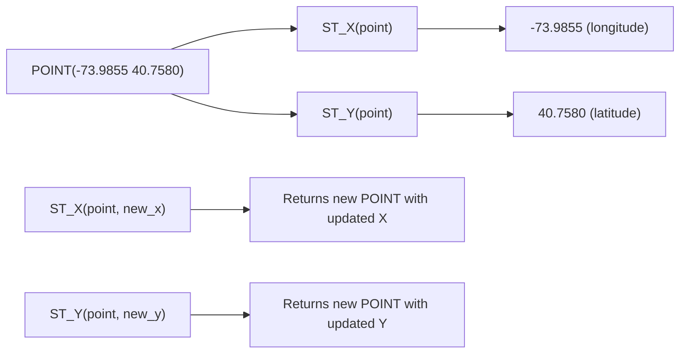

# How to Use ST_X() and ST_Y() in MySQL to Extract Coordinates

Author: [nawazdhandala](https://www.github.com/nawazdhandala)

Tags: MySQL, SQL, Spatial, GIS, Geometry, Database

Description: Learn how to use ST_X() and ST_Y() in MySQL to extract longitude and latitude from POINT geometry columns, including update usage and coordinate projection.

---

## What Are ST_X and ST_Y

`ST_X()` and `ST_Y()` are MySQL spatial functions that extract the X and Y coordinate values from a `POINT` geometry:

- `ST_X(point)` returns the X coordinate, which corresponds to longitude in geographic (WGS84) coordinate systems.
- `ST_Y(point)` returns the Y coordinate, which corresponds to latitude in geographic coordinate systems.

Both functions can also be used in their two-argument form to set the X or Y value, returning a new POINT with the updated coordinate.



## Syntax

```sql
-- Read coordinates
ST_X(point)           -- returns X (longitude)
ST_Y(point)           -- returns Y (latitude)

-- Set coordinate (returns new POINT, does not modify in place)
ST_X(point, new_x_value)
ST_Y(point, new_y_value)

-- Also available as
ST_Longitude(point)   -- alias for ST_X on geographic SRS
ST_Latitude(point)    -- alias for ST_Y on geographic SRS
```

## Examples

### Create a Table and Extract Coordinates

```sql
CREATE TABLE airports (
    id       INT          PRIMARY KEY AUTO_INCREMENT,
    name     VARCHAR(100) NOT NULL,
    iata     CHAR(3),
    location POINT        NOT NULL SRID 4326,
    SPATIAL INDEX idx_location (location)
);

INSERT INTO airports (name, iata, location) VALUES
    ('John F. Kennedy',    'JFK', ST_GeomFromText('POINT(-73.7781 40.6413)',  4326)),
    ('Los Angeles Intl',   'LAX', ST_GeomFromText('POINT(-118.4085 33.9425)', 4326)),
    ('Chicago O\'Hare',    'ORD', ST_GeomFromText('POINT(-87.9073 41.9742)',  4326)),
    ('Heathrow',           'LHR', ST_GeomFromText('POINT(-0.4543 51.4700)',   4326)),
    ('Charles de Gaulle',  'CDG', ST_GeomFromText('POINT(2.5479 49.0097)',    4326));

-- Extract coordinates
SELECT
    name,
    iata,
    ST_X(location) AS longitude,
    ST_Y(location) AS latitude
FROM airports
ORDER BY name;
```

```text
+---------------------+------+-------------+----------+
| name                | iata | longitude   | latitude |
+---------------------+------+-------------+----------+
| Charles de Gaulle   | CDG  |      2.5479 |  49.0097 |
| Chicago O'Hare      | ORD  |   -87.9073  |  41.9742 |
| Heathrow            | LHR  |    -0.4543  |  51.4700 |
| John F. Kennedy     | JFK  |   -73.7781  |  40.6413 |
| Los Angeles Intl    | LAX  |  -118.4085  |  33.9425 |
+---------------------+------+-------------+----------+
```

### Use ST_X and ST_Y in Arithmetic

Calculate the midpoint between two airports as a rough average of coordinates:

```sql
SELECT
    a1.name AS airport_1,
    a2.name AS airport_2,
    ROUND((ST_X(a1.location) + ST_X(a2.location)) / 2, 4) AS mid_longitude,
    ROUND((ST_Y(a1.location) + ST_Y(a2.location)) / 2, 4) AS mid_latitude
FROM airports a1
JOIN airports a2 ON a1.iata = 'JFK' AND a2.iata = 'LHR';
```

```text
+-----------------+----------+-----------------+--------------+
| airport_1       | airport_2| mid_longitude   | mid_latitude |
+-----------------+----------+-----------------+--------------+
| John F. Kennedy | Heathrow |        -37.1162 |      46.0557 |
+-----------------+----------+-----------------+--------------+
```

### Filter by Coordinate Range Using ST_X and ST_Y

```sql
-- Find airports in the Northern Hemisphere, West of Greenwich
SELECT name, iata,
       ST_X(location) AS lon,
       ST_Y(location) AS lat
FROM airports
WHERE ST_X(location) < 0
  AND ST_Y(location) > 0;
```

```text
+-----------------------+------+-----------+--------+
| name                  | iata | lon       | lat    |
+-----------------------+------+-----------+--------+
| John F. Kennedy       | JFK  | -73.7781  | 40.6413|
| Los Angeles Intl      | LAX  | -118.4085 | 33.9425|
| Chicago O'Hare        | ORD  | -87.9073  | 41.9742|
| Heathrow              | LHR  | -0.4543   | 51.4700|
+-----------------------+------+-----------+--------+
```

### Update Coordinates Using ST_X and ST_Y

The two-argument form returns a new POINT with the specified coordinate replaced:

```sql
-- Correct a slightly wrong longitude for an airport
UPDATE airports
SET location = ST_X(location, -73.7790)
WHERE iata = 'JFK';

-- Correct a latitude
UPDATE airports
SET location = ST_Y(location, 40.6420)
WHERE iata = 'JFK';

-- Verify
SELECT iata, ST_X(location) AS lon, ST_Y(location) AS lat
FROM airports
WHERE iata = 'JFK';
```

```text
+------+----------+----------+
| iata | lon      | lat      |
+------+----------+----------+
| JFK  | -73.7790 | 40.6420  |
+------+----------+----------+
```

### Use ST_Longitude and ST_Latitude (MySQL 8.0+)

For geographic SRS (SRID 4326), MySQL 8.0 provides named aliases:

```sql
SELECT
    name,
    ST_Longitude(location) AS longitude,
    ST_Latitude(location)  AS latitude
FROM airports
ORDER BY ST_Latitude(location) DESC;
```

```text
+---------------------+-----------+----------+
| name                | longitude | latitude |
+---------------------+-----------+----------+
| Heathrow            |   -0.4543 |  51.4700 |
| Charles de Gaulle   |    2.5479 |  49.0097 |
| Chicago O'Hare      |  -87.9073 |  41.9742 |
| John F. Kennedy     |  -73.7781 |  40.6413 |
| Los Angeles Intl    | -118.4085 |  33.9425 |
+---------------------+-----------+----------+
```

### Build a Bounding Box Filter Using Coordinates

```sql
-- Find airports within a lat/lon bounding box (without spatial index)
SELECT name, iata
FROM airports
WHERE ST_X(location) BETWEEN -130 AND -60
  AND ST_Y(location) BETWEEN 25  AND 50;
```

```text
+-----------------------+------+
| name                  | iata |
+-----------------------+------+
| John F. Kennedy       | JFK  |
| Los Angeles Intl      | LAX  |
| Chicago O'Hare        | ORD  |
+-----------------------+------+
```

For large tables, use `MBRContains` with a spatial index instead of `ST_X`/`ST_Y` range filters to take advantage of the R-tree index.

## Best Practices

- Use `ST_X` for longitude (horizontal) and `ST_Y` for latitude (vertical). This follows the OpenGIS convention but is the reverse of the common "lat, lon" verbal order.
- For updates, use `SET location = ST_X(location, new_lon)` rather than reconstructing the entire WKT string.
- Use `ST_Longitude` and `ST_Latitude` (MySQL 8.0+) for self-documenting code on SRID 4326 columns.
- Avoid `ST_X`/`ST_Y` range filters on large tables. Use a spatial index with `MBRContains` or `ST_Within` for indexed coordinate range queries.

## Summary

`ST_X(point)` returns the X coordinate (longitude) and `ST_Y(point)` returns the Y coordinate (latitude) from a POINT geometry. Use the two-argument form `ST_X(point, value)` to return a new POINT with an updated coordinate. MySQL 8.0+ also offers `ST_Longitude` and `ST_Latitude` as semantic aliases for SRID 4326 geometries. For coordinate-range queries on large tables, prefer spatial index functions over arithmetic comparisons on `ST_X`/`ST_Y` values.
