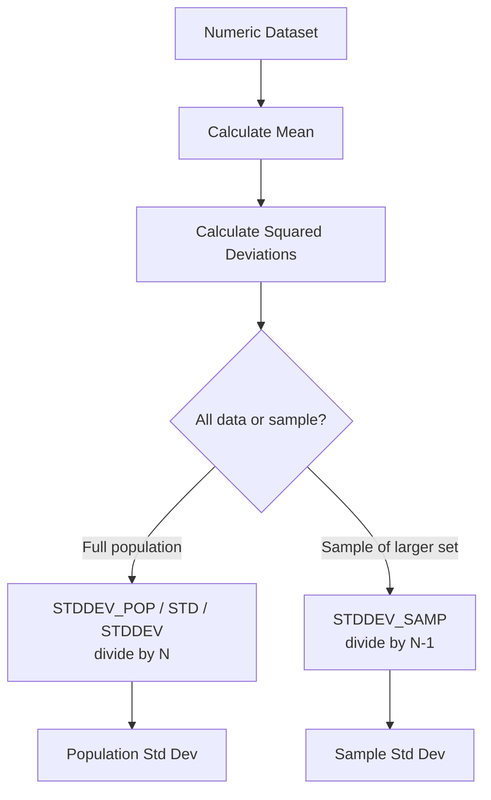

# How to Use STD() and STDDEV() Functions in MySQL

Author: [nawazdhandala](https://www.github.com/nawazdhandala)

Tags: MySQL, SQL, Aggregate Function, Statistical Function, Database

Description: Learn how to use MySQL STD(), STDDEV(), STDDEV_POP(), and STDDEV_SAMP() to measure data spread and variability in numeric datasets.

---

## What Standard Deviation Functions Do

Standard deviation measures how spread out values are around the mean. MySQL provides several aliases:

- `STD(expr)` - population standard deviation (alias for STDDEV_POP)
- `STDDEV(expr)` - population standard deviation (alias for STDDEV_POP)
- `STDDEV_POP(expr)` - population standard deviation (divides by N)
- `STDDEV_SAMP(expr)` - sample standard deviation (divides by N-1)

The distinction between population and sample standard deviation matters when you have a sample of a larger dataset (use STDDEV_SAMP) versus the entire population (use STDDEV_POP or STD/STDDEV).



## Syntax

```sql
STD(expression)
STDDEV(expression)
STDDEV_POP(expression)
STDDEV_SAMP(expression)
```

All are aggregate functions that ignore `NULL` values and return `NULL` if no non-NULL rows exist. `STDDEV_SAMP()` returns `NULL` when there is only one row in the group.

## Setup: Sample Table

```sql
CREATE TABLE sales (
    id         INT AUTO_INCREMENT PRIMARY KEY,
    rep        VARCHAR(50),
    region     VARCHAR(20),
    sale_amount DECIMAL(10, 2),
    sale_date  DATE
);

INSERT INTO sales (rep, region, sale_amount, sale_date) VALUES
('Alice', 'North', 1200.00, '2026-01-05'),
('Alice', 'North', 1850.00, '2026-01-12'),
('Alice', 'North', 1100.00, '2026-02-03'),
('Alice', 'North', 2300.00, '2026-02-20'),
('Alice', 'North', 950.00,  '2026-03-08'),
('Bob',   'South', 3200.00, '2026-01-07'),
('Bob',   'South', 3100.00, '2026-01-22'),
('Bob',   'South', 3400.00, '2026-02-14'),
('Bob',   'South', 2900.00, '2026-03-01'),
('Bob',   'South', 3050.00, '2026-03-19'),
('Carol', 'East',  500.00,  '2026-01-10'),
('Carol', 'East',  4500.00, '2026-02-05'),
('Carol', 'East',  800.00,  '2026-02-25'),
('Carol', 'East',  200.00,  '2026-03-12'),
('Carol', 'East',  3800.00, '2026-03-28');
```

## Basic Usage

```sql
SELECT
    rep,
    COUNT(*)                      AS sales_count,
    AVG(sale_amount)              AS avg_sale,
    STD(sale_amount)              AS std_pop,
    STDDEV_SAMP(sale_amount)      AS std_sample
FROM sales
GROUP BY rep
ORDER BY std_pop DESC;
```

```text
+-------+-------------+-----------+---------+------------+
| rep   | sales_count | avg_sale  | std_pop | std_sample |
+-------+-------------+-----------+---------+------------+
| Carol |           5 |  1960.00  | 1677.73 |    1876.12 |
| Alice |           5 |  1480.00  |  489.90 |     547.72 |
| Bob   |           5 |  3130.00  |  175.78 |     196.56 |
+-------+-------------+-----------+---------+------------+
```

Carol has the highest standard deviation, indicating highly inconsistent sale amounts.

## Overall Dataset Statistics

```sql
SELECT
    COUNT(*)                 AS total_sales,
    ROUND(AVG(sale_amount), 2) AS mean,
    ROUND(STD(sale_amount), 2) AS std_dev_pop,
    ROUND(MIN(sale_amount), 2) AS min_sale,
    ROUND(MAX(sale_amount), 2) AS max_sale
FROM sales;
```

## Identifying Outliers Using Standard Deviation

Values more than two standard deviations from the mean are often considered outliers:

```sql
SELECT
    rep,
    sale_amount,
    sale_date,
    ROUND(ABS(sale_amount - stats.mean) / stats.std_dev, 2) AS z_score
FROM sales
JOIN (
    SELECT
        AVG(sale_amount)  AS mean,
        STD(sale_amount)  AS std_dev
    FROM sales
) AS stats
WHERE ABS(sale_amount - stats.mean) > 2 * stats.std_dev
ORDER BY z_score DESC;
```

## Per-Region Consistency Analysis

```sql
SELECT
    region,
    COUNT(*)                         AS count,
    ROUND(AVG(sale_amount), 2)       AS avg_sale,
    ROUND(STD(sale_amount), 2)       AS std_dev,
    ROUND(STD(sale_amount) /
          AVG(sale_amount) * 100, 1) AS cv_pct   -- coefficient of variation
FROM sales
GROUP BY region
ORDER BY cv_pct DESC;
```

The coefficient of variation (CV) expresses standard deviation as a percentage of the mean, allowing comparison across regions with different average sale amounts.

## STD() vs STDDEV() vs STDDEV_POP() vs STDDEV_SAMP()

```sql
SELECT
    STD(sale_amount)         AS std_alias,
    STDDEV(sale_amount)      AS stddev_alias,
    STDDEV_POP(sale_amount)  AS pop,
    STDDEV_SAMP(sale_amount) AS samp
FROM sales;
```

`STD`, `STDDEV`, and `STDDEV_POP` all produce the same result. `STDDEV_SAMP` produces a slightly larger value because it uses N-1 in the denominator (Bessel's correction).

## Tracking Sales Consistency Over Time

```sql
SELECT
    YEAR(sale_date)                       AS yr,
    MONTH(sale_date)                      AS mo,
    COUNT(*)                              AS count,
    ROUND(AVG(sale_amount), 2)            AS avg_sale,
    ROUND(STDDEV_SAMP(sale_amount), 2)    AS std_dev
FROM sales
GROUP BY YEAR(sale_date), MONTH(sale_date)
ORDER BY yr, mo;
```

## NULL Handling

`STD()` and related functions ignore `NULL` values:

```sql
SELECT STD(val)
FROM (
    SELECT 10 AS val UNION ALL
    SELECT NULL       UNION ALL
    SELECT 20         UNION ALL
    SELECT 30
) t;
-- Calculates std dev of 10, 20, 30 only
```

## Summary

`STD()` and `STDDEV()` are aliases for `STDDEV_POP()`, which computes the population standard deviation by dividing by N. Use `STDDEV_SAMP()` when your data is a sample of a larger population, as it applies Bessel's correction (divides by N-1) for an unbiased estimate. High standard deviation relative to the mean indicates inconsistent or volatile data, making these functions useful for quality control, outlier detection, and performance analysis.
