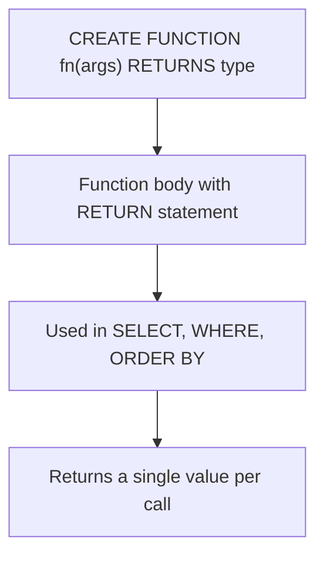

# How to Use MySQL Stored Functions

Author: [nawazdhandala](https://www.github.com/nawazdhandala)

Tags: MySQL, SQL, Stored Function, Database, Procedural SQL

Description: Learn how to create and use MySQL stored functions to encapsulate reusable calculation logic that can be called directly within SQL expressions.

---

## How Stored Functions Work

A stored function is similar to a stored procedure, but it returns a single value and can be used anywhere a scalar expression is valid - in SELECT lists, WHERE clauses, and ORDER BY. Unlike procedures (called with CALL), functions are invoked like built-in MySQL functions.

Key differences between functions and procedures:
- Functions return exactly one value; procedures can return multiple result sets and OUT parameters.
- Functions can be used in SQL expressions; procedures cannot.
- Functions must be `DETERMINISTIC` or `NOT DETERMINISTIC` (and `READS SQL DATA` or `MODIFIES SQL DATA`) declared explicitly.



## Syntax

```sql
DELIMITER $$

CREATE FUNCTION function_name(param1 DATATYPE, param2 DATATYPE)
RETURNS return_datatype
DETERMINISTIC
READS SQL DATA
BEGIN
    DECLARE result DATATYPE;
    -- Logic here
    RETURN result;
END$$

DELIMITER ;
```

Required attributes:
- `DETERMINISTIC` - same inputs always produce same output (pure calculation).
- `NOT DETERMINISTIC` - output may vary (e.g., depends on current time or random values).
- `READS SQL DATA` - reads from tables but does not modify them.
- `MODIFIES SQL DATA` - modifies tables (rarely used in functions).

## Examples

### Setup: Create Sample Tables

```sql
CREATE TABLE products (
    id INT PRIMARY KEY AUTO_INCREMENT,
    name VARCHAR(100) NOT NULL,
    price DECIMAL(10, 2),
    cost DECIMAL(10, 2),
    tax_rate DECIMAL(5, 4) DEFAULT 0.08
);

CREATE TABLE orders (
    id INT PRIMARY KEY AUTO_INCREMENT,
    product_id INT,
    quantity INT,
    discount_pct DECIMAL(5, 2) DEFAULT 0
);

INSERT INTO products (name, price, cost, tax_rate) VALUES
    ('Laptop',   999.99, 600.00, 0.08),
    ('Mouse',     29.99,  10.00, 0.08),
    ('Keyboard',  59.99,  20.00, 0.08),
    ('Desk',     349.99, 180.00, 0.05),
    ('Chair',    199.99,  90.00, 0.05);

INSERT INTO orders (product_id, quantity, discount_pct) VALUES
    (1, 3, 10), (2, 10, 0), (3, 5, 5), (4, 2, 15), (5, 4, 0);
```

### Simple Calculation Function

Create a function to compute the final price after tax.

```sql
DELIMITER $$

CREATE FUNCTION price_with_tax(p_price DECIMAL(10,2), p_tax_rate DECIMAL(5,4))
RETURNS DECIMAL(10,2)
DETERMINISTIC
BEGIN
    RETURN ROUND(p_price * (1 + p_tax_rate), 2);
END$$

DELIMITER ;

-- Use in SELECT
SELECT name, price, tax_rate,
       price_with_tax(price, tax_rate) AS final_price
FROM products;
```

```text
+----------+--------+----------+-------------+
| name     | price  | tax_rate | final_price |
+----------+--------+----------+-------------+
| Laptop   | 999.99 | 0.0800   | 1079.99     |
| Mouse    |  29.99 | 0.0800   |  32.39      |
| Keyboard |  59.99 | 0.0800   |  64.79      |
| Desk     | 349.99 | 0.0500   | 367.49      |
| Chair    | 199.99 | 0.0500   | 209.99      |
+----------+--------+----------+-------------+
```

### Function with Conditional Logic

Calculate profit margin percentage for a product.

```sql
DELIMITER $$

CREATE FUNCTION profit_margin_pct(p_price DECIMAL(10,2), p_cost DECIMAL(10,2))
RETURNS DECIMAL(5,2)
DETERMINISTIC
BEGIN
    IF p_price = 0 OR p_price IS NULL THEN
        RETURN 0.00;
    END IF;
    RETURN ROUND((p_price - p_cost) / p_price * 100, 2);
END$$

DELIMITER ;

SELECT name, price, cost,
       profit_margin_pct(price, cost) AS margin_pct
FROM products
ORDER BY margin_pct DESC;
```

```text
+----------+--------+--------+------------+
| name     | price  | cost   | margin_pct |
+----------+--------+--------+------------+
| Mouse    |  29.99 |  10.00 |  66.62     |
| Keyboard |  59.99 |  20.00 |  66.64     |
| Chair    | 199.99 |  90.00 |  54.99     |
| Desk     | 349.99 | 180.00 |  48.57     |
| Laptop   | 999.99 | 600.00 |  40.00     |
+----------+--------+--------+------------+
```

### Function That Reads from a Table

```sql
DELIMITER $$

CREATE FUNCTION get_category_avg_price(p_category VARCHAR(50))
RETURNS DECIMAL(10,2)
READS SQL DATA
DETERMINISTIC
BEGIN
    DECLARE avg_price DECIMAL(10,2);
    SELECT AVG(price) INTO avg_price
    FROM products
    WHERE category = p_category;
    RETURN IFNULL(avg_price, 0.00);
END$$

DELIMITER ;
```

Note: Functions that read tables should technically be declared `NOT DETERMINISTIC` if the underlying data can change - but MySQL allows `DETERMINISTIC` with `READS SQL DATA` for practical use.

### Function in WHERE and ORDER BY

Functions work anywhere a scalar value is valid.

```sql
-- Use function in WHERE clause
SELECT name, price FROM products
WHERE profit_margin_pct(price, cost) > 50;

-- Use function in ORDER BY
SELECT name, price, cost
FROM products
ORDER BY profit_margin_pct(price, cost) DESC;

-- Use function in a join's ON condition (less common but valid)
SELECT o.id, p.name,
       o.quantity * p.price * (1 - o.discount_pct / 100) AS line_total,
       price_with_tax(o.quantity * p.price * (1 - o.discount_pct / 100), p.tax_rate) AS total_with_tax
FROM orders o
INNER JOIN products p ON o.product_id = p.id;
```

### Managing Stored Functions

```sql
-- List all functions in the current database
SHOW FUNCTION STATUS WHERE Db = DATABASE();

-- View the CREATE statement
SHOW CREATE FUNCTION price_with_tax;

-- Drop a function
DROP FUNCTION IF EXISTS price_with_tax;
```

## Best Practices

- Use `DETERMINISTIC` for pure calculations (no side effects, no table reads). Use `READS SQL DATA` for functions that query tables.
- Keep functions small and focused on one calculation. Avoid complex multi-table logic in functions.
- Functions called in SELECT lists execute once per row - avoid expensive table reads inside functions applied to large result sets; use JOINs instead.
- Declare variables with `DECLARE` before using them.
- Use `IFNULL` or `COALESCE` in function returns to handle NULL inputs gracefully.
- Grant `EXECUTE` privilege on specific functions rather than blanket `EXECUTE` on the whole database.

## Summary

MySQL stored functions return a single value and can be used directly in SQL expressions. They are ideal for encapsulating reusable calculations - price calculations, formatting, business rule computations - that would otherwise be repeated across many queries. Unlike procedures, functions integrate seamlessly into SELECT, WHERE, and ORDER BY clauses. Keep functions deterministic and lightweight to avoid performance penalties when they are called once per row in large result sets.
