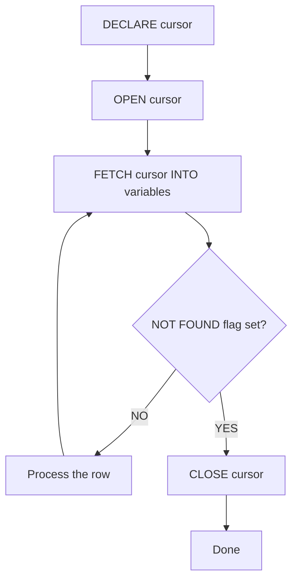
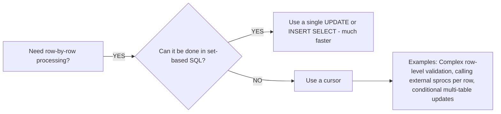

# How to Use Cursors in MySQL Stored Procedures

Author: [nawazdhandala](https://www.github.com/nawazdhandala)

Tags: MySQL, Stored Procedure, Cursor, SQL, Database

Description: Learn how to declare, open, fetch, and close cursors in MySQL stored procedures to iterate over query result sets row by row with a NOT FOUND handler.

---

## What is a Cursor?

A cursor is a database object that lets a stored procedure iterate over the rows of a query result set one at a time. It is used when set-based SQL is insufficient and row-by-row processing is required.



## Cursor Lifecycle

1. `DECLARE cursor_name CURSOR FOR select_statement` - defines the query.
2. `DECLARE CONTINUE HANDLER FOR NOT FOUND SET done = 1` - required to detect end of rows.
3. `OPEN cursor_name` - executes the query and positions before the first row.
4. `FETCH cursor_name INTO var1, var2, ...` - reads the next row into variables.
5. `CLOSE cursor_name` - releases the cursor's resources.

**Important rules:**
- Cursors must be declared before `DECLARE HANDLER` statements.
- Variable declarations come before cursor declarations.
- All cursors in a procedure are read-only and forward-only in MySQL.

## Setup: Sample Tables

```sql
CREATE TABLE employees (
    id         INT PRIMARY KEY AUTO_INCREMENT,
    name       VARCHAR(100),
    department VARCHAR(50),
    salary     DECIMAL(10,2)
);

CREATE TABLE salary_audit (
    emp_id     INT,
    emp_name   VARCHAR(100),
    old_salary DECIMAL(10,2),
    new_salary DECIMAL(10,2),
    changed_at DATETIME DEFAULT CURRENT_TIMESTAMP
);

INSERT INTO employees (name, department, salary) VALUES
    ('Alice', 'Engineering', 95000.00),
    ('Bob',   'Engineering', 65000.00),
    ('Carol', 'Marketing',   72000.00),
    ('Dave',  'Marketing',   68000.00),
    ('Eve',   'Finance',     80000.00);
```

## Basic Cursor Example

Apply a 10% raise to all Engineering employees and record the change in the audit table.

```sql
DELIMITER $$

CREATE PROCEDURE RaiseEngineeringStaff ()
BEGIN
    -- Variable declarations first
    DECLARE v_done     INT DEFAULT 0;
    DECLARE v_emp_id   INT;
    DECLARE v_emp_name VARCHAR(100);
    DECLARE v_salary   DECIMAL(10,2);

    -- Cursor declaration
    DECLARE emp_cursor CURSOR FOR
        SELECT id, name, salary
        FROM employees
        WHERE department = 'Engineering';

    -- Handler must come after cursor declaration
    DECLARE CONTINUE HANDLER FOR NOT FOUND SET v_done = 1;

    OPEN emp_cursor;

    read_loop: LOOP
        FETCH emp_cursor INTO v_emp_id, v_emp_name, v_salary;

        IF v_done = 1 THEN
            LEAVE read_loop;
        END IF;

        -- Log the old salary
        INSERT INTO salary_audit (emp_id, emp_name, old_salary, new_salary)
        VALUES (v_emp_id, v_emp_name, v_salary, v_salary * 1.10);

        -- Apply the raise
        UPDATE employees
        SET salary = salary * 1.10
        WHERE id = v_emp_id;

    END LOOP read_loop;

    CLOSE emp_cursor;
END$$

DELIMITER ;
```

```sql
CALL RaiseEngineeringStaff();

SELECT * FROM salary_audit;
SELECT id, name, salary FROM employees WHERE department = 'Engineering';
```

```text
+--------+----------+------------+------------+
| emp_id | emp_name | old_salary | new_salary |
+--------+----------+------------+------------+
|      1 | Alice    |   95000.00 |  104500.00 |
|      2 | Bob      |   65000.00 |   71500.00 |
+--------+----------+------------+------------+

+----+-------+-----------+
| id | name  | salary    |
+----+-------+-----------+
|  1 | Alice | 104500.00 |
|  2 | Bob   |  71500.00 |
+----+-------+-----------+
```

## The NOT FOUND Handler

The `NOT FOUND` condition fires when a `FETCH` finds no more rows. Without this handler, MySQL raises error 1329 (`No data`) when the cursor is exhausted.

```sql
-- Pattern: use a flag variable and CONTINUE handler
DECLARE v_done INT DEFAULT 0;
DECLARE CONTINUE HANDLER FOR NOT FOUND SET v_done = 1;

-- After the last FETCH, v_done becomes 1
-- Check the flag immediately after FETCH
FETCH cursor_name INTO ...;
IF v_done = 1 THEN
    LEAVE loop_label;
END IF;
```

The `CONTINUE HANDLER` is essential - use `CONTINUE`, not `EXIT`, so control returns to the statement after the FETCH and you can check the flag.

## Multiple Cursors in One Procedure

MySQL allows multiple cursors, but only one can be open at a time per nesting level.

```sql
DELIMITER $$

CREATE PROCEDURE SyncDepartmentStats ()
BEGIN
    DECLARE v_done     INT DEFAULT 0;
    DECLARE v_dept     VARCHAR(50);
    DECLARE v_count    INT;
    DECLARE v_avg      DECIMAL(10,2);

    DECLARE dept_cursor CURSOR FOR
        SELECT department, COUNT(*), AVG(salary)
        FROM employees
        GROUP BY department;

    DECLARE CONTINUE HANDLER FOR NOT FOUND SET v_done = 1;

    OPEN dept_cursor;

    dept_loop: LOOP
        FETCH dept_cursor INTO v_dept, v_count, v_avg;

        IF v_done = 1 THEN
            LEAVE dept_loop;
        END IF;

        -- Process each department row
        INSERT INTO audit_log (message)
        VALUES (CONCAT(v_dept, ': ', v_count, ' employees, avg salary ', v_avg));

    END LOOP dept_loop;

    CLOSE dept_cursor;
END$$

DELIMITER ;
```

## Cursor with OUT Parameter

Return the count of rows processed via an OUT parameter.

```sql
DELIMITER $$

CREATE PROCEDURE ProcessEmployees (
    IN  p_department VARCHAR(50),
    OUT p_processed  INT
)
BEGIN
    DECLARE v_done     INT DEFAULT 0;
    DECLARE v_emp_id   INT;
    DECLARE v_salary   DECIMAL(10,2);

    DECLARE emp_cursor CURSOR FOR
        SELECT id, salary
        FROM employees
        WHERE department = p_department;

    DECLARE CONTINUE HANDLER FOR NOT FOUND SET v_done = 1;

    SET p_processed = 0;

    OPEN emp_cursor;

    proc_loop: LOOP
        FETCH emp_cursor INTO v_emp_id, v_salary;

        IF v_done = 1 THEN
            LEAVE proc_loop;
        END IF;

        -- Business logic per row
        SET p_processed = p_processed + 1;

    END LOOP proc_loop;

    CLOSE emp_cursor;
END$$

DELIMITER ;
```

```sql
CALL ProcessEmployees('Engineering', @cnt);
SELECT @cnt AS rows_processed;
```

## When to Use Cursors



Cursors are slower than set-based SQL because they issue one DML per iteration. Use them only when the row-by-row logic genuinely cannot be expressed as a set operation.

## Best Practices

- Declare variables before cursors, and cursors before handlers - MySQL enforces this order.
- Always use `CONTINUE HANDLER FOR NOT FOUND`, not `EXIT HANDLER`, so the flag is set and control returns to your IF check.
- Reset the `v_done` flag to 0 before opening a second cursor if you reuse the variable.
- Close every cursor before the procedure returns to release memory.
- Wrap cursor loops in transactions when making DML changes to allow rollback on error.

## Summary

MySQL cursors let stored procedures process query result sets row by row. The lifecycle is: DECLARE, OPEN, loop with FETCH, check the NOT FOUND flag, then CLOSE. Always declare a `CONTINUE HANDLER FOR NOT FOUND` to detect when rows are exhausted. Use cursors sparingly - set-based SQL operations are significantly faster for large data volumes, but cursors are the right tool when per-row logic is genuinely complex.
