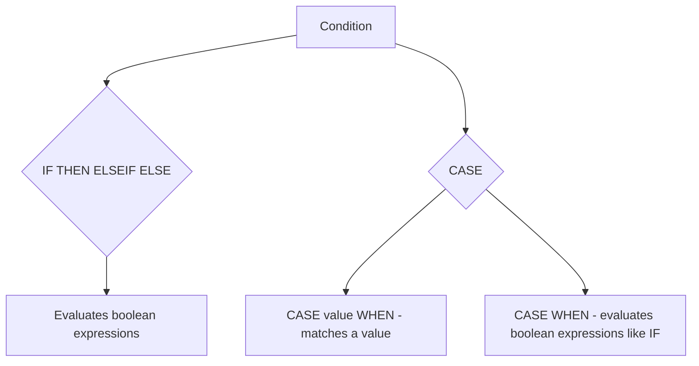

# How to Use IF THEN ELSE in MySQL Stored Procedures

Author: [nawazdhandala](https://www.github.com/nawazdhandala)

Tags: MySQL, Stored Procedure, SQL, Database, Programming

Description: Learn how to use IF THEN ELSEIF ELSE and CASE statements in MySQL stored procedures to implement conditional logic with practical business rule examples.

---

## Conditional Flow in Stored Procedures

MySQL stored procedures support two main conditional constructs:



## IF THEN ELSE Syntax

```sql
IF condition THEN
    -- statements
[ELSEIF condition2 THEN
    -- statements]
[ELSE
    -- statements]
END IF;
```

Note: The stored procedure `IF` statement is different from the `IF()` function used in SQL expressions. The statement form is only valid inside BEGIN...END blocks.

## Setup: Sample Table

```sql
CREATE TABLE employees (
    id         INT PRIMARY KEY AUTO_INCREMENT,
    name       VARCHAR(100),
    department VARCHAR(50),
    salary     DECIMAL(10,2),
    years_exp  INT
);

INSERT INTO employees (name, department, salary, years_exp) VALUES
    ('Alice', 'Engineering', 95000.00, 8),
    ('Bob',   'Engineering', 65000.00, 2),
    ('Carol', 'Marketing',   72000.00, 5),
    ('Dave',  'HR',          55000.00, 1);
```

## Basic IF THEN ELSE

Classify an employee as senior or junior based on years of experience.

```sql
DELIMITER $$

CREATE PROCEDURE ClassifyEmployee (
    IN  p_emp_id INT,
    OUT p_level  VARCHAR(20)
)
BEGIN
    DECLARE v_years INT;

    SELECT years_exp INTO v_years
    FROM employees
    WHERE id = p_emp_id;

    IF v_years >= 5 THEN
        SET p_level = 'Senior';
    ELSE
        SET p_level = 'Junior';
    END IF;
END$$

DELIMITER ;
```

```sql
CALL ClassifyEmployee(1, @level);
SELECT @level AS employee_level;

CALL ClassifyEmployee(2, @level);
SELECT @level AS employee_level;
```

```text
+----------------+
| employee_level |
+----------------+
| Senior         |
+----------------+

+----------------+
| employee_level |
+----------------+
| Junior         |
+----------------+
```

## Multiple ELSEIF Branches

Use ELSEIF to check multiple conditions in order. Only the first matching branch executes.

```sql
DELIMITER $$

CREATE PROCEDURE GetSalaryBand (
    IN  p_emp_id INT,
    OUT p_band   VARCHAR(20)
)
BEGIN
    DECLARE v_salary DECIMAL(10,2);

    SELECT salary INTO v_salary
    FROM employees
    WHERE id = p_emp_id;

    IF v_salary IS NULL THEN
        SET p_band = 'Unknown';
    ELSEIF v_salary >= 90000 THEN
        SET p_band = 'Band A';
    ELSEIF v_salary >= 70000 THEN
        SET p_band = 'Band B';
    ELSEIF v_salary >= 55000 THEN
        SET p_band = 'Band C';
    ELSE
        SET p_band = 'Band D';
    END IF;
END$$

DELIMITER ;
```

```sql
CALL GetSalaryBand(1, @band); SELECT @band;   -- Band A
CALL GetSalaryBand(3, @band); SELECT @band;   -- Band B
CALL GetSalaryBand(4, @band); SELECT @band;   -- Band C
```

## IF with DML Statements

Conditional logic commonly controls which DML statement executes.

```sql
DELIMITER $$

CREATE PROCEDURE AdjustSalary (
    IN p_emp_id    INT,
    IN p_action    VARCHAR(10),
    IN p_amount    DECIMAL(10,2)
)
BEGIN
    IF p_action = 'raise' THEN
        UPDATE employees
        SET salary = salary + p_amount
        WHERE id = p_emp_id;

    ELSEIF p_action = 'cut' THEN
        UPDATE employees
        SET salary = GREATEST(salary - p_amount, 30000.00)
        WHERE id = p_emp_id;

    ELSEIF p_action = 'set' THEN
        UPDATE employees
        SET salary = p_amount
        WHERE id = p_emp_id;

    ELSE
        SIGNAL SQLSTATE '45000'
            SET MESSAGE_TEXT = 'Invalid action. Use raise, cut, or set.';
    END IF;
END$$

DELIMITER ;
```

```sql
CALL AdjustSalary(2, 'raise', 5000.00);
SELECT name, salary FROM employees WHERE id = 2;
```

```text
+------+----------+
| name | salary   |
+------+----------+
| Bob  | 70000.00 |
+------+----------+
```

## Nested IF Statements

IF blocks can be nested for multi-dimensional logic.

```sql
DELIMITER $$

CREATE PROCEDURE GetBonus (
    IN  p_emp_id  INT,
    OUT p_bonus   DECIMAL(10,2)
)
BEGIN
    DECLARE v_dept   VARCHAR(50);
    DECLARE v_salary DECIMAL(10,2);
    DECLARE v_years  INT;

    SELECT department, salary, years_exp
    INTO v_dept, v_salary, v_years
    FROM employees
    WHERE id = p_emp_id;

    IF v_dept = 'Engineering' THEN
        IF v_years >= 5 THEN
            SET p_bonus = v_salary * 0.20;
        ELSE
            SET p_bonus = v_salary * 0.10;
        END IF;
    ELSEIF v_dept = 'Marketing' THEN
        SET p_bonus = v_salary * 0.15;
    ELSE
        SET p_bonus = v_salary * 0.05;
    END IF;
END$$

DELIMITER ;
```

```sql
CALL GetBonus(1, @bonus);
SELECT @bonus AS alice_bonus;
```

```text
+-------------+
| alice_bonus |
+-------------+
|   19000.00  |
+-------------+
```

## CASE Statement (searched form)

`CASE` in a stored procedure works like a more structured form of IF ELSEIF. The searched CASE is equivalent to IF:

```sql
DELIMITER $$

CREATE PROCEDURE GetDepartmentCode (
    IN  p_dept VARCHAR(50),
    OUT p_code CHAR(3)
)
BEGIN
    CASE
        WHEN p_dept = 'Engineering' THEN SET p_code = 'ENG';
        WHEN p_dept = 'Marketing'   THEN SET p_code = 'MKT';
        WHEN p_dept = 'HR'          THEN SET p_code = 'HRS';
        WHEN p_dept = 'Finance'     THEN SET p_code = 'FIN';
        ELSE SET p_code = 'UNK';
    END CASE;
END$$

DELIMITER ;
```

## CASE Statement (simple form)

Match a single value against multiple options.

```sql
DELIMITER $$

CREATE PROCEDURE GetDepartmentBudget (
    IN  p_dept   VARCHAR(50),
    OUT p_budget DECIMAL(12,2)
)
BEGIN
    CASE p_dept
        WHEN 'Engineering' THEN SET p_budget = 5000000.00;
        WHEN 'Marketing'   THEN SET p_budget = 2000000.00;
        WHEN 'HR'          THEN SET p_budget = 800000.00;
        WHEN 'Finance'     THEN SET p_budget = 1200000.00;
        ELSE SET p_budget = 500000.00;
    END CASE;
END$$

DELIMITER ;
```

Note: Unlike the `CASE` expression in SQL, the `CASE` statement in a stored procedure raises an error if no WHEN clause matches and there is no ELSE. Always include ELSE or handle the unmatched case with a DECLARE HANDLER.

## IF vs CASE: When to Use Which

- Use `IF THEN ELSEIF` when conditions involve ranges, NULL checks, or complex boolean expressions.
- Use `CASE` when matching a single variable against a fixed set of literal values.
- The `CASE` statement is often more readable for dispatch logic (mapping codes to actions).

## Best Practices

- Always include an `ELSE` branch in IF and CASE statements to handle unexpected values.
- Avoid deeply nested IF blocks; extract complex logic into helper functions.
- Use `SIGNAL` to raise an error from the ELSE branch when an unexpected input is a programming error.
- Test each branch independently to verify correct behavior.

## Summary

MySQL stored procedures use `IF THEN ELSEIF ELSE END IF` for conditional branching and `CASE WHEN ... END CASE` for structured dispatch. Both constructs can control DML statements, call subprocedures, set variables, or signal errors. Use IF for range-based and complex boolean conditions, and CASE for value-matching logic. Always provide an ELSE branch to handle unexpected input and signal meaningful errors.
