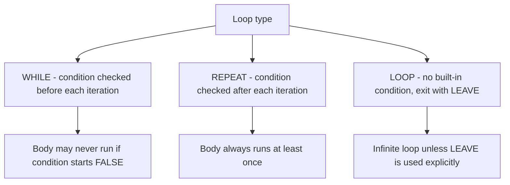
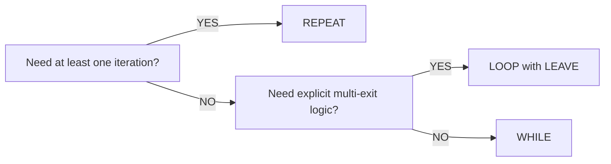

# How to Use LOOP and REPEAT in MySQL Stored Procedures

Author: [nawazdhandala](https://www.github.com/nawazdhandala)

Tags: MySQL, Stored Procedure, SQL, Database, Programming

Description: Learn how to use the LOOP and REPEAT constructs in MySQL stored procedures, when to choose each over WHILE, and how to use LEAVE and ITERATE for flow control.

---

## Three Loop Constructs in MySQL

MySQL stored procedures provide three iterative constructs:



## LOOP Syntax

`LOOP` has no built-in exit condition. You must use `LEAVE` to break out.

```sql
[label:] LOOP
    -- statements
    IF condition THEN
        LEAVE label;
    END IF;
END LOOP [label];
```

## REPEAT Syntax

`REPEAT` executes the body at least once, then checks the condition. It exits when the condition becomes TRUE (opposite of WHILE, which exits when FALSE).

```sql
[label:] REPEAT
    -- statements
UNTIL condition
END REPEAT [label];
```

## Setup: Sample Tables

```sql
CREATE TABLE fibonacci (
    position INT PRIMARY KEY,
    value    BIGINT
);

CREATE TABLE audit_log (
    id         INT PRIMARY KEY AUTO_INCREMENT,
    message    VARCHAR(200),
    logged_at  DATETIME DEFAULT CURRENT_TIMESTAMP
);
```

## LOOP Example: Generate Fibonacci Numbers

```sql
DELIMITER $$

CREATE PROCEDURE GenerateFibonacci (
    IN p_count INT
)
BEGIN
    DECLARE v_a     BIGINT DEFAULT 0;
    DECLARE v_b     BIGINT DEFAULT 1;
    DECLARE v_temp  BIGINT;
    DECLARE v_pos   INT DEFAULT 1;

    TRUNCATE fibonacci;

    INSERT INTO fibonacci VALUES (1, 0);

    fib_loop: LOOP
        SET v_pos = v_pos + 1;

        IF v_pos > p_count THEN
            LEAVE fib_loop;
        END IF;

        SET v_temp = v_a + v_b;
        SET v_a    = v_b;
        SET v_b    = v_temp;

        INSERT INTO fibonacci VALUES (v_pos, v_a);
    END LOOP fib_loop;
END$$

DELIMITER ;
```

```sql
CALL GenerateFibonacci(10);
SELECT * FROM fibonacci ORDER BY position;
```

```text
+----------+-------+
| position | value |
+----------+-------+
|        1 |     0 |
|        2 |     1 |
|        3 |     1 |
|        4 |     2 |
|        5 |     3 |
|        6 |     5 |
|        7 |     8 |
|        8 |    13 |
|        9 |    21 |
|       10 |    34 |
+----------+-------+
```

## LOOP with ITERATE (continue)

`ITERATE` skips the rest of the current iteration and jumps back to the loop condition check.

```sql
DELIMITER $$

CREATE PROCEDURE LogEvenNumbers (
    IN p_max INT
)
BEGIN
    DECLARE v_i INT DEFAULT 0;

    even_loop: LOOP
        SET v_i = v_i + 1;

        IF v_i > p_max THEN
            LEAVE even_loop;
        END IF;

        -- Skip odd numbers
        IF v_i MOD 2 != 0 THEN
            ITERATE even_loop;
        END IF;

        INSERT INTO audit_log (message)
        VALUES (CONCAT('Even number processed: ', v_i));
    END LOOP even_loop;
END$$

DELIMITER ;
```

```sql
CALL LogEvenNumbers(6);
SELECT message FROM audit_log ORDER BY id;
```

```text
+------------------------------+
| message                      |
+------------------------------+
| Even number processed: 2     |
| Even number processed: 4     |
| Even number processed: 6     |
+------------------------------+
```

## REPEAT Example: Poll Until Condition Met

`REPEAT` is ideal when the body must run at least once before the exit condition can be evaluated, such as polling a queue or waiting for a row to appear.

```sql
DELIMITER $$

CREATE PROCEDURE WaitForJobCompletion (
    IN  p_job_id      INT,
    IN  p_max_retries INT,
    OUT p_result      VARCHAR(50)
)
BEGIN
    DECLARE v_status   VARCHAR(20);
    DECLARE v_retries  INT DEFAULT 0;

    REPEAT
        SELECT status INTO v_status
        FROM batch_jobs
        WHERE id = p_job_id;

        SET v_retries = v_retries + 1;

        -- Simulate a small delay by doing lightweight work
        DO SLEEP(0);

    UNTIL v_status = 'done' OR v_retries >= p_max_retries
    END REPEAT;

    IF v_status = 'done' THEN
        SET p_result = CONCAT('Completed after ', v_retries, ' checks');
    ELSE
        SET p_result = CONCAT('Timed out after ', v_retries, ' checks');
    END IF;
END$$

DELIMITER ;
```

## REPEAT Example: Build a Comma-Separated List

```sql
DELIMITER $$

CREATE PROCEDURE BuildCSV (
    IN  p_max INT,
    OUT p_csv VARCHAR(1000)
)
BEGIN
    DECLARE v_i INT DEFAULT 1;

    SET p_csv = '';

    REPEAT
        IF p_csv != '' THEN
            SET p_csv = CONCAT(p_csv, ',');
        END IF;
        SET p_csv = CONCAT(p_csv, v_i);
        SET v_i = v_i + 1;
    UNTIL v_i > p_max
    END REPEAT;
END$$

DELIMITER ;
```

```sql
CALL BuildCSV(5, @csv);
SELECT @csv AS csv_result;
```

```text
+------------+
| csv_result |
+------------+
| 1,2,3,4,5  |
+------------+
```

## LOOP vs REPEAT vs WHILE: Comparison

| Feature | LOOP | REPEAT | WHILE |
|---|---|---|---|
| Condition check | Manual (LEAVE) | After each iteration | Before each iteration |
| Min iterations | 0 (LEAVE first) | 1 | 0 |
| Exit keyword | LEAVE | UNTIL ... END REPEAT | Condition becomes FALSE |
| Use case | Complex multi-exit logic | At-least-once polling | Standard counted loops |



## Nested Loops with Labels

Labels are required to distinguish LEAVE and ITERATE targets in nested loops.

```sql
DELIMITER $$

CREATE PROCEDURE MultiplicationTable (
    IN p_size INT
)
BEGIN
    DECLARE v_i INT DEFAULT 1;
    DECLARE v_j INT;

    outer_loop: LOOP
        IF v_i > p_size THEN
            LEAVE outer_loop;
        END IF;

        SET v_j = 1;

        inner_loop: LOOP
            IF v_j > p_size THEN
                LEAVE inner_loop;
            END IF;

            INSERT INTO audit_log (message)
            VALUES (CONCAT(v_i, ' x ', v_j, ' = ', v_i * v_j));

            SET v_j = v_j + 1;
        END LOOP inner_loop;

        SET v_i = v_i + 1;
    END LOOP outer_loop;
END$$

DELIMITER ;
```

## Best Practices

- Always label loops that use `LEAVE` or `ITERATE` to make the target explicit.
- Use `REPEAT` when you need the body to run at least once (user input validation, queue polling).
- Use `LOOP` when you need multiple exit points or complex break conditions.
- Use `WHILE` for standard counted loops where the condition can be evaluated before the first run.
- Add a safety counter to prevent infinite loops caused by logic bugs.

## Summary

MySQL stored procedures provide three loop types: `LOOP` (no built-in exit condition - requires LEAVE), `REPEAT` (exits when UNTIL condition is TRUE, always runs at least once), and `WHILE` (exits when condition is FALSE, may not run at all). Use `LEAVE` to break out of any loop and `ITERATE` to skip to the next iteration. Label loops when nesting or using flow control to identify the target loop explicitly.
