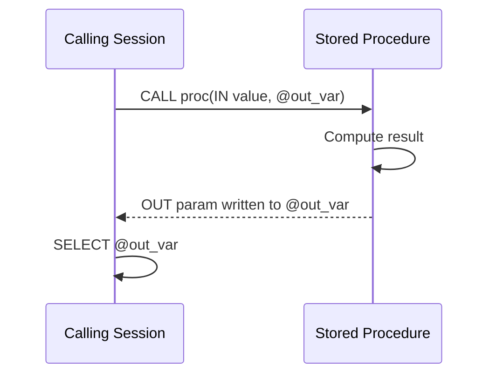

# How to Use Output Parameters in MySQL Stored Procedures

Author: [nawazdhandala](https://www.github.com/nawazdhandala)

Tags: MySQL, Stored Procedure, SQL, Database, Programming

Description: Learn how to use OUT and INOUT parameters in MySQL stored procedures to return computed values to the caller, with examples covering status codes, aggregates, and error signaling.

---

## What are Output Parameters?

Output parameters let a stored procedure communicate results back to the calling session without a result set. This is useful when you need to return a single scalar value, a status code, or multiple computed values alongside a result set.



MySQL provides two output parameter modes:

- `OUT` - the procedure writes a value; the initial value inside the procedure is always NULL.
- `INOUT` - the caller provides an initial value; the procedure can read and modify it; the final value is returned.

## Setup: Sample Tables

```sql
CREATE TABLE accounts (
    id      INT PRIMARY KEY AUTO_INCREMENT,
    owner   VARCHAR(100),
    balance DECIMAL(12,2) NOT NULL DEFAULT 0.00
);

CREATE TABLE transfers (
    id          INT PRIMARY KEY AUTO_INCREMENT,
    from_id     INT,
    to_id       INT,
    amount      DECIMAL(12,2),
    transferred_at DATETIME DEFAULT CURRENT_TIMESTAMP
);

INSERT INTO accounts (owner, balance) VALUES
    ('Alice', 5000.00),
    ('Bob',   2000.00),
    ('Carol', 8500.00);
```

## Basic OUT Parameter: Return a Computed Value

```sql
DELIMITER $$

CREATE PROCEDURE GetAccountBalance (
    IN  p_account_id INT,
    OUT p_balance    DECIMAL(12,2)
)
BEGIN
    SELECT balance INTO p_balance
    FROM accounts
    WHERE id = p_account_id;
END$$

DELIMITER ;
```

```sql
CALL GetAccountBalance(1, @bal);
SELECT @bal AS balance;
```

```text
+---------+
| balance |
+---------+
| 5000.00 |
+---------+
```

If the account does not exist, `@bal` remains NULL.

## Multiple OUT Parameters

Return several values in a single call.

```sql
DELIMITER $$

CREATE PROCEDURE GetAccountSummary (
    OUT p_count       INT,
    OUT p_total       DECIMAL(12,2),
    OUT p_avg         DECIMAL(12,2),
    OUT p_max_balance DECIMAL(12,2)
)
BEGIN
    SELECT
        COUNT(*),
        SUM(balance),
        AVG(balance),
        MAX(balance)
    INTO p_count, p_total, p_avg, p_max_balance
    FROM accounts;
END$$

DELIMITER ;
```

```sql
CALL GetAccountSummary(@cnt, @total, @avg, @max_bal);

SELECT
    @cnt      AS account_count,
    @total    AS total_balance,
    @avg      AS average_balance,
    @max_bal  AS max_balance;
```

```text
+---------------+---------------+-----------------+-------------+
| account_count | total_balance | average_balance | max_balance |
+---------------+---------------+-----------------+-------------+
|             3 |      15500.00 |      5166.666667|     8500.00 |
+---------------+---------------+-----------------+-------------+
```

## OUT Parameter as Status Code

A common pattern is to use an OUT parameter as a return code so the caller knows whether the operation succeeded.

```sql
DELIMITER $$

CREATE PROCEDURE TransferFunds (
    IN  p_from_id INT,
    IN  p_to_id   INT,
    IN  p_amount  DECIMAL(12,2),
    OUT p_status  VARCHAR(50)
)
BEGIN
    DECLARE v_balance DECIMAL(12,2);

    -- Check source balance
    SELECT balance INTO v_balance
    FROM accounts
    WHERE id = p_from_id
    FOR UPDATE;

    IF v_balance IS NULL THEN
        SET p_status = 'ERROR: Source account not found';
    ELSEIF v_balance < p_amount THEN
        SET p_status = 'ERROR: Insufficient funds';
    ELSE
        START TRANSACTION;

        UPDATE accounts SET balance = balance - p_amount WHERE id = p_from_id;
        UPDATE accounts SET balance = balance + p_amount WHERE id = p_to_id;

        INSERT INTO transfers (from_id, to_id, amount)
        VALUES (p_from_id, p_to_id, p_amount);

        COMMIT;
        SET p_status = 'SUCCESS';
    END IF;
END$$

DELIMITER ;
```

```sql
CALL TransferFunds(1, 2, 1000.00, @result);
SELECT @result AS transfer_status;

CALL TransferFunds(2, 3, 9999.00, @result);
SELECT @result AS transfer_status;
```

```text
+-----------------+
| transfer_status |
+-----------------+
| SUCCESS         |
+-----------------+

+----------------------------+
| transfer_status            |
+----------------------------+
| ERROR: Insufficient funds  |
+----------------------------+
```

## INOUT Parameter: Counter Accumulator

An INOUT parameter is useful when the caller maintains a running count that the procedure increments.

```sql
DELIMITER $$

CREATE PROCEDURE IncrementCounter (
    INOUT p_count INT,
    IN    p_increment INT
)
BEGIN
    SET p_count = p_count + p_increment;
END$$

DELIMITER ;
```

```sql
SET @counter = 0;
CALL IncrementCounter(@counter, 5);
CALL IncrementCounter(@counter, 3);
SELECT @counter AS final_count;
```

```text
+-------------+
| final_count |
+-------------+
|           8 |
+-------------+
```

## Combining Result Sets with OUT Parameters

A procedure can return both a result set and OUT parameters simultaneously.

```sql
DELIMITER $$

CREATE PROCEDURE GetTopAccounts (
    IN  p_limit     INT,
    OUT p_total_returned INT
)
BEGIN
    SELECT id, owner, balance
    FROM accounts
    ORDER BY balance DESC
    LIMIT p_limit;

    -- Also set the count of rows returned
    SET p_total_returned = p_limit;
END$$

DELIMITER ;
```

```sql
CALL GetTopAccounts(2, @returned);
SELECT @returned AS rows_in_result;
```

## OUT Parameters in Application Code

When calling MySQL from application code, output parameters are retrieved via session variables.

```sql
-- Python (mysql-connector-python) example pattern
-- cursor.callproc('GetAccountBalance', [1, 0])
-- result = cursor.fetchone()  # for result sets
-- output = connection.cmd_query('SELECT @_GetAccountBalance_1')

-- Node.js (mysql2) example pattern
-- await connection.query('CALL GetAccountBalance(?, @bal)', [1]);
-- const [[{ '@bal': balance }]] = await connection.query('SELECT @bal');
```

## Best Practices

- Use a `p_` prefix for parameters and `v_` prefix for local variables to prevent naming conflicts with column names.
- Always initialize OUT parameters at the start of the procedure body when there are early-return paths, to avoid returning stale NULL values.
- Use status code OUT parameters instead of relying only on exceptions for expected business logic failures (insufficient funds, not found, etc.).
- For complex error handling, combine OUT status parameters with `DECLARE HANDLER` to catch SQL exceptions.

## Summary

`OUT` parameters let MySQL stored procedures return computed scalar values directly to the calling session without a result set. Retrieve them with `@user_variables` after the CALL. Use multiple OUT parameters to return several values at once, and pair an `OUT p_status VARCHAR` parameter with business logic checks to communicate success or failure. `INOUT` parameters extend this by allowing the caller to provide an initial value that the procedure can modify.
