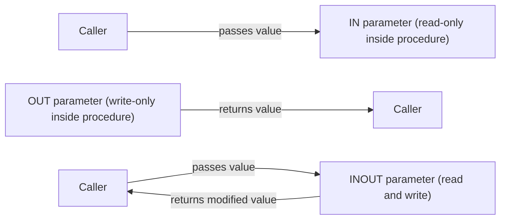

# How to Use Parameters in MySQL Stored Procedures

Author: [nawazdhandala](https://www.github.com/nawazdhandala)

Tags: MySQL, Stored Procedure, SQL, Database, Programming

Description: Learn how to declare and use IN, OUT, and INOUT parameters in MySQL stored procedures with practical examples for passing data into and out of procedure calls.

---

## Parameter Modes in MySQL

MySQL stored procedures support three parameter modes:



- `IN` - the caller provides a value; the procedure can read it but changes are not visible to the caller. This is the default if no mode is specified.
- `OUT` - the procedure writes a value; the caller reads it after the call. The initial value is always NULL inside the procedure.
- `INOUT` - the caller provides an initial value; the procedure can read and modify it; the modified value is returned to the caller.

## Syntax

```sql
CREATE PROCEDURE procedure_name (
    [IN | OUT | INOUT] parameter_name data_type,
    ...
)
BEGIN
    -- procedure body
END;
```

## Setup: Sample Table

```sql
CREATE TABLE orders (
    id         INT PRIMARY KEY AUTO_INCREMENT,
    customer   VARCHAR(100),
    amount     DECIMAL(10,2),
    status     VARCHAR(20) DEFAULT 'pending',
    created_at DATETIME DEFAULT CURRENT_TIMESTAMP
);

INSERT INTO orders (customer, amount, status) VALUES
    ('Alice',  250.00, 'completed'),
    ('Bob',    180.00, 'pending'),
    ('Carol',  320.00, 'completed'),
    ('Dave',   100.00, 'cancelled'),
    ('Eve',    450.00, 'completed');
```

## IN Parameters

Pass a customer name to retrieve their total spending.

```sql
DELIMITER $$

CREATE PROCEDURE GetCustomerTotal (
    IN p_customer VARCHAR(100)
)
BEGIN
    SELECT
        customer,
        COUNT(*)        AS order_count,
        SUM(amount)     AS total_spent
    FROM orders
    WHERE customer = p_customer
      AND status = 'completed'
    GROUP BY customer;
END$$

DELIMITER ;
```

```sql
-- Call the procedure with an IN parameter
CALL GetCustomerTotal('Alice');
```

```text
+----------+-------------+-------------+
| customer | order_count | total_spent |
+----------+-------------+-------------+
| Alice    |           1 |      250.00 |
+----------+-------------+-------------+
```

Multiple IN parameters work the same way.

```sql
DELIMITER $$

CREATE PROCEDURE GetOrdersByStatusAndMinAmount (
    IN p_status    VARCHAR(20),
    IN p_min_amount DECIMAL(10,2)
)
BEGIN
    SELECT id, customer, amount, status
    FROM orders
    WHERE status = p_status
      AND amount >= p_min_amount
    ORDER BY amount DESC;
END$$

DELIMITER ;

CALL GetOrdersByStatusAndMinAmount('completed', 300.00);
```

```text
+----+----------+--------+-----------+
| id | customer | amount | status    |
+----+----------+--------+-----------+
|  5 | Eve      | 450.00 | completed |
|  3 | Carol    | 320.00 | completed |
+----+----------+--------+-----------+
```

## OUT Parameters

Use OUT parameters to return a single computed value to the caller.

```sql
DELIMITER $$

CREATE PROCEDURE GetOrderCount (
    IN  p_status  VARCHAR(20),
    OUT p_count   INT
)
BEGIN
    SELECT COUNT(*) INTO p_count
    FROM orders
    WHERE status = p_status;
END$$

DELIMITER ;
```

```sql
-- Call with a user variable to receive the OUT value
CALL GetOrderCount('completed', @order_count);

-- Read the returned value
SELECT @order_count AS completed_orders;
```

```text
+------------------+
| completed_orders |
+------------------+
|                3 |
+------------------+
```

Multiple OUT parameters can return several values at once.

```sql
DELIMITER $$

CREATE PROCEDURE GetOrderStats (
    IN  p_status    VARCHAR(20),
    OUT p_count     INT,
    OUT p_total     DECIMAL(10,2),
    OUT p_avg       DECIMAL(10,2)
)
BEGIN
    SELECT COUNT(*), SUM(amount), AVG(amount)
    INTO p_count, p_total, p_avg
    FROM orders
    WHERE status = p_status;
END$$

DELIMITER ;

CALL GetOrderStats('completed', @cnt, @total, @avg);

SELECT
    @cnt   AS count,
    @total AS total,
    @avg   AS average;
```

```text
+-------+---------+-----------+
| count | total   | average   |
+-------+---------+-----------+
|     3 | 1020.00 | 340.000000|
+-------+---------+-----------+
```

## INOUT Parameters

Use INOUT when the procedure needs to both read an incoming value and return a modified value.

```sql
DELIMITER $$

CREATE PROCEDURE ApplyDiscount (
    IN     p_discount_pct DECIMAL(5,2),
    INOUT  p_amount       DECIMAL(10,2)
)
BEGIN
    SET p_amount = p_amount * (1 - p_discount_pct / 100);
END$$

DELIMITER ;
```

```sql
SET @price = 250.00;
CALL ApplyDiscount(10.00, @price);
SELECT @price AS discounted_price;
```

```text
+------------------+
| discounted_price |
+------------------+
|           225.00 |
+------------------+
```

## Passing NULL to Parameters

You can pass NULL to an IN parameter. Always guard against NULL inside the procedure if needed.

```sql
DELIMITER $$

CREATE PROCEDURE GetOrders (
    IN p_status VARCHAR(20)
)
BEGIN
    IF p_status IS NULL THEN
        SELECT * FROM orders;
    ELSE
        SELECT * FROM orders WHERE status = p_status;
    END IF;
END$$

DELIMITER ;

-- Returns all orders
CALL GetOrders(NULL);
```

## Default Values for IN Parameters

MySQL does not support default parameter values natively. Simulate them with INOUT or by passing NULL and checking inside the procedure.

```sql
DELIMITER $$

CREATE PROCEDURE ListOrders (
    IN p_limit INT
)
BEGIN
    SET p_limit = COALESCE(p_limit, 10);
    SELECT * FROM orders LIMIT p_limit;
END$$

DELIMITER ;

CALL ListOrders(NULL);   -- uses default of 10
CALL ListOrders(3);      -- uses 3
```

## Best Practices

- Prefix parameter names (e.g., `p_`) to avoid conflicts with column names in SQL statements.
- Use user variables (`@var`) to capture OUT and INOUT values from CALL statements.
- OUT parameters return NULL if the procedure encounters an error before assigning them - check with DECLARE HANDLER when needed.
- Keep parameter lists short; if a procedure needs many parameters, consider passing JSON or using a staging table.

## Summary

MySQL stored procedure parameters come in three modes: `IN` for read-only input, `OUT` for write-only output returned to the caller, and `INOUT` for values that are both read on entry and written back on exit. Always use a `p_` prefix to avoid naming conflicts with column names, and use session user variables (`@var`) to capture OUT and INOUT values after a CALL.
