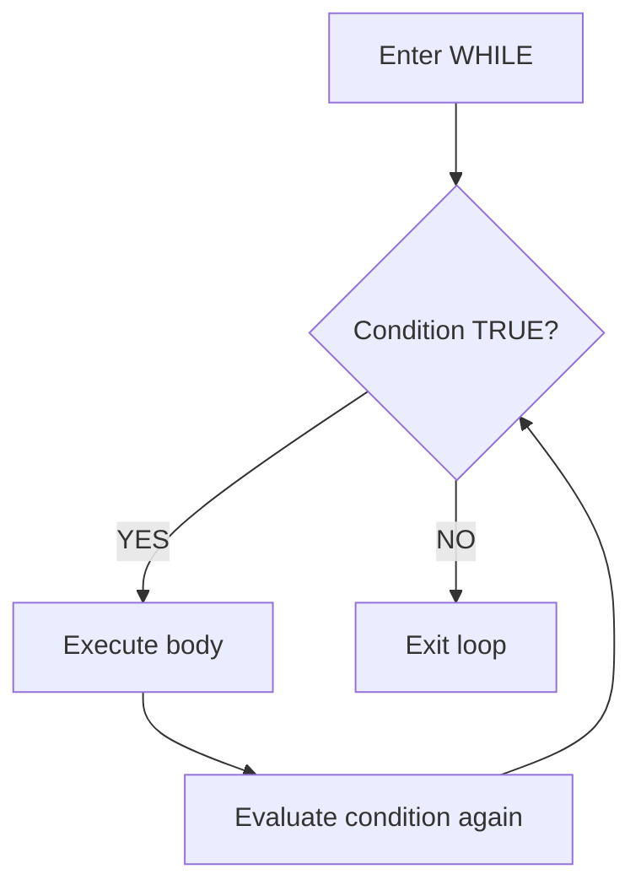

# How to Use WHILE Loop in MySQL Stored Procedures

Author: [nawazdhandala](https://www.github.com/nawazdhandala)

Tags: MySQL, Stored Procedure, SQL, Database, Programming

Description: Learn how to use WHILE loops in MySQL stored procedures to iterate over rows and perform repeated operations, with examples for batch processing and data generation.

---

## WHILE Loop Syntax

The `WHILE` loop evaluates a condition before each iteration. If the condition is FALSE on the first check, the body never executes.



```sql
WHILE condition DO
    -- statements
END WHILE;
```

Labels are optional but recommended for nested loops or when using `LEAVE` and `ITERATE`.

```sql
loop_label: WHILE condition DO
    -- statements
    LEAVE loop_label;    -- equivalent to break
    ITERATE loop_label;  -- equivalent to continue
END WHILE loop_label;
```

## Setup: Sample Tables

```sql
CREATE TABLE batch_jobs (
    id          INT PRIMARY KEY AUTO_INCREMENT,
    job_name    VARCHAR(100),
    status      VARCHAR(20) DEFAULT 'pending',
    processed_at DATETIME
);

CREATE TABLE numbers (
    n INT PRIMARY KEY
);

INSERT INTO batch_jobs (job_name) VALUES
    ('export_report'),
    ('send_emails'),
    ('cleanup_logs'),
    ('archive_orders'),
    ('sync_inventory');
```

## Basic WHILE Loop: Generate a Sequence

Insert numbers 1 through 10 into a table.

```sql
DELIMITER $$

CREATE PROCEDURE FillNumbers (
    IN p_max INT
)
BEGIN
    DECLARE v_i INT DEFAULT 1;

    WHILE v_i <= p_max DO
        INSERT IGNORE INTO numbers (n) VALUES (v_i);
        SET v_i = v_i + 1;
    END WHILE;
END$$

DELIMITER ;
```

```sql
CALL FillNumbers(10);
SELECT * FROM numbers ORDER BY n;
```

```text
+----+
| n  |
+----+
|  1 |
|  2 |
| ...|
| 10 |
+----+
```

## WHILE Loop with COUNT-Based Iteration

Process batch jobs one at a time using a counter.

```sql
DELIMITER $$

CREATE PROCEDURE ProcessBatchJobs ()
BEGIN
    DECLARE v_total INT;
    DECLARE v_current INT DEFAULT 1;
    DECLARE v_job_id INT;

    SELECT COUNT(*) INTO v_total
    FROM batch_jobs
    WHERE status = 'pending';

    WHILE v_current <= v_total DO
        -- Get the next pending job ID
        SELECT id INTO v_job_id
        FROM batch_jobs
        WHERE status = 'pending'
        ORDER BY id
        LIMIT 1;

        -- Mark it as processed
        UPDATE batch_jobs
        SET status = 'done',
            processed_at = NOW()
        WHERE id = v_job_id;

        SET v_current = v_current + 1;
    END WHILE;

    SELECT CONCAT('Processed ', v_total, ' jobs') AS result;
END$$

DELIMITER ;
```

```sql
CALL ProcessBatchJobs();
SELECT id, job_name, status, processed_at FROM batch_jobs;
```

```text
+-------------------+
| result            |
+-------------------+
| Processed 5 jobs  |
+-------------------+

+----+----------------+------+---------------------+
| id | job_name       | status | processed_at      |
+----+----------------+------+---------------------+
|  1 | export_report  | done | 2024-01-15 10:00:01 |
|  2 | send_emails    | done | 2024-01-15 10:00:01 |
| .. | ...            | done | ...                 |
+----+----------------+------+---------------------+
```

## WHILE Loop with Batch Size Limiting

Process rows in configurable batches to avoid long-running transactions.

```sql
DELIMITER $$

CREATE PROCEDURE ArchiveOldOrders (
    IN  p_batch_size INT,
    OUT p_total_archived INT
)
BEGIN
    DECLARE v_affected INT DEFAULT 1;
    SET p_total_archived = 0;

    WHILE v_affected > 0 DO
        -- Move old orders to archive in chunks
        INSERT INTO order_archive
        SELECT * FROM orders
        WHERE created_at < DATE_SUB(NOW(), INTERVAL 1 YEAR)
        LIMIT p_batch_size;

        SET v_affected = ROW_COUNT();

        DELETE FROM orders
        WHERE created_at < DATE_SUB(NOW(), INTERVAL 1 YEAR)
        LIMIT p_batch_size;

        SET p_total_archived = p_total_archived + v_affected;
    END WHILE;
END$$

DELIMITER ;
```

`ROW_COUNT()` returns the number of rows affected by the most recent DML statement, making it a reliable loop exit condition.

## WHILE Loop with LEAVE (break)

Exit the loop early when a condition is met.

```sql
DELIMITER $$

CREATE PROCEDURE FindFirstPrime (
    IN  p_start INT,
    OUT p_prime INT
)
BEGIN
    DECLARE v_n      INT DEFAULT p_start;
    DECLARE v_div    INT;
    DECLARE v_is_prime TINYINT;

    SET p_prime = NULL;

    search_loop: WHILE v_n <= 1000 DO
        SET v_div = 2;
        SET v_is_prime = 1;

        check_loop: WHILE v_div * v_div <= v_n DO
            IF v_n MOD v_div = 0 THEN
                SET v_is_prime = 0;
                LEAVE check_loop;
            END IF;
            SET v_div = v_div + 1;
        END WHILE check_loop;

        IF v_is_prime = 1 AND v_n > 1 THEN
            SET p_prime = v_n;
            LEAVE search_loop;
        END IF;

        SET v_n = v_n + 1;
    END WHILE search_loop;
END$$

DELIMITER ;
```

```sql
CALL FindFirstPrime(10, @prime);
SELECT @prime AS first_prime_from_10;
```

```text
+---------------------+
| first_prime_from_10 |
+---------------------+
|                  11 |
+---------------------+
```

## WHILE Loop with ITERATE (continue)

Skip an iteration without exiting the loop.

```sql
DELIMITER $$

CREATE PROCEDURE InsertOddNumbers (
    IN p_max INT
)
BEGIN
    DECLARE v_i INT DEFAULT 0;

    num_loop: WHILE v_i < p_max DO
        SET v_i = v_i + 1;

        -- Skip even numbers
        IF v_i MOD 2 = 0 THEN
            ITERATE num_loop;
        END IF;

        INSERT IGNORE INTO numbers (n) VALUES (v_i);
    END WHILE num_loop;
END$$

DELIMITER ;
```

## Best Practices

- Always modify the loop variable inside the loop body - failing to do so creates an infinite loop.
- Use `ROW_COUNT()` as a loop exit condition for batch DML operations.
- Add a safety counter (e.g., `v_iterations < 10000`) to prevent runaway loops caused by logic errors.
- Prefer set-based SQL operations (single UPDATE with LIMIT, bulk INSERT SELECT) over loops for large data volumes - they are orders of magnitude faster.
- Use labels on nested loops so `LEAVE` and `ITERATE` target the correct loop.

## Summary

The `WHILE` loop in MySQL stored procedures executes a block of statements repeatedly as long as the condition is TRUE. Use `LEAVE` to exit early (like break) and `ITERATE` to skip to the next iteration (like continue). WHILE loops are useful for batch processing, data generation, and polling-style logic, but should be replaced with set-based SQL whenever possible for performance.
