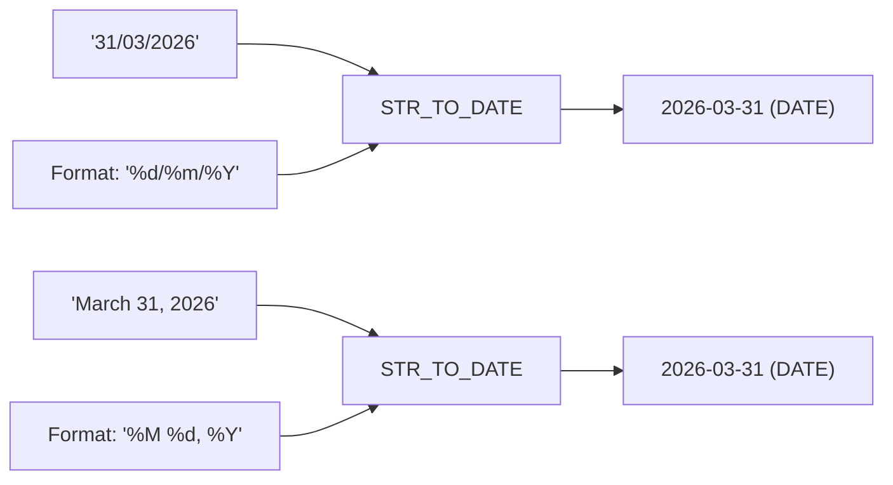

# How to Use MySQL STR_TO_DATE() for String-to-Date Conversion

Author: [nawazdhandala](https://www.github.com/nawazdhandala)

Tags: MySQL, SQL, Date Function, STR_TO_DATE, Data Import, Database

Description: Learn how to use MySQL STR_TO_DATE() to parse date strings in any format into proper DATE or DATETIME values for storage and comparison.

---

## How STR_TO_DATE Works

`STR_TO_DATE` is the inverse of `DATE_FORMAT`. It parses a string according to a format pattern and returns a `DATE`, `TIME`, or `DATETIME` value. This function is essential when importing data from external sources where dates arrive in non-standard formats such as `'March 31, 2026'`, `'31/03/2026'`, or `'03-31-2026 2:30PM'`.



## Syntax

```sql
STR_TO_DATE(str, format)
```

The format uses the same specifiers as `DATE_FORMAT`:

```text
%d  - Day as 01-31
%e  - Day as 1-31 (no leading zero)
%m  - Month number 01-12
%c  - Month number 1-12 (no leading zero)
%M  - Month name (January-December)
%b  - Abbreviated month (Jan-Dec)
%Y  - 4-digit year
%y  - 2-digit year
%H  - Hour 00-23
%h  - Hour 01-12
%i  - Minutes 00-59
%s  - Seconds 00-59
%p  - AM or PM
%T  - time as HH:MM:SS
%r  - time as hh:mm:ss AM/PM
```

## Setup: Sample Raw Import Table

```sql
CREATE TABLE raw_orders (
    id           INT AUTO_INCREMENT PRIMARY KEY,
    order_id_str VARCHAR(20),
    date_str     VARCHAR(50),
    date_format  VARCHAR(30),
    amount_str   VARCHAR(20)
);

INSERT INTO raw_orders (order_id_str, date_str, date_format, amount_str) VALUES
('ORD-001', '31/03/2026',          '%d/%m/%Y',     '299.99'),
('ORD-002', '03-31-2026',          '%m-%d-%Y',     '149.50'),
('ORD-003', 'March 31, 2026',      '%M %d, %Y',    '89.00'),
('ORD-004', '2026.03.31',          '%Y.%m.%d',     '459.00'),
('ORD-005', '31 Mar 2026 09:30',   '%d %b %Y %H:%i','199.99'),
('ORD-006', '03/31/2026 2:30PM',   '%m/%d/%Y %h:%i%p','79.00');
```

## Basic STR_TO_DATE Examples

**Parse different date string formats:**

```sql
SELECT
    date_str,
    STR_TO_DATE('31/03/2026',        '%d/%m/%Y')         AS eu_date,
    STR_TO_DATE('03-31-2026',        '%m-%d-%Y')         AS us_date,
    STR_TO_DATE('March 31, 2026',    '%M %d, %Y')        AS long_date,
    STR_TO_DATE('2026.03.31',        '%Y.%m.%d')         AS dot_date,
    STR_TO_DATE('31 Mar 2026 09:30', '%d %b %Y %H:%i')  AS abbr_datetime
FROM raw_orders LIMIT 1;
```

```text
+----------+------------+------------+------------+------------+---------------------+
| date_str | eu_date    | us_date    | long_date  | dot_date   | abbr_datetime       |
+----------+------------+------------+------------+------------+---------------------+
| 31/03... | 2026-03-31 | 2026-03-31 | 2026-03-31 | 2026-03-31 | 2026-03-31 09:30:00 |
+----------+------------+------------+------------+------------+---------------------+
```

## Parsing During Import (INSERT ... SELECT)

```sql
CREATE TABLE orders (
    id         INT AUTO_INCREMENT PRIMARY KEY,
    order_code VARCHAR(20),
    order_date DATE NOT NULL,
    amount     DECIMAL(10,2)
);

INSERT INTO orders (order_code, order_date, amount)
SELECT
    order_id_str,
    STR_TO_DATE(date_str, '%d/%m/%Y'),
    CAST(amount_str AS DECIMAL(10,2))
FROM raw_orders
WHERE date_format = '%d/%m/%Y'
  AND STR_TO_DATE(date_str, '%d/%m/%Y') IS NOT NULL;
```

## Handling NULL on Invalid Dates

`STR_TO_DATE` returns NULL when the string does not match the format or represents an invalid date. Use this to identify bad rows:

```sql
SELECT date_str, STR_TO_DATE(date_str, '%d/%m/%Y') AS parsed
FROM raw_orders
WHERE STR_TO_DATE(date_str, '%d/%m/%Y') IS NULL;
```

## Using STR_TO_DATE in WHERE Clauses

```sql
-- Find orders placed after a string date:
SELECT order_code, order_date
FROM orders
WHERE order_date > STR_TO_DATE('15/03/2026', '%d/%m/%Y');
```

Alternatively, convert the filter constant rather than the column to allow index use:

```sql
SELECT order_code, order_date
FROM orders
WHERE order_date > '2026-03-15';  -- MySQL accepts ISO format directly
```

## Parsing 12-Hour Clock Format

```sql
SELECT STR_TO_DATE('03/31/2026 2:30PM', '%m/%d/%Y %h:%i%p') AS parsed_datetime;
-- Result: 2026-03-31 14:30:00
```

## STR_TO_DATE vs. CAST

```text
Function              Input Example           Result
-----------           --------------          -------
STR_TO_DATE           '31/03/2026'           2026-03-31
CAST ... AS DATE      '31/03/2026'           NULL (non-ISO format fails)
CAST ... AS DATE      '2026-03-31'           2026-03-31 (ISO works)
```

Use `STR_TO_DATE` when the input is not in `YYYY-MM-DD` ISO format; use `CAST` for ISO-formatted strings.

## Mass Update: Fixing a VARCHAR Date Column

A common data migration task - converting a VARCHAR date column to a proper DATE:

```sql
ALTER TABLE raw_orders ADD COLUMN parsed_date DATE;

UPDATE raw_orders
SET parsed_date = STR_TO_DATE(date_str, date_format)
WHERE STR_TO_DATE(date_str, date_format) IS NOT NULL;

-- Log rows that failed to parse:
SELECT id, date_str, date_format
FROM raw_orders
WHERE parsed_date IS NULL;
```

## Best Practices

- Always provide the exact format that matches the source data - a mismatch returns NULL silently.
- Validate by checking for NULL results before committing import data: any NULL from `STR_TO_DATE` means the row did not parse correctly.
- Prefer storing dates in `DATE` or `DATETIME` columns after import rather than keeping them as strings.
- For ISO-8601 format strings (`'2026-03-31'`) use `CAST(str AS DATE)` - it is slightly faster and more explicit than `STR_TO_DATE`.
- When input formats vary per row, use a CASE WHEN to select the correct format pattern.

## Summary

`STR_TO_DATE(str, format)` is the essential MySQL function for parsing non-standard date strings into typed `DATE` or `DATETIME` values. It accepts the same format specifiers as `DATE_FORMAT` and returns NULL for strings that do not match the pattern. It is particularly valuable during data imports, migrations, and when working with legacy data sources that store dates as text. Combined with a NULL check, it provides a straightforward way to validate and clean date data in SQL.
