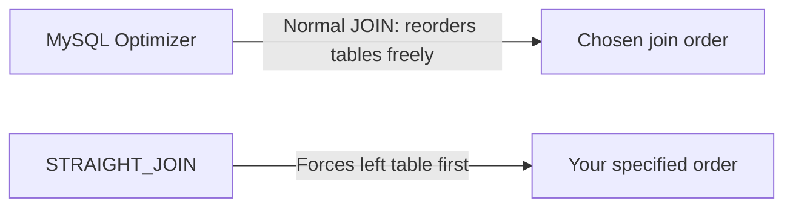
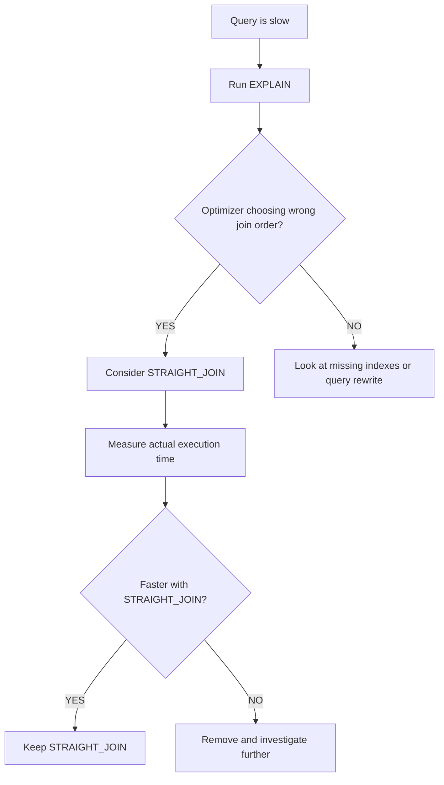

# How to Use STRAIGHT_JOIN in MySQL for Query Optimization

Author: [nawazdhandala](https://www.github.com/nawazdhandala)

Tags: MySQL, SQL, JOIN, Performance, Query Optimization

Description: Learn how STRAIGHT_JOIN forces MySQL to read tables in the specified order, when to use it to override the query optimizer, and how to verify its effect with EXPLAIN.

---

## What is STRAIGHT_JOIN?

`STRAIGHT_JOIN` is a MySQL-specific join hint that forces the query optimizer to read the tables in the exact left-to-right order you write them. Normally, MySQL's cost-based optimizer chooses the join order it believes is most efficient. STRAIGHT_JOIN overrides that decision.



STRAIGHT_JOIN should be used sparingly - only when you have measured that the optimizer is choosing a suboptimal plan and your chosen order performs better.

## Syntax

STRAIGHT_JOIN can be used in two forms:

```sql
-- Form 1: as a SELECT hint - forces ALL joins in the query to use the written order
SELECT STRAIGHT_JOIN column_list
FROM table_a
JOIN table_b ON table_a.id = table_b.a_id;

-- Form 2: as a join type between two specific tables
SELECT column_list
FROM table_a
STRAIGHT_JOIN table_b ON table_a.id = table_b.a_id;
```

## Setup: Sample Tables

```sql
CREATE TABLE categories (
    id   INT PRIMARY KEY AUTO_INCREMENT,
    name VARCHAR(100) NOT NULL
);

CREATE TABLE products (
    id          INT PRIMARY KEY AUTO_INCREMENT,
    name        VARCHAR(200) NOT NULL,
    category_id INT NOT NULL,
    price       DECIMAL(10,2),
    INDEX idx_category (category_id)
);

CREATE TABLE order_items (
    id         INT PRIMARY KEY AUTO_INCREMENT,
    product_id INT NOT NULL,
    quantity   INT NOT NULL,
    INDEX idx_product (product_id)
);

INSERT INTO categories (name) VALUES ('Electronics'),('Clothing'),('Books');

INSERT INTO products (name, category_id, price) VALUES
    ('Laptop',    1, 999.99),
    ('T-Shirt',   2, 29.99),
    ('Novel',     3, 14.99),
    ('Headphones',1, 199.99);

INSERT INTO order_items (product_id, quantity) VALUES
    (1, 2),(2, 5),(1, 1),(3, 3),(4, 1);
```

## Normal JOIN vs STRAIGHT_JOIN

### Normal JOIN (optimizer chooses order)

```sql
EXPLAIN
SELECT c.name AS category, p.name AS product, SUM(oi.quantity) AS units_sold
FROM order_items oi
JOIN products p    ON oi.product_id = p.id
JOIN categories c  ON p.category_id = c.id
GROUP BY c.id, p.id;
```

MySQL may reorder the tables in its execution plan based on estimated row counts and index statistics.

### STRAIGHT_JOIN (your order is enforced)

```sql
EXPLAIN
SELECT STRAIGHT_JOIN c.name AS category, p.name AS product, SUM(oi.quantity) AS units_sold
FROM order_items oi
JOIN products p    ON oi.product_id = p.id
JOIN categories c  ON p.category_id = c.id
GROUP BY c.id, p.id;
```

With `SELECT STRAIGHT_JOIN`, MySQL starts with `order_items`, then `products`, then `categories` - exactly as written.

### STRAIGHT_JOIN as a join keyword

Use this form to control the order only between two specific tables.

```sql
SELECT p.name, c.name AS category, SUM(oi.quantity) AS units_sold
FROM products p
STRAIGHT_JOIN categories c ON p.category_id = c.id
JOIN order_items oi        ON oi.product_id = p.id
GROUP BY p.id, c.id;
```

## Using EXPLAIN to Verify Join Order

Always use EXPLAIN before and after adding STRAIGHT_JOIN to confirm the effect.

```sql
-- Without hint
EXPLAIN SELECT c.name, p.name
FROM products p
JOIN categories c ON p.category_id = c.id\G

-- With STRAIGHT_JOIN hint
EXPLAIN SELECT STRAIGHT_JOIN c.name, p.name
FROM products p
JOIN categories c ON p.category_id = c.id\G
```

The `id` and `rows` columns in EXPLAIN output show which table is accessed first and how many rows are estimated. The table listed first in EXPLAIN output is the driving table.

## When STRAIGHT_JOIN Helps



STRAIGHT_JOIN is most useful when:

- The driving table has a small result set after filtering but the optimizer estimates incorrectly due to stale statistics.
- You are joining a large table to a tiny lookup table and want to ensure the small table is read first (nested-loop).
- Optimizer statistics are outdated and `ANALYZE TABLE` has not yet been run.

```sql
-- Update table statistics so the optimizer has fresh data before trying STRAIGHT_JOIN
ANALYZE TABLE products, order_items, categories;
```

## Pitfalls

- STRAIGHT_JOIN bypasses optimizer intelligence. If your statistics change or data grows, the forced order may become slower over time.
- It is not portable to other databases (PostgreSQL, SQL Server, etc. do not support it).
- When you add STRAIGHT_JOIN as a SELECT hint, it applies to all joins in that query, not just the first pair.

## Alternative: JOIN_ORDER Optimizer Hint (MySQL 8.0+)

MySQL 8.0 introduced more granular optimizer hints that are less invasive than STRAIGHT_JOIN.

```sql
SELECT /*+ JOIN_ORDER(oi, p, c) */
    c.name AS category, p.name AS product, SUM(oi.quantity) AS units_sold
FROM order_items oi
JOIN products p    ON oi.product_id = p.id
JOIN categories c  ON p.category_id = c.id
GROUP BY c.id, p.id;
```

This achieves the same result as STRAIGHT_JOIN but is more explicit and easier to maintain.

## Best Practices

- Run `ANALYZE TABLE` to update statistics before resorting to STRAIGHT_JOIN.
- Always benchmark with real data before and after adding the hint.
- Document why STRAIGHT_JOIN is present so future maintainers understand the intent.
- Prefer MySQL 8.0 optimizer hints (`JOIN_ORDER`, `BKA`, `NO_BKA`) for finer control.
- Remove STRAIGHT_JOIN if the query plan naturally improves after re-running ANALYZE TABLE.

## Summary

STRAIGHT_JOIN forces MySQL to execute joins in the order you write them, overriding the cost-based optimizer. It is a last-resort performance tool useful when the optimizer consistently picks a suboptimal join order. Always confirm its effect with EXPLAIN, benchmark against real data, and prefer fresh table statistics or MySQL 8.0 optimizer hints as a first approach before reaching for STRAIGHT_JOIN.
