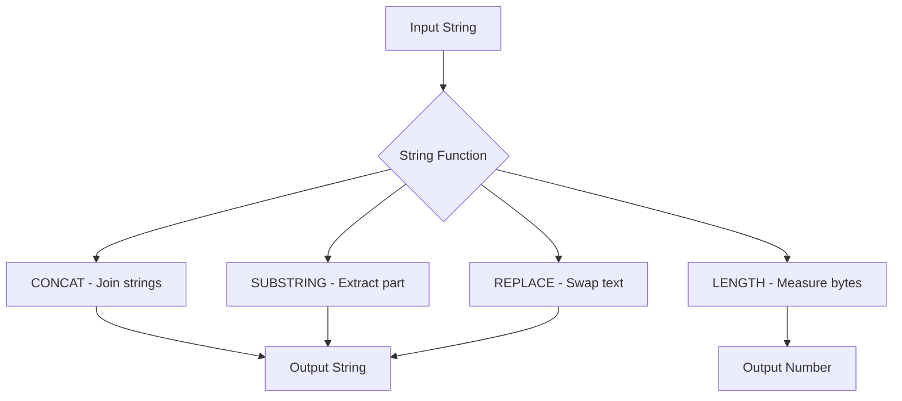

# How to Use MySQL String Functions (CONCAT, SUBSTRING, LENGTH, REPLACE)

Author: [nawazdhandala](https://www.github.com/nawazdhandala)

Tags: MySQL, SQL, String Function, Database

Description: Learn how to use MySQL string functions including CONCAT, SUBSTRING, LENGTH, and REPLACE to manipulate and transform text data in your queries.

---

## How MySQL String Functions Work

MySQL provides a rich set of built-in string functions that let you manipulate text data directly in SQL queries. These functions operate on character strings and return modified or derived values without requiring application-level processing.

String functions are evaluated at query time, which means you can use them in SELECT lists, WHERE clauses, and ORDER BY expressions.



## Setup: Sample Table

Create a sample table and insert data to use throughout the examples.

```sql
CREATE TABLE employees (
    id INT AUTO_INCREMENT PRIMARY KEY,
    first_name VARCHAR(50) NOT NULL,
    last_name  VARCHAR(50) NOT NULL,
    email      VARCHAR(100),
    bio        TEXT
);

INSERT INTO employees (first_name, last_name, email, bio) VALUES
('Alice',   'Johnson',  'alice.johnson@example.com',  'Senior software engineer with 10 years of experience.'),
('Bob',     'Smith',    'bob.smith@example.com',      'Product manager focused on developer tools.'),
('Charlie', 'Williams', 'charlie.williams@example.com','Data scientist specializing in ML pipelines.'),
('Diana',   'Brown',    NULL,                          'UX designer with a background in psychology.');
```

## CONCAT

`CONCAT` joins two or more strings into a single string. If any argument is NULL, the result is NULL.

**Syntax:**

```sql
CONCAT(str1, str2, ...)
```

**Example - build a full name:**

```sql
SELECT
    CONCAT(first_name, ' ', last_name) AS full_name,
    email
FROM employees;
```

```text
+------------------+--------------------------------+
| full_name        | email                          |
+------------------+--------------------------------+
| Alice Johnson    | alice.johnson@example.com      |
| Bob Smith        | bob.smith@example.com          |
| Charlie Williams | charlie.williams@example.com   |
| Diana Brown      | NULL                           |
+------------------+--------------------------------+
```

**Use CONCAT_WS to handle NULL safely:**

`CONCAT_WS` (concat with separator) skips NULL values automatically.

```sql
SELECT CONCAT_WS(' ', first_name, last_name) AS full_name
FROM employees;
```

## SUBSTRING

`SUBSTRING` (also spelled `SUBSTR`) extracts a portion of a string starting at a given position. Positions are 1-based.

**Syntax:**

```sql
SUBSTRING(str, pos)
SUBSTRING(str, pos, len)
```

**Example - extract domain from email:**

```sql
SELECT
    email,
    SUBSTRING(email, LOCATE('@', email) + 1) AS domain
FROM employees
WHERE email IS NOT NULL;
```

```text
+------------------------------+-------------+
| email                        | domain      |
+------------------------------+-------------+
| alice.johnson@example.com    | example.com |
| bob.smith@example.com        | example.com |
| charlie.williams@example.com | example.com |
+------------------------------+-------------+
```

**Example - get first three characters of first name:**

```sql
SELECT first_name, SUBSTRING(first_name, 1, 3) AS initials
FROM employees;
```

## LENGTH and CHAR_LENGTH

`LENGTH` returns the number of bytes. `CHAR_LENGTH` returns the number of characters. For ASCII text these are identical, but they differ for multi-byte character sets such as UTF-8.

**Syntax:**

```sql
LENGTH(str)
CHAR_LENGTH(str)
```

**Example - find employees with short bios:**

```sql
SELECT
    first_name,
    CHAR_LENGTH(bio) AS bio_char_count
FROM employees
WHERE CHAR_LENGTH(bio) < 50;
```

**Example - check email lengths:**

```sql
SELECT
    email,
    LENGTH(email)      AS byte_length,
    CHAR_LENGTH(email) AS char_length
FROM employees
WHERE email IS NOT NULL
ORDER BY char_length DESC;
```

## REPLACE

`REPLACE` substitutes all occurrences of a substring with a new value. The search is case-sensitive.

**Syntax:**

```sql
REPLACE(str, from_str, to_str)
```

**Example - mask email domain:**

```sql
SELECT
    first_name,
    REPLACE(email, 'example.com', 'company.com') AS updated_email
FROM employees
WHERE email IS NOT NULL;
```

```text
+----------+--------------------------------+
| first_name | updated_email               |
+----------+--------------------------------+
| Alice    | alice.johnson@company.com      |
| Bob      | bob.smith@company.com          |
| Charlie  | charlie.williams@company.com   |
+----------+--------------------------------+
```

**Example - sanitize text data:**

```sql
UPDATE employees
SET bio = REPLACE(bio, 'ML pipelines', 'machine learning pipelines')
WHERE first_name = 'Charlie';
```

## Additional Useful String Functions

**UPPER and LOWER** - change case:

```sql
SELECT UPPER(first_name), LOWER(last_name) FROM employees;
```

**TRIM, LTRIM, RTRIM** - remove whitespace:

```sql
SELECT TRIM('  hello world  ');
-- Result: 'hello world'
```

**LPAD and RPAD** - pad strings to a fixed width:

```sql
SELECT LPAD(id, 5, '0') AS padded_id FROM employees;
-- Result: 00001, 00002, ...
```

**LOCATE** - find position of a substring:

```sql
SELECT LOCATE('@', email) AS at_position FROM employees WHERE email IS NOT NULL;
```

**REVERSE** - reverse a string:

```sql
SELECT REVERSE('MySQL');
-- Result: LQSyM
```

## Combining Functions

Functions can be nested to perform complex transformations in a single expression.

**Example - extract username from email:**

```sql
SELECT
    email,
    SUBSTRING(email, 1, LOCATE('@', email) - 1) AS username
FROM employees
WHERE email IS NOT NULL;
```

```text
+------------------------------+------------------+
| email                        | username         |
+------------------------------+------------------+
| alice.johnson@example.com    | alice.johnson    |
| bob.smith@example.com        | bob.smith        |
| charlie.williams@example.com | charlie.williams |
+------------------------------+------------------+
```

## Best Practices

- Use `CHAR_LENGTH` instead of `LENGTH` when working with UTF-8 columns to get accurate character counts.
- Avoid applying string functions in WHERE clauses on indexed columns - this prevents index usage. Add a generated column if you need to filter on a derived value.
- Use `CONCAT_WS` when any argument could be NULL to avoid silently producing NULL results.
- Prefer storing clean data over relying on run-time string manipulation for every query.
- Validate string lengths at the application layer before INSERT to avoid truncation errors.

## Summary

MySQL string functions let you build, extract, measure, and transform text data directly in SQL. `CONCAT` and `CONCAT_WS` join strings together while handling NULLs gracefully. `SUBSTRING` extracts portions of text by position. `LENGTH` and `CHAR_LENGTH` measure string size in bytes or characters respectively. `REPLACE` substitutes one substring for another throughout a string. These functions can be combined and nested to handle complex text processing without needing extra application code.
