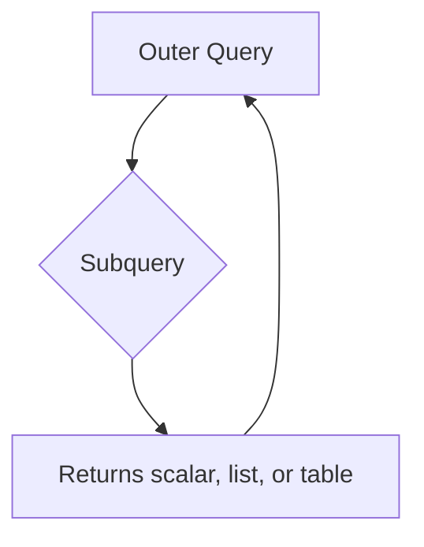

# How to Write Subqueries in MySQL

Author: [nawazdhandala](https://www.github.com/nawazdhandala)

Tags: MySQL, SQL, Subquery, Database, Query

Description: Learn how to write subqueries in MySQL - nested SELECT statements used inside WHERE, FROM, SELECT, and HAVING clauses with practical examples.

---

## How Subqueries Work

A subquery is a SELECT statement nested inside another SQL statement. MySQL evaluates the inner query first and passes its result to the outer query. Subqueries can return a single value (scalar), a single column of values (column subquery), or an entire result set (table subquery / derived table).



## Types of Subqueries

| Type | Returns | Used With |
|------|---------|-----------|
| Scalar | Single value | =, >, <, comparison operators |
| Column | Single-column list | IN, NOT IN, ANY, ALL |
| Table (derived) | Result set | FROM clause |
| Correlated | Depends on outer row | WHERE, HAVING |

## Examples

### Setup: Create Sample Tables

```sql
CREATE TABLE products (
    id INT PRIMARY KEY AUTO_INCREMENT,
    name VARCHAR(100) NOT NULL,
    category VARCHAR(50),
    price DECIMAL(10, 2),
    supplier_id INT
);

CREATE TABLE suppliers (
    id INT PRIMARY KEY AUTO_INCREMENT,
    name VARCHAR(100) NOT NULL,
    country VARCHAR(50)
);

CREATE TABLE order_items (
    id INT PRIMARY KEY AUTO_INCREMENT,
    product_id INT,
    quantity INT,
    unit_price DECIMAL(10, 2)
);

INSERT INTO suppliers (name, country) VALUES
    ('Acme Corp', 'US'),
    ('GlobalTech', 'DE'),
    ('AsiaSource', 'CN');

INSERT INTO products (name, category, price, supplier_id) VALUES
    ('Laptop',   'Electronics', 999.99, 1),
    ('Mouse',    'Electronics', 29.99,  1),
    ('Keyboard', 'Electronics', 59.99,  2),
    ('Desk',     'Furniture',   349.99, 3),
    ('Chair',    'Furniture',   199.99, 3),
    ('Monitor',  'Electronics', 399.99, 2);

INSERT INTO order_items (product_id, quantity, unit_price) VALUES
    (1, 5, 999.99),
    (2, 20, 29.99),
    (3, 10, 59.99),
    (4, 3, 349.99),
    (6, 8, 399.99);
```

### Scalar Subquery in WHERE

Find products priced above the average product price.

```sql
SELECT name, price
FROM products
WHERE price > (SELECT AVG(price) FROM products)
ORDER BY price DESC;
```

```text
+---------+--------+
| name    | price  |
+---------+--------+
| Laptop  | 999.99 |
| Monitor | 399.99 |
| Desk    | 349.99 |
+---------+--------+
```

### Column Subquery with IN

Find products that have been ordered at least once.

```sql
SELECT name, price, category
FROM products
WHERE id IN (SELECT DISTINCT product_id FROM order_items)
ORDER BY name;
```

```text
+----------+--------+-------------+
| name     | price  | category    |
+----------+--------+-------------+
| Desk     | 349.99 | Furniture   |
| Keyboard |  59.99 | Electronics |
| Laptop   | 999.99 | Electronics |
| Monitor  | 399.99 | Electronics |
| Mouse    |  29.99 | Electronics |
+----------+--------+-------------+
```

### Subquery in FROM (Derived Table)

Use a subquery in the FROM clause to create a derived table. Aggregate order totals per product, then filter by total revenue.

```sql
SELECT p.name, p.category, t.total_revenue
FROM products p
INNER JOIN (
    SELECT product_id,
           SUM(quantity * unit_price) AS total_revenue
    FROM order_items
    GROUP BY product_id
) t ON p.id = t.product_id
WHERE t.total_revenue > 1000
ORDER BY t.total_revenue DESC;
```

```text
+---------+-------------+---------------+
| name    | category    | total_revenue |
+---------+-------------+---------------+
| Laptop  | Electronics |      4999.95  |
| Monitor | Electronics |      3199.92  |
| Mouse   | Electronics |       599.80  |
+---------+-------------+---------------+
```

### Scalar Subquery in SELECT

Add a column that shows how each product's price compares to the category average.

```sql
SELECT p.name,
       p.category,
       p.price,
       (SELECT ROUND(AVG(p2.price), 2)
        FROM products p2
        WHERE p2.category = p.category) AS category_avg,
       ROUND(p.price - (SELECT AVG(p2.price)
                        FROM products p2
                        WHERE p2.category = p.category), 2) AS diff_from_avg
FROM products p
ORDER BY p.category, p.price;
```

### Subquery with ALL and ANY

Find products more expensive than all furniture items.

```sql
SELECT name, price, category
FROM products
WHERE price > ALL (
    SELECT price FROM products WHERE category = 'Furniture'
)
ORDER BY price;
```

```text
+---------+--------+-------------+
| name    | price  | category    |
+---------+--------+-------------+
| Monitor | 399.99 | Electronics |
| Laptop  | 999.99 | Electronics |
+---------+--------+-------------+
```

### Subquery in HAVING

Find categories where the average price exceeds the overall average price.

```sql
SELECT category, ROUND(AVG(price), 2) AS avg_price
FROM products
GROUP BY category
HAVING AVG(price) > (SELECT AVG(price) FROM products);
```

```text
+-------------+-----------+
| category    | avg_price |
+-------------+-----------+
| Electronics |    372.49 |
+-------------+-----------+
```

## Best Practices

- Prefer a JOIN over a subquery in the FROM clause when the subquery is non-correlated - MySQL optimizes JOINs well.
- Use `EXISTS` instead of `IN` for correlated subqueries on large tables - it short-circuits on the first match.
- Alias derived tables (subqueries in FROM) - MySQL requires it.
- Avoid placing correlated subqueries in the SELECT list when the outer query returns many rows; each outer row triggers a separate inner execution.
- Use EXPLAIN to check whether MySQL materializes or merges derived tables.

## Summary

Subqueries in MySQL allow you to nest SELECT statements inside other queries. They can return scalars for comparisons, column lists for IN/NOT IN checks, or full result sets as derived tables in the FROM clause. Subqueries are powerful but can be slow if used as correlated subqueries on large datasets. Understanding when to use a subquery versus a JOIN is key to writing efficient MySQL queries.
