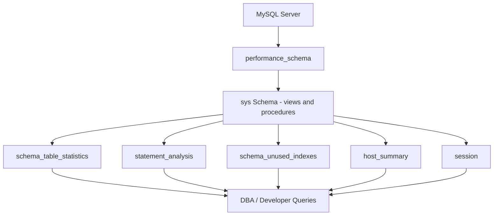

# How to Use MySQL sys.schema_table_statistics View

Author: [nawazdhandala](https://www.github.com/nawazdhandala)

Tags: MySQL, SQL, sys Schema, Performance, Database Administration

Description: Learn how to use the MySQL sys schema views, including schema_table_statistics, to monitor table activity, identify hot tables, and diagnose performance issues.

---

## How the MySQL sys Schema Works

The `sys` schema, introduced in MySQL 5.7, is a collection of views, functions, and procedures that expose data from `performance_schema` in a human-readable format. It transforms raw instrumentation data into actionable insights such as the busiest tables, slowest queries, and unused indexes - all accessible with simple SELECT queries.



## Prerequisites

Ensure performance_schema is enabled (it is on by default in MySQL 5.7+):

```sql
SHOW VARIABLES LIKE 'performance_schema';
-- Value should be: ON
```

## schema_table_statistics

`sys.schema_table_statistics` shows cumulative I/O statistics per table since the server started.

```sql
SELECT
    table_schema,
    table_name,
    total_latency,
    rows_fetched,
    fetch_latency,
    rows_inserted,
    insert_latency,
    rows_updated,
    update_latency,
    rows_deleted,
    delete_latency,
    io_read_requests,
    io_read,
    io_write_requests,
    io_write
FROM sys.schema_table_statistics
WHERE table_schema NOT IN ('sys', 'performance_schema', 'information_schema', 'mysql')
ORDER BY total_latency DESC
LIMIT 20;
```

**Find top 10 most-read tables:**

```sql
SELECT
    table_schema,
    table_name,
    rows_fetched,
    fetch_latency
FROM sys.schema_table_statistics
WHERE table_schema = 'myapp'
ORDER BY rows_fetched DESC
LIMIT 10;
```

**Find tables with high write load:**

```sql
SELECT
    table_name,
    rows_inserted + rows_updated + rows_deleted AS total_writes,
    insert_latency,
    update_latency,
    delete_latency
FROM sys.schema_table_statistics
WHERE table_schema = 'myapp'
ORDER BY total_writes DESC
LIMIT 10;
```

## schema_table_statistics_with_buffer

Includes buffer pool statistics showing how much of each table lives in the InnoDB buffer pool:

```sql
SELECT
    table_schema,
    table_name,
    rows_fetched,
    innodb_buffer_allocated,
    innodb_buffer_data,
    innodb_buffer_pages_hashed
FROM sys.schema_table_statistics_with_buffer
WHERE table_schema = 'myapp'
ORDER BY innodb_buffer_allocated DESC
LIMIT 10;
```

## Other Useful sys Views

**statement_analysis - slowest queries:**

```sql
SELECT
    digest_text,
    exec_count,
    total_latency,
    avg_latency,
    rows_sent_avg,
    rows_examined_avg
FROM sys.statement_analysis
ORDER BY total_latency DESC
LIMIT 10;
```

**schema_unused_indexes - indexes that have never been used:**

```sql
SELECT
    object_schema,
    object_name,
    index_name
FROM sys.schema_unused_indexes
WHERE object_schema = 'myapp';
```

**schema_redundant_indexes - duplicate indexes:**

```sql
SELECT
    table_schema,
    table_name,
    redundant_index_name,
    dominant_index_name
FROM sys.schema_redundant_indexes
WHERE table_schema = 'myapp';
```

**host_summary - per-host connection stats:**

```sql
SELECT
    host,
    statements,
    statement_latency,
    connections,
    current_connections,
    unique_users
FROM sys.host_summary
ORDER BY statement_latency DESC;
```

**session - what each connection is doing right now:**

```sql
SELECT
    thd_id,
    conn_id,
    user,
    db,
    command,
    state,
    time,
    current_statement,
    last_statement_latency
FROM sys.session
WHERE command != 'Sleep'
ORDER BY time DESC;
```

**io_global_by_file_by_bytes - slowest file I/O:**

```sql
SELECT file, total, read_latency, write_latency
FROM sys.io_global_by_file_by_bytes
ORDER BY total DESC
LIMIT 10;
```

## Resetting Statistics

Performance schema counters accumulate since server start. You can reset them:

```sql
-- Reset all performance_schema statistics:
CALL sys.ps_truncate_all_tables(FALSE);
```

Or selectively:

```sql
TRUNCATE performance_schema.table_io_waits_summary_by_table;
```

## sys Schema Procedures

```sql
-- Show memory usage breakdown:
CALL sys.memory_by_host_by_current_bytes();

-- Show InnoDB lock waits:
CALL sys.innodb_lock_waits();

-- Show queries that have caused the most temp tables:
SELECT * FROM sys.statements_with_temp_tables LIMIT 10;
```

## Best Practices

- Query `sys` views during off-peak hours on production; some views join large `performance_schema` tables and can be expensive.
- Use `schema_unused_indexes` to identify candidates for index removal - unused indexes waste write I/O.
- Monitor `schema_redundant_indexes` after schema migrations where column types or index compositions change.
- Use `session` or `processlist` views to find blocked or long-running queries in real time.
- Reset statistics before a load test with `ps_truncate_all_tables` so the test data is isolated.

## Summary

The MySQL `sys` schema provides analyst-friendly views over raw `performance_schema` data. `schema_table_statistics` shows cumulative read, write, and I/O latency per table, helping identify hot or problematic tables. `statement_analysis` reveals the slowest and most-run queries. `schema_unused_indexes` and `schema_redundant_indexes` help trim bloated schemas. Views like `session` and `host_summary` support real-time monitoring. Together, the `sys` schema is the fastest way to diagnose MySQL performance issues without external tools.
