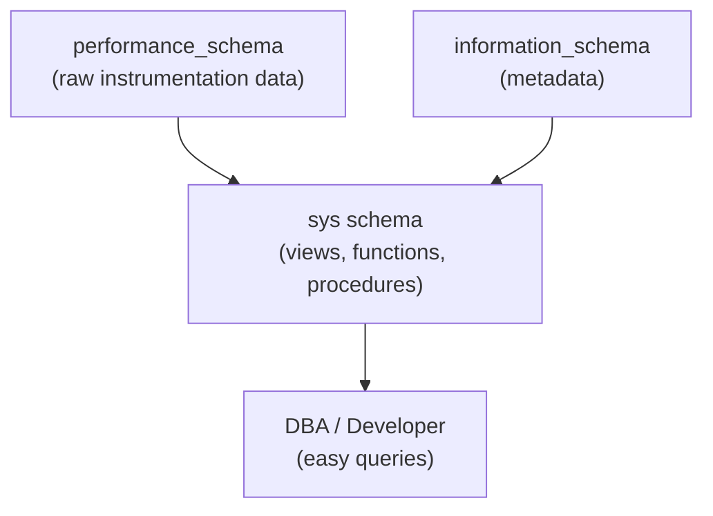

# How to Use MySQL sys Schema for Performance Insights

Author: [nawazdhandala](https://www.github.com/nawazdhandala)

Tags: MySQL, sys Schema, Performance, Monitoring, Query Analysis

Description: Learn how to use the MySQL sys schema to quickly identify slow queries, unused indexes, blocking sessions, and I/O bottlenecks using human-readable views.

---

## How the sys Schema Works

The MySQL `sys` schema is a collection of views, functions, and procedures built on top of `performance_schema` and `information_schema`. It provides human-readable summaries of performance data, making it easy to diagnose problems without writing complex queries against raw performance_schema tables.



The sys schema is installed by default in MySQL 5.7.9+. Verify it is available:

```sql
SHOW DATABASES LIKE 'sys';
USE sys;
SHOW TABLES;
```

## Finding Slow Queries

### Top 10 Queries by Total Latency

```sql
SELECT query,
       exec_count,
       ROUND(avg_latency / 1000000, 2) AS avg_ms,
       ROUND(total_latency / 1000000000, 2) AS total_sec,
       rows_sent_avg,
       rows_examined_avg
FROM   sys.statement_analysis
ORDER  BY total_latency DESC
LIMIT  10;
```

### Top Queries by Average Latency

```sql
SELECT query,
       exec_count,
       ROUND(avg_latency / 1000000, 2) AS avg_ms,
       ROUND(max_latency / 1000000, 2) AS max_ms
FROM   sys.statement_analysis
ORDER  BY avg_latency DESC
LIMIT  10;
```

### Queries with Full Table Scans

```sql
SELECT query,
       exec_count,
       no_index_used_count,
       no_good_index_used_count
FROM   sys.statement_analysis
WHERE  no_index_used_count > 0
ORDER  BY no_index_used_count DESC
LIMIT  20;
```

## Identifying Unused Indexes

Unused indexes waste storage and slow down writes. Find them:

```sql
SELECT object_schema,
       object_name,
       index_name
FROM   sys.schema_unused_indexes
WHERE  object_schema NOT IN ('mysql', 'sys', 'information_schema', 'performance_schema')
ORDER  BY object_schema, object_name;
```

## Identifying Redundant Indexes

```sql
SELECT table_schema,
       table_name,
       redundant_index_name,
       dominant_index_name,
       redundant_index_columns
FROM   sys.schema_redundant_indexes
WHERE  table_schema NOT IN ('mysql', 'sys')
ORDER  BY table_schema, table_name;
```

## Finding Blocking Sessions

```sql
-- See sessions blocking other sessions
SELECT blocking_pid,
       blocking_query,
       blocking_lock_type,
       waiting_pid,
       waiting_query,
       wait_age
FROM   sys.innodb_lock_waits;
```

Kill a blocking session:

```sql
-- Find the thread ID
SELECT * FROM sys.processlist WHERE conn_id = <blocking_pid>;

-- Kill it
CALL sys.kill_query_or_connection(<blocking_pid>);
```

## Memory Usage by Component

```sql
SELECT event_name,
       current_alloc,
       high_alloc
FROM   sys.memory_global_by_current_bytes
ORDER  BY current_alloc DESC
LIMIT  20;
```

## I/O by File

```sql
SELECT file,
       io_read_requests,
       io_read,
       io_write_requests,
       io_write,
       io_misc_requests
FROM   sys.io_global_by_file_by_bytes
ORDER  BY io_read + io_write DESC
LIMIT  20;
```

## I/O by Table

```sql
SELECT table_schema,
       table_name,
       io_read_requests,
       io_read,
       io_write_requests,
       io_write
FROM   sys.io_global_by_wait_by_bytes
LIMIT  20;
```

## Waits Analysis

```sql
-- Overall wait analysis
SELECT event_name,
       total_latency,
       avg_latency,
       max_latency,
       count_star AS occurrences
FROM   sys.waits_global_by_latency
ORDER  BY total_latency DESC
LIMIT  20;

-- Wait analysis per table
SELECT object_schema,
       object_name,
       total_latency,
       count_read,
       count_write,
       count_fetch
FROM   sys.table_lock_waits_summary_by_table
ORDER  BY total_latency DESC
LIMIT  10;
```

## Table Statistics

```sql
-- Tables with most rows examined
SELECT table_schema,
       table_name,
       rows_fetched,
       rows_inserted,
       rows_updated,
       rows_deleted,
       io_read_requests,
       io_write_requests
FROM   sys.schema_table_statistics
WHERE  table_schema NOT IN ('mysql', 'sys', 'information_schema', 'performance_schema')
ORDER  BY rows_fetched + rows_inserted + rows_updated + rows_deleted DESC
LIMIT  20;
```

## User-Level Statistics

```sql
-- Top users by statements executed
SELECT user,
       total_connections,
       current_connections,
       statements,
       ROUND(statement_latency / 1000000000, 2) AS stmt_latency_sec
FROM   sys.user_summary
ORDER  BY statements DESC;
```

## Host-Level Statistics

```sql
SELECT host,
       statements,
       ROUND(statement_latency / 1000000000, 2) AS stmt_latency_sec,
       current_connections
FROM   sys.host_summary
ORDER  BY statements DESC;
```

## Useful sys Procedures

Generate a performance report:

```sql
CALL sys.diagnostics(60, 60, 'current');
```

Get a formatted InnoDB buffer pool status:

```sql
CALL sys.ps_setup_show_enabled(TRUE, TRUE, TRUE);
```

Reset all performance_schema accumulated data:

```sql
CALL sys.ps_truncate_all_tables(FALSE);
```

## Best Practices

- Enable performance_schema (default ON in MySQL 5.7+) to power sys schema views.
- Use `sys.statement_analysis` as your first stop for query performance investigations.
- Run `sys.schema_unused_indexes` monthly and drop confirmed unused indexes.
- Monitor `sys.innodb_lock_waits` during incidents to find blocking queries quickly.
- Use `sys.memory_global_by_current_bytes` when troubleshooting out-of-memory issues.
- Schedule periodic captures of `sys.statement_analysis` for trend analysis.

## Summary

The MySQL sys schema provides pre-built, human-readable views over `performance_schema` data, making performance diagnostics accessible without deep knowledge of raw instrumentation tables. Use `statement_analysis` for slow query identification, `schema_unused_indexes` for index cleanup, and `innodb_lock_waits` for deadlock investigation. The sys schema is available by default in MySQL 5.7.9+ and requires no additional installation.
