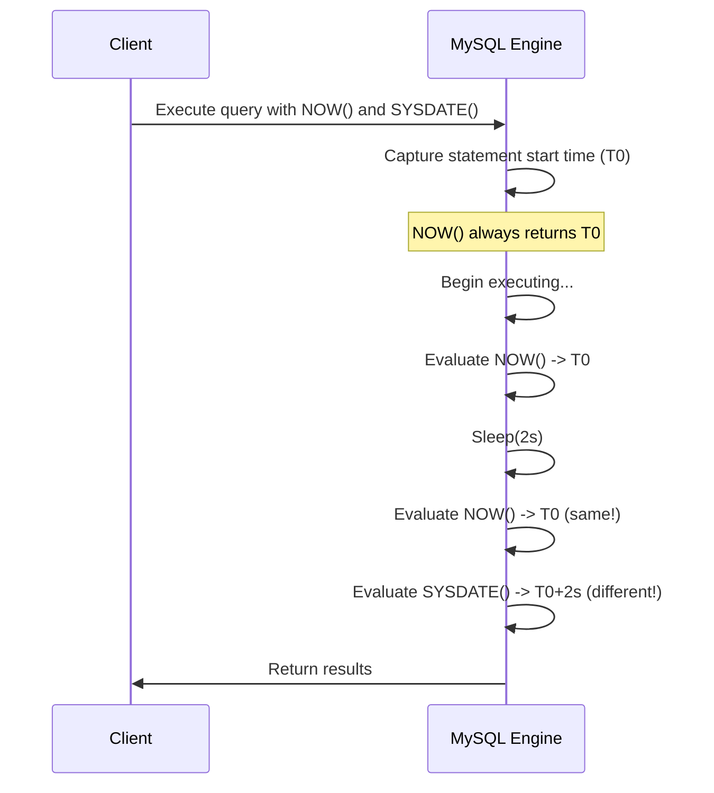

# How to Use SYSDATE() vs NOW() in MySQL

Author: [nawazdhandala](https://www.github.com/nawazdhandala)

Tags: MySQL, SQL, Date Function, Time Function, Database

Description: Learn the key differences between MySQL SYSDATE() and NOW(), when each is evaluated, and which to use for accurate timestamping in queries.

---

## Overview

Both `NOW()` and `SYSDATE()` return the current date and time in MySQL, but they differ in a critical way: when exactly they are evaluated during query execution. Understanding this distinction is essential for accurate timestamping, replication consistency, and stored procedure behavior.

---

## NOW() Function

`NOW()` returns the date and time at which the current statement **began executing**. Within a single statement (even a long-running one), every call to `NOW()` returns the same value.

```sql
SELECT NOW();
-- Returns: '2026-03-31 14:23:45'

SELECT NOW(), SLEEP(2), NOW();
-- Both NOW() calls return the same timestamp
```

---

## SYSDATE() Function

`SYSDATE()` returns the date and time at the **moment it is called** during execution. Each call reflects the actual wall-clock time at that instant.

```sql
SELECT SYSDATE();
-- Returns: '2026-03-31 14:23:45'

SELECT SYSDATE(), SLEEP(2), SYSDATE();
-- The second SYSDATE() is 2 seconds later than the first
```

---

## Key Difference: Static vs Dynamic



---

## Demonstration

```sql
-- Create a test table
CREATE TABLE timing_test (
    id INT AUTO_INCREMENT PRIMARY KEY,
    ts_now DATETIME,
    ts_sysdate DATETIME
);

-- Insert with a sleep to highlight the difference
INSERT INTO timing_test (ts_now, ts_sysdate)
SELECT NOW(), SYSDATE()
FROM (SELECT SLEEP(0)) t;

-- Run a second insert after a short delay
INSERT INTO timing_test (ts_now, ts_sysdate)
SELECT NOW(), SYSDATE()
FROM (SELECT SLEEP(1)) t;

SELECT * FROM timing_test;
```

Within a single complex statement containing `SLEEP()`, you will observe that `NOW()` values for both rows differ (each statement has its own start time), while `SYSDATE()` values reflect the exact moment each row was inserted.

---

## Fractional Seconds

Both functions accept an optional precision argument (0-6) for sub-second accuracy:

```sql
SELECT NOW(3);
-- Returns: '2026-03-31 14:23:45.123'

SELECT SYSDATE(3);
-- Returns: '2026-03-31 14:23:45.127'

SELECT NOW(6), SYSDATE(6);
```

---

## Stored Procedures and Triggers

In stored procedures, `NOW()` returns the timestamp when the statement began, while `SYSDATE()` captures the real current time inside loops or multi-step operations:

```sql
DELIMITER //
CREATE PROCEDURE timing_demo()
BEGIN
    DECLARE i INT DEFAULT 0;
    WHILE i < 3 DO
        INSERT INTO timing_test (ts_now, ts_sysdate)
        VALUES (NOW(), SYSDATE());
        DO SLEEP(1);
        SET i = i + 1;
    END WHILE;
END //
DELIMITER ;

CALL timing_demo();

SELECT id, ts_now, ts_sysdate FROM timing_test ORDER BY id;
```

After this call, `ts_now` will be the same for all three rows (the procedure's start time), while `ts_sysdate` will differ by approximately 1 second per row.

---

## Replication Implications

This is one of the most important practical differences:

- **`NOW()`** is safe for statement-based replication (SBR). The coordinator writes the exact timestamp to the binary log, and replicas use the same value.
- **`SYSDATE()`** is **unsafe** for statement-based replication. Each replica evaluates `SYSDATE()` independently, potentially producing different timestamps on different servers.

MySQL will warn or error when `SYSDATE()` is used in SBR mode unless the `--sysdate-is-now` option is set.

```mermaid
flowchart LR
    A[Primary writes SYSDATE() query to binlog] --> B[Replica replays query]
    B --> C{SYSDATE evaluated again}
    C --> D[Different timestamp on replica!]
    A2[Primary writes NOW() query to binlog] --> B2[Replica replays query]
    B2 --> C2{NOW() value fixed from binlog}
    C2 --> D2[Same timestamp on replica]
```

---

## --sysdate-is-now Option

Starting MySQL 5.1, you can configure `SYSDATE()` to behave like `NOW()` by starting mysqld with `--sysdate-is-now`. This makes `SYSDATE()` safe for replication but removes its dynamic behavior.

---

## When to Use Each

| Scenario                                         | Recommended Function |
|--------------------------------------------------|----------------------|
| Timestamp entire transaction consistently        | `NOW()`              |
| Audit log requiring real elapsed wall-clock time | `SYSDATE()`          |
| Statement-based replication safety               | `NOW()`              |
| Long-running stored procedure timing             | `SYSDATE()`          |
| Default for most applications                    | `NOW()`              |

---

## Other Related Functions

```sql
SELECT CURRENT_TIMESTAMP();   -- Synonym for NOW()
SELECT LOCALTIME();           -- Synonym for NOW()
SELECT LOCALTIMESTAMP();      -- Synonym for NOW()

-- Date and time separately
SELECT CURDATE();             -- Current date only
SELECT CURTIME();             -- Current time only
```

All of `CURRENT_TIMESTAMP()`, `LOCALTIME()`, and `LOCALTIMESTAMP()` behave like `NOW()` (fixed at statement start).

---

## Practical Recommendation

For most applications, use `NOW()` because:
1. It is consistent within a statement.
2. It is safe for replication.
3. It is deterministic within the query context, making debugging easier.

Use `SYSDATE()` only when you specifically need the actual wall-clock time at each function evaluation point, such as precise elapsed-time measurement inside stored procedures.

---

## Summary

`NOW()` and `SYSDATE()` both return the current datetime, but differ critically in timing: `NOW()` is frozen at statement start and remains constant for the entire statement, while `SYSDATE()` reflects the real clock time at each evaluation point. For most use cases, `NOW()` is the safer and more predictable choice, especially for statement-based replication environments. Use `SYSDATE()` only when genuine real-time wall-clock measurement is required.
