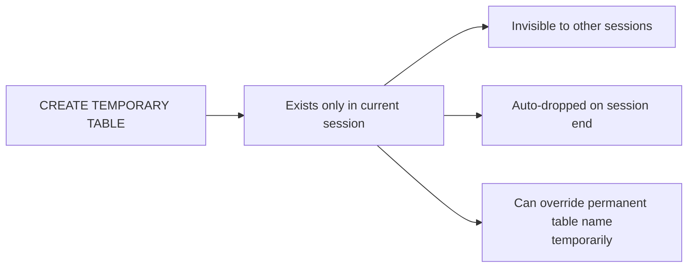

# How to Create a Temporary Table in MySQL

Author: [nawazdhandala](https://www.github.com/nawazdhandala)

Tags: MySQL, SQL, DDL, Table, Database

Description: Learn how to create and use temporary tables in MySQL, their session-scoped lifetime, syntax, storage engines, and practical use cases for intermediate query results.

---

## What Is a Temporary Table

A temporary table in MySQL exists only for the duration of the session (connection) that created it. It is automatically dropped when the session ends. Temporary tables are visible only to the creating session, making them safe for concurrent use.



## Syntax

```sql
CREATE TEMPORARY TABLE [IF NOT EXISTS] table_name (
    column_name data_type [constraints],
    ...
)
[ENGINE = engine_name];
```

## Basic Example

```sql
CREATE TEMPORARY TABLE temp_active_users (
    id       INT NOT NULL,
    username VARCHAR(100) NOT NULL,
    score    DECIMAL(10, 2) NOT NULL
);

INSERT INTO temp_active_users (id, username, score)
VALUES (1, 'alice', 98.5),
       (2, 'bob',   72.0),
       (3, 'carol', 85.3);

SELECT * FROM temp_active_users ORDER BY score DESC;
```

```text
+----+----------+-------+
| id | username | score |
+----+----------+-------+
|  1 | alice    | 98.50 |
|  3 | carol    | 85.30 |
|  2 | bob      | 72.00 |
+----+----------+-------+
```

## Creating a Temporary Table from a SELECT

```sql
-- Materialize intermediate results
CREATE TEMPORARY TABLE temp_top_customers AS
SELECT customer_id,
       SUM(amount) AS total_spent,
       COUNT(*)    AS order_count
FROM orders
WHERE placed_at >= '2025-01-01'
GROUP BY customer_id
HAVING total_spent > 1000;

-- Now join the temp table in subsequent queries
SELECT c.name, t.total_spent, t.order_count
FROM temp_top_customers t
JOIN customers c ON c.id = t.customer_id
ORDER BY t.total_spent DESC
LIMIT 20;
```

## IF NOT EXISTS

```sql
-- Avoids an error if the temp table already exists in this session
CREATE TEMPORARY TABLE IF NOT EXISTS temp_report_data (
    report_date DATE NOT NULL,
    revenue     DECIMAL(15, 2) NOT NULL,
    cost        DECIMAL(15, 2) NOT NULL
);
```

## Storage Engine

By default, temporary tables use the `TempTable` storage engine in MySQL 8.0 (or `MEMORY` engine in older versions). For large datasets, specify `InnoDB`:

```sql
CREATE TEMPORARY TABLE temp_large_dataset (
    id     BIGINT UNSIGNED NOT NULL,
    data   VARCHAR(500),
    INDEX (id)
) ENGINE = InnoDB;
```

Use `MEMORY` engine for small in-memory tables:

```sql
CREATE TEMPORARY TABLE temp_session_cache (
    key_name  VARCHAR(100) NOT NULL PRIMARY KEY,
    value     VARCHAR(500)
) ENGINE = MEMORY;
```

## Practical: Multi-Step Report Calculation

```sql
-- Step 1: Summarize raw events
CREATE TEMPORARY TABLE temp_event_summary AS
SELECT user_id,
       event_type,
       COUNT(*)    AS event_count,
       DATE(occurred_at) AS event_date
FROM events
WHERE occurred_at >= '2025-03-01'
  AND occurred_at < '2025-04-01'
GROUP BY user_id, event_type, DATE(occurred_at);

-- Step 2: Pivot the summary
CREATE TEMPORARY TABLE temp_user_pivot AS
SELECT user_id,
       SUM(CASE WHEN event_type = 'login'    THEN event_count ELSE 0 END) AS login_count,
       SUM(CASE WHEN event_type = 'purchase' THEN event_count ELSE 0 END) AS purchase_count,
       SUM(CASE WHEN event_type = 'view'     THEN event_count ELSE 0 END) AS view_count
FROM temp_event_summary
GROUP BY user_id;

-- Step 3: Final report
SELECT u.name, p.login_count, p.purchase_count, p.view_count
FROM temp_user_pivot p
JOIN users u ON u.id = p.user_id
ORDER BY p.purchase_count DESC
LIMIT 10;
```

## Dropping a Temporary Table

Temporary tables are dropped automatically at session end, but you can drop them explicitly:

```sql
DROP TEMPORARY TABLE IF EXISTS temp_active_users;
DROP TEMPORARY TABLE IF EXISTS temp_top_customers;
```

Using `DROP TEMPORARY TABLE` (with the `TEMPORARY` keyword) ensures you only drop the temporary table and not a permanent table with the same name.

## Temporary Table vs Permanent Table Name Conflict

```sql
-- If a permanent table named 'users' exists, a temp table with
-- the same name shadows it within the current session:
CREATE TEMPORARY TABLE users (
    id   INT,
    name VARCHAR(50)
);

SELECT * FROM users;  -- reads the temporary table, not the permanent one
DROP TEMPORARY TABLE users;
SELECT * FROM users;  -- now reads the permanent table again
```

## Temporary Table Limitations

- Cannot be referenced more than once in the same query (no self-join of a temp table).
- Temporary tables are not visible in `SHOW TABLES` output.
- `MEMORY` engine temp tables are limited by `max_heap_table_size` and `tmp_table_size`.
- Temporary tables cannot have `FOREIGN KEY` constraints.
- Binary logging of temp table statements depends on the `binlog_format` setting.

## Best Practices

- Prefer `CREATE TEMPORARY TABLE ... AS SELECT` to materialize expensive intermediate query results.
- Always use `DROP TEMPORARY TABLE IF EXISTS` before recreating a temp table in scripts that might run multiple times in one session.
- Use `InnoDB` engine for large temporary tables to support on-disk overflow; use `MEMORY` for small, fast lookup tables.
- Avoid using the same name as an existing permanent table; it shadows the permanent table and can cause confusion.
- Clean up temp tables explicitly with `DROP TEMPORARY TABLE` rather than relying on session end to avoid memory exhaustion in long-running sessions.

## Summary

`CREATE TEMPORARY TABLE` creates a session-scoped table that is automatically dropped when the connection closes. Temp tables are invisible to other sessions, making them safe for concurrent workloads. Use `CREATE TEMPORARY TABLE ... AS SELECT` to materialize intermediate results for multi-step reports. Always use the `TEMPORARY` keyword when dropping to avoid accidentally removing a permanent table with the same name.
