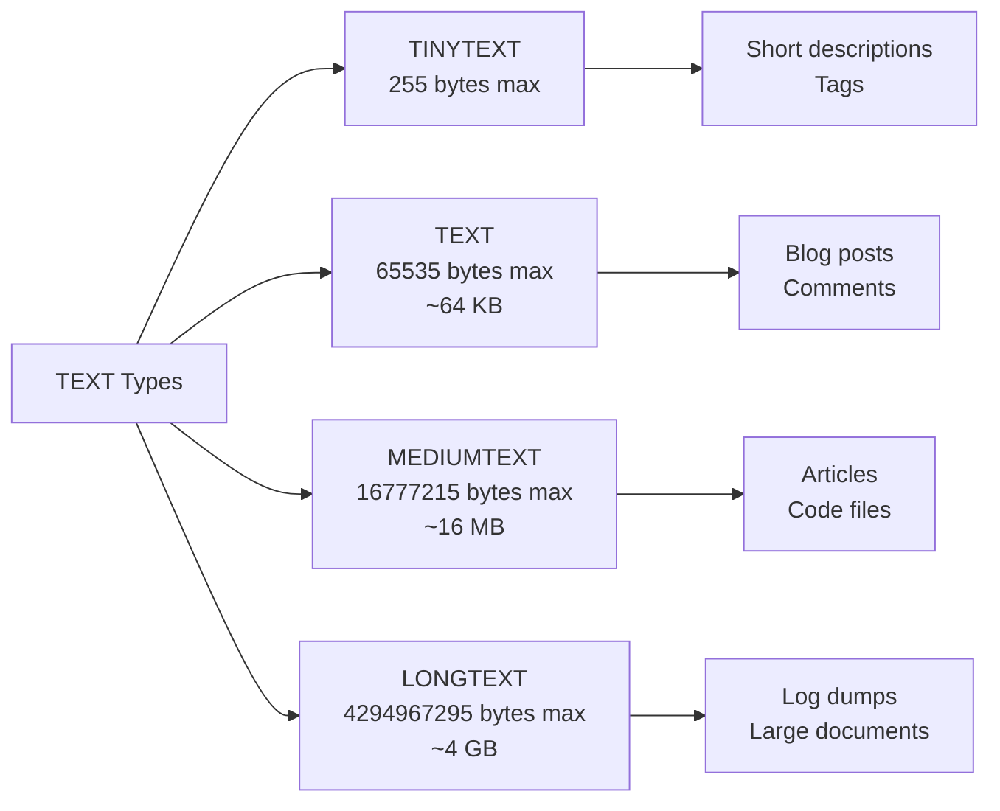

# How to Use TINYTEXT, TEXT, MEDIUMTEXT, LONGTEXT in MySQL

Author: [nawazdhandala](https://www.github.com/nawazdhandala)

Tags: MySQL, SQL, Data Type, Text, Database

Description: Learn how to use MySQL TEXT family data types (TINYTEXT, TEXT, MEDIUMTEXT, LONGTEXT), their storage limits, differences from VARCHAR, and practical examples.

---

## The TEXT Family

MySQL provides four TEXT types for storing large character strings. Unlike `VARCHAR`, TEXT columns are stored off-page in InnoDB (for large values), and they cannot have default values or be used in indexes without a prefix length.



## Storage Limits

| Type | Max Length | Max Storage | Length Prefix |
|---|---|---|---|
| `TINYTEXT` | 255 bytes | 255 bytes + 1 byte length | 1 byte |
| `TEXT` | 65,535 bytes | 65,535 bytes + 2 bytes length | 2 bytes |
| `MEDIUMTEXT` | 16,777,215 bytes | ~16 MB + 3 bytes length | 3 bytes |
| `LONGTEXT` | 4,294,967,295 bytes | ~4 GB + 4 bytes length | 4 bytes |

These limits are in **bytes**. For `utf8mb4`, each character can use up to 4 bytes, so `TEXT` stores up to 16,383 characters of 4-byte glyphs.

## Syntax

```sql
column_name TINYTEXT   [CHARACTER SET charset] [COLLATE collation] [NOT NULL]
column_name TEXT       [CHARACTER SET charset] [COLLATE collation] [NOT NULL]
column_name MEDIUMTEXT [CHARACTER SET charset] [COLLATE collation] [NOT NULL]
column_name LONGTEXT   [CHARACTER SET charset] [COLLATE collation] [NOT NULL]
```

TEXT columns cannot have a `DEFAULT` value other than `NULL`.

## Basic Usage

```sql
CREATE TABLE articles (
    id           INT AUTO_INCREMENT PRIMARY KEY,
    title        VARCHAR(200) NOT NULL,
    summary      TINYTEXT,              -- short teaser, up to 255 bytes
    body         MEDIUMTEXT NOT NULL,   -- full article content
    raw_html     LONGTEXT,              -- original HTML if needed
    published_at DATETIME
) CHARACTER SET utf8mb4 COLLATE utf8mb4_unicode_ci;

INSERT INTO articles (title, summary, body, published_at) VALUES
(
    'Getting Started with MySQL',
    'A beginner guide to MySQL data types.',
    'MySQL supports many data types including INT, VARCHAR, TEXT, and more...',
    NOW()
);
```

## TINYTEXT for Short Strings

`TINYTEXT` is functionally equivalent to `VARCHAR(255)` but stored differently (off-page for large values). Prefer `VARCHAR(255)` for short strings unless you need TEXT-type behavior.

```sql
CREATE TABLE tags (
    id    INT AUTO_INCREMENT PRIMARY KEY,
    name  TINYTEXT NOT NULL,
    slug  VARCHAR(100) NOT NULL UNIQUE
);
```

## TEXT for User-Generated Content

```sql
CREATE TABLE comments (
    id          BIGINT UNSIGNED AUTO_INCREMENT PRIMARY KEY,
    post_id     INT NOT NULL,
    user_id     INT NOT NULL,
    content     TEXT NOT NULL,
    created_at  DATETIME NOT NULL DEFAULT CURRENT_TIMESTAMP,
    INDEX (post_id)
);

INSERT INTO comments (post_id, user_id, content) VALUES
(1, 42, 'Great article! Really helped me understand the concepts.');
```

## MEDIUMTEXT for Large Documents

```sql
CREATE TABLE source_code_files (
    id          INT AUTO_INCREMENT PRIMARY KEY,
    repo_id     INT NOT NULL,
    path        VARCHAR(500) NOT NULL,
    content     MEDIUMTEXT NOT NULL,   -- up to ~16 MB per file
    language    VARCHAR(50),
    committed_at DATETIME NOT NULL,
    UNIQUE KEY (repo_id, path)
);
```

## LONGTEXT for Very Large Content

```sql
CREATE TABLE system_logs (
    id          BIGINT UNSIGNED AUTO_INCREMENT PRIMARY KEY,
    server_id   VARCHAR(50) NOT NULL,
    log_date    DATE NOT NULL,
    log_content LONGTEXT,              -- full log dump up to 4 GB
    created_at  DATETIME NOT NULL DEFAULT CURRENT_TIMESTAMP
);
```

## Indexing TEXT Columns

TEXT columns require a prefix length for indexing.

```sql
CREATE TABLE search_content (
    id      INT AUTO_INCREMENT PRIMARY KEY,
    title   VARCHAR(200) NOT NULL,
    body    TEXT NOT NULL,
    INDEX idx_body_prefix (body(100))  -- index on first 100 bytes
);
```

For full-text search, use `FULLTEXT` indexes instead:

```sql
ALTER TABLE articles
    ADD FULLTEXT INDEX ft_body (body);

-- Full-text search query
SELECT title, MATCH(body) AGAINST ('MySQL data types' IN NATURAL LANGUAGE MODE) AS relevance
FROM articles
WHERE MATCH(body) AGAINST ('MySQL data types' IN NATURAL LANGUAGE MODE)
ORDER BY relevance DESC;
```

## TEXT vs VARCHAR

| Feature | TEXT | VARCHAR |
|---|---|---|
| Max length | Up to 4 GB (LONGTEXT) | Up to 65,535 bytes |
| DEFAULT value | Not supported | Supported |
| Index without prefix | Not supported | Supported (up to 767 bytes) |
| In-row storage | Off-page for large values | In-row (up to row limit) |
| Sorting / GROUP BY | Requires prefix | Up to 65,535 bytes |

## Searching in TEXT Columns

```sql
-- Pattern matching (no index used on TEXT without FULLTEXT)
SELECT title FROM articles
WHERE body LIKE '%OpenTelemetry%';

-- Preferred: FULLTEXT search for large TEXT columns
SELECT title
FROM articles
WHERE MATCH(body) AGAINST ('OpenTelemetry observability' WITH QUERY EXPANSION);
```

## Character Set Considerations

```sql
-- With utf8mb4, TEXT stores up to 65535/4 = 16383 characters
-- With latin1, TEXT stores up to 65535 characters
ALTER TABLE comments
    MODIFY content TEXT CHARACTER SET utf8mb4 COLLATE utf8mb4_unicode_ci NOT NULL;
```

## Best Practices

- Use `VARCHAR(255)` instead of `TINYTEXT` for short strings; VARCHAR has better index support and allows default values.
- Use `TEXT` for user comments, product descriptions, and any content under 64 KB.
- Use `MEDIUMTEXT` for article bodies, source code files, and documents that may reach a few MB.
- Use `LONGTEXT` only for very large data like log aggregations or binary-encoded large content.
- Add `FULLTEXT` indexes on TEXT columns used in search rather than relying on `LIKE '%...%'` scans.
- Avoid selecting TEXT columns with `SELECT *` in performance-sensitive queries; select only needed columns.

## Summary

MySQL TEXT types -- `TINYTEXT` (255 bytes), `TEXT` (64 KB), `MEDIUMTEXT` (16 MB), and `LONGTEXT` (4 GB) -- store large character strings. They differ from `VARCHAR` in that they do not support default values, require prefix lengths for non-FULLTEXT indexes, and store large values off-page in InnoDB. Choose the smallest TEXT type that fits your data to avoid unnecessary storage overhead. For full-text search, use `FULLTEXT` indexes rather than `LIKE` pattern matching.
