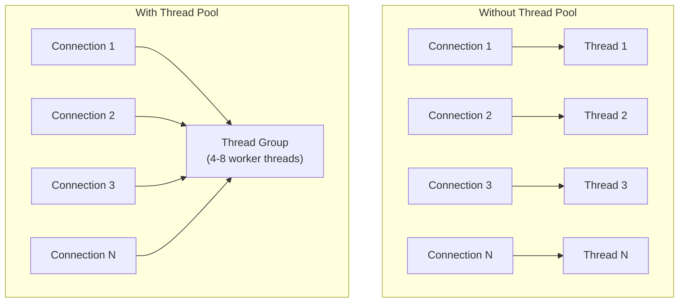

# How to Use MySQL Thread Pool Plugin

Author: [nawazdhandala](https://www.github.com/nawazdhandala)

Tags: MySQL, Thread Pool, Performance, Concurrency, Scalability

Description: Learn how to install and configure the MySQL Thread Pool plugin to reduce context switching overhead at high connection counts and improve throughput under heavy concurrency.

---

## How the MySQL Thread Pool Works

By default, MySQL uses a one-thread-per-connection model: each client connection gets a dedicated OS thread. At hundreds or thousands of concurrent connections, context switching between threads degrades throughput. The Thread Pool plugin replaces this with a pool of worker threads that serve multiple connections.



Thread groups handle connections round-robin. Each group has a small number of worker threads. Connections waiting for I/O are parked (not blocking a thread), allowing worker threads to handle other connections.

## Availability

The Thread Pool plugin is available in:
- **MySQL Enterprise Edition** - `thread_pool.so`
- **Percona Server for MySQL** - included by default
- **MariaDB** - included by default

It is NOT available in MySQL Community Edition without using Percona Server.

## Installation (MySQL Enterprise)

```sql
-- Install the plugin
INSTALL PLUGIN thread_pool SONAME 'thread_pool.so';

-- Verify
SELECT plugin_name, plugin_status FROM information_schema.PLUGINS
WHERE plugin_name = 'thread_pool';
```

Add to configuration for persistence:

```ini
# /etc/mysql/mysql.conf.d/mysqld.cnf
[mysqld]
plugin-load-add             = thread_pool.so
thread_handling             = pool-of-threads
thread_pool_size            = 16
thread_pool_max_threads     = 1000
thread_pool_stall_limit     = 500
thread_pool_idle_timeout    = 60
```

## Installation (Percona Server)

Percona Server includes the thread pool by default. Enable it:

```ini
[mysqld]
thread_handling          = pool-of-threads
thread_pool_size         = 16
thread_pool_stall_limit  = 500
```

Restart Percona Server:

```bash
sudo systemctl restart mysql
```

## Key Configuration Variables

### thread_pool_size

Number of thread groups. Each group handles connections independently. The recommended value is equal to the number of CPU cores:

```sql
SET GLOBAL thread_pool_size = 16;  -- For a 16-core server
```

Each group runs 1-2 active threads. Too few groups creates a bottleneck; too many reduces the benefit.

### thread_pool_stall_limit

Time in milliseconds before a connection is considered stalled (blocking the thread group). When a query stalls, the thread pool creates an extra thread to avoid starving other connections:

```sql
SET GLOBAL thread_pool_stall_limit = 500;  -- 500ms (default)
```

For long-running queries, increase this value. For OLTP workloads, lower values (100-200ms) keep the pool more responsive.

### thread_pool_max_threads

Maximum total threads the pool can create (including extra threads for stalled connections):

```sql
SET GLOBAL thread_pool_max_threads = 1000;
```

### thread_pool_idle_timeout

Time in seconds before an idle worker thread exits:

```sql
SET GLOBAL thread_pool_idle_timeout = 60;
```

## Monitoring the Thread Pool

```sql
-- View per-thread-group stats (Percona Server / MariaDB)
SELECT * FROM information_schema.TP_THREAD_GROUP_STATE\G

-- View per-thread stats
SELECT * FROM information_schema.TP_THREAD_STATE\G
```

Key metrics in `TP_THREAD_GROUP_STATE`:

| Column | Meaning |
|--------|---------|
| `connections_in_queue` | Connections waiting for a thread |
| `active_threads` | Currently executing threads in the group |
| `stall_limit` | Configured stall limit for this group |
| `waiting_threads` | Threads waiting for I/O |
| `stalls` | Number of stall events |

MySQL Enterprise Audit table:

```sql
SELECT * FROM performance_schema.tp_thread_group_stats\G
```

## Tuning for Different Workloads

### OLTP (Short Queries, High Concurrency)

```ini
[mysqld]
thread_pool_size         = 16      -- Equal to CPU cores
thread_pool_stall_limit  = 100     -- Detect stalls quickly
thread_pool_max_threads  = 500
```

### Mixed OLAP/OLTP

```ini
[mysqld]
thread_pool_size         = 8       -- Fewer groups, fewer context switches
thread_pool_stall_limit  = 1000    -- Give long queries more time before stall
thread_pool_max_threads  = 200
```

### Long-Running Reports

Long queries will frequently hit `thread_pool_stall_limit` and trigger extra threads. Consider routing them to a separate MySQL instance with a higher `thread_pool_stall_limit`:

```ini
[mysqld]
thread_pool_stall_limit = 5000    -- 5 seconds for report queries
```

## Comparing Performance

Benchmark with and without the thread pool using sysbench:

```bash
# Test without thread pool
sysbench oltp_read_write \
    --mysql-host=localhost \
    --mysql-user=root \
    --mysql-password=password \
    --mysql-db=sbtest \
    --threads=500 \
    --time=60 \
    run

# Enable thread pool, then test again
```

## Thread Pool vs Connection Pooling (ProxySQL)

| Feature | Thread Pool | ProxySQL |
|---------|-------------|----------|
| Location | Inside MySQL | External proxy |
| Goal | Reduce thread context switching | Reduce backend connections |
| Helps with | > 200 concurrent queries | > 500 concurrent client connections |
| Requires | Enterprise/Percona/MariaDB | Any MySQL |
| Complexity | Low (configuration only) | Medium (separate service) |

Use both for maximum scalability: ProxySQL reduces backend connections, and the thread pool efficiently schedules work within MySQL.

## Best Practices

- Set `thread_pool_size` equal to the number of CPU cores (no more).
- Start with `thread_pool_stall_limit = 500` and reduce it for OLTP workloads.
- Monitor `connections_in_queue` - if consistently > 0, the pool is undersized or `thread_pool_stall_limit` is too low.
- Use the thread pool for servers handling 200+ concurrent active queries.
- Combine the thread pool with connection pooling (ProxySQL) for maximum scalability.
- Test under realistic production-like load before deploying to production.

## Summary

The MySQL Thread Pool plugin replaces the default one-thread-per-connection model with thread groups that serve multiple connections, reducing OS thread context switching at high concurrency. Set `thread_pool_size` to the CPU core count and `thread_pool_stall_limit` based on your query duration profile. The plugin is available in MySQL Enterprise Edition and Percona Server. Monitor `TP_THREAD_GROUP_STATE` to detect stalls and tune accordingly.
