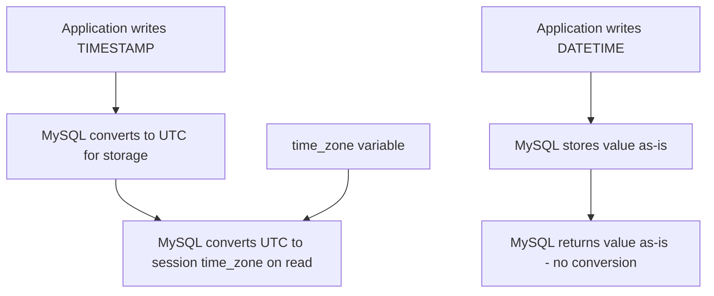

# How to Use MySQL TIME_ZONE Variable for Timezone Handling

Author: [nawazdhandala](https://www.github.com/nawazdhandala)

Tags: MySQL, SQL, Timezone, Time Zone, DateTime, Database

Description: Learn how to configure and use the MySQL time_zone system variable to control timezone behavior for TIMESTAMP columns and NOW() at server and session level.

---

## How MySQL Timezone Handling Works

MySQL handles timezones differently for `DATETIME` and `TIMESTAMP` columns. `TIMESTAMP` values are stored internally in UTC and converted to the session timezone on read. `DATETIME` values are stored as-is with no timezone conversion. Understanding this distinction is critical for building multi-timezone applications.



## The time_zone Variable

MySQL has three levels of timezone configuration:

```text
Level          Variable                 Scope
-----------    --------                 -----
System default --timezone on startup    Server-wide, set at startup
Global         @@global.time_zone       All new connections
Session        @@session.time_zone      Current connection only
```

**Check current timezone settings:**

```sql
SELECT @@global.time_zone, @@session.time_zone;
```

**Check effective current time in the session:**

```sql
SELECT NOW(), UTC_TIMESTAMP(), SYSDATE();
```

## Setting the Timezone

**Set for the current session only:**

```sql
SET time_zone = 'America/New_York';
SET time_zone = '+05:30';           -- UTC+5:30 (IST)
SET time_zone = 'Europe/London';
SET time_zone = 'UTC';
```

**Set globally (affects all new connections):**

```sql
SET GLOBAL time_zone = 'UTC';
```

**In MySQL configuration file (my.cnf / my.ini):**

```text
[mysqld]
default-time-zone = UTC
```

## TIMESTAMP vs. DATETIME Behavior

```sql
CREATE TABLE timezone_demo (
    id          INT AUTO_INCREMENT PRIMARY KEY,
    ts_col      TIMESTAMP NOT NULL DEFAULT NOW(),
    dt_col      DATETIME  NOT NULL DEFAULT NOW(),
    label       VARCHAR(50)
);

-- Insert a row while in New York timezone:
SET time_zone = 'America/New_York';
INSERT INTO timezone_demo (label) VALUES ('new_york_insert');

-- Now read back in Tokyo timezone:
SET time_zone = 'Asia/Tokyo';
SELECT id, ts_col, dt_col, label FROM timezone_demo;
```

The `ts_col` value will appear shifted to Tokyo time. The `dt_col` value will appear exactly as it was stored - no conversion.

## Named Timezone Support

Named timezones (e.g., `'America/New_York'`) require the `mysql.time_zone` tables to be populated. Check if they are loaded:

```sql
SELECT COUNT(*) FROM mysql.time_zone_name;
```

If the result is 0, load the timezone data. On Linux/macOS:

```bash
mysql_tzinfo_to_sql /usr/share/zoneinfo | mysql -u root -p mysql
```

On Windows, download the prebuilt timezone tables from the MySQL website.

After loading, flush:

```sql
FLUSH TABLES;
```

## Practical Pattern: Always Store UTC

The recommended pattern for multi-timezone applications is to always write and store in UTC, then convert to local time at the application layer or using `CONVERT_TZ`.

```sql
-- Always connect with UTC:
SET time_zone = 'UTC';

CREATE TABLE user_events (
    id         INT AUTO_INCREMENT PRIMARY KEY,
    user_id    INT,
    event_type VARCHAR(50),
    occurred   TIMESTAMP NOT NULL DEFAULT NOW()
);

-- Insert from any timezone - stored as UTC:
INSERT INTO user_events (user_id, event_type) VALUES (1, 'login');
```

## Setting Timezone Per Connection in Application Code

**Node.js (mysql2):**

```javascript
const pool = mysql.createPool({
    host: 'localhost',
    user: 'root',
    database: 'myapp',
    timezone: 'Z'   // Z means UTC
});
```

**Python (mysql-connector):**

```python
import mysql.connector
conn = mysql.connector.connect(
    host='localhost',
    user='root',
    database='myapp'
)
conn.cursor().execute("SET time_zone = 'UTC'")
```

**Java (JDBC connection string):**

```text
jdbc:mysql://localhost/myapp?serverTimezone=UTC
```

## Checking Timezone-Aware Query Results

```sql
-- See NOW() output in different timezones:
SET time_zone = 'UTC';
SELECT NOW() AS utc_now;

SET time_zone = 'America/Los_Angeles';
SELECT NOW() AS la_now;

SET time_zone = 'Asia/Kolkata';
SELECT NOW() AS ist_now;
```

## Best Practices

- Always set `time_zone = 'UTC'` at the server level and in every application connection string.
- Use `TIMESTAMP` columns for event timestamps (created_at, updated_at) - they store UTC and convert automatically.
- Use `DATETIME` columns only when you need to store "wall clock" times that should never shift (e.g., meeting schedule expressed in local time).
- Never mix `DATETIME` and `TIMESTAMP` comparisons in the same query without explicit conversion.
- Load named timezone tables (`mysql_tzinfo_to_sql`) so you can use region names like `'America/New_York'` rather than numeric offsets that break during daylight saving transitions.

## Summary

MySQL's `time_zone` variable controls how `TIMESTAMP` values are interpreted on read and write. `TIMESTAMP` columns store UTC internally and convert on display; `DATETIME` columns store literal values with no conversion. Setting `time_zone = 'UTC'` at both the server and connection level eliminates most timezone bugs in multi-region applications. Named timezone support requires populating the `mysql.time_zone` tables using `mysql_tzinfo_to_sql`. Always connect with an explicit timezone setting rather than relying on server defaults.
