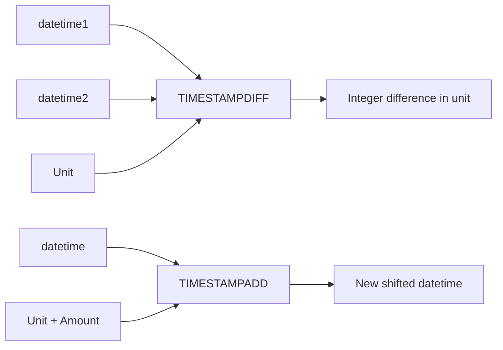

# How to Use MySQL TIMESTAMPDIFF and TIMESTAMPADD

Author: [nawazdhandala](https://www.github.com/nawazdhandala)

Tags: MySQL, SQL, Date Function, TIMESTAMPDIFF, TIMESTAMPADD, Database

Description: Learn how to use MySQL TIMESTAMPDIFF and TIMESTAMPADD to calculate precise date intervals and shift datetime values by any time unit.

---

## How TIMESTAMPDIFF and TIMESTAMPADD Work

`TIMESTAMPDIFF` calculates the difference between two datetime values in a specified unit. Unlike `DATEDIFF`, which only returns days, `TIMESTAMPDIFF` supports units from microseconds to years and accounts for the actual time components in the calculation. `TIMESTAMPADD` shifts a datetime forward or backward by a specified interval, similar to `DATE_ADD` but using the same unit syntax.



## Syntax

```sql
TIMESTAMPDIFF(unit, datetime1, datetime2)
TIMESTAMPADD(unit, amount, datetime)
```

Supported units:

```text
MICROSECOND
SECOND
MINUTE
HOUR
DAY
WEEK
MONTH
QUARTER
YEAR
```

## Setup: Sample Table

```sql
CREATE TABLE subscriptions (
    id           INT AUTO_INCREMENT PRIMARY KEY,
    customer     VARCHAR(100),
    plan         VARCHAR(50),
    started_at   DATETIME NOT NULL,
    ends_at      DATETIME,
    trial_ends   DATETIME
);

INSERT INTO subscriptions (customer, plan, started_at, ends_at, trial_ends) VALUES
('Alice',   'annual',  '2025-03-15 10:00:00', '2026-03-15 10:00:00', '2025-03-29 10:00:00'),
('Bob',     'monthly', '2026-01-10 14:30:00', '2026-02-10 14:30:00', NULL),
('Charlie', 'trial',   '2026-03-01 09:00:00', NULL,                  '2026-03-15 09:00:00'),
('Diana',   'annual',  '2024-12-01 08:00:00', '2025-12-01 08:00:00', NULL),
('Eve',     'monthly', '2026-03-20 16:00:00', '2026-04-20 16:00:00', '2026-04-03 16:00:00');
```

## TIMESTAMPDIFF Examples

**Calculate subscription duration in different units:**

```sql
SELECT
    customer,
    plan,
    started_at,
    ends_at,
    TIMESTAMPDIFF(DAY,    started_at, ends_at) AS duration_days,
    TIMESTAMPDIFF(MONTH,  started_at, ends_at) AS duration_months,
    TIMESTAMPDIFF(HOUR,   started_at, ends_at) AS duration_hours
FROM subscriptions
WHERE ends_at IS NOT NULL;
```

```text
+---------+---------+---------------------+---------------------+---------------+-----------------+----------------+
| customer| plan    | started_at          | ends_at             | duration_days | duration_months | duration_hours |
+---------+---------+---------------------+---------------------+---------------+-----------------+----------------+
| Alice   | annual  | 2025-03-15 10:00:00 | 2026-03-15 10:00:00 | 365           | 12              | 8760           |
| Bob     | monthly | 2026-01-10 14:30:00 | 2026-02-10 14:30:00 | 31            | 1               | 744            |
| Diana   | annual  | 2024-12-01 08:00:00 | 2025-12-01 08:00:00 | 365           | 12              | 8760           |
| Eve     | monthly | 2026-03-20 16:00:00 | 2026-04-20 16:00:00 | 31            | 1               | 744            |
+---------+---------+---------------------+---------------------+---------------+-----------------+----------------+
```

**Calculate age of each subscription in days from today:**

```sql
SELECT
    customer,
    started_at,
    TIMESTAMPDIFF(DAY, started_at, NOW()) AS days_active
FROM subscriptions
ORDER BY days_active DESC;
```

**Find subscriptions expiring within the next 7 days:**

```sql
SELECT customer, plan, ends_at
FROM subscriptions
WHERE ends_at IS NOT NULL
  AND TIMESTAMPDIFF(DAY, NOW(), ends_at) BETWEEN 0 AND 7;
```

**Calculate trial days remaining:**

```sql
SELECT
    customer,
    trial_ends,
    TIMESTAMPDIFF(HOUR, NOW(), trial_ends) AS hours_left_in_trial
FROM subscriptions
WHERE trial_ends IS NOT NULL
  AND trial_ends > NOW();
```

## TIMESTAMPADD Examples

**Add renewal periods:**

```sql
SELECT
    customer,
    plan,
    ends_at,
    CASE plan
        WHEN 'monthly' THEN TIMESTAMPADD(MONTH, 1,  ends_at)
        WHEN 'annual'  THEN TIMESTAMPADD(YEAR,  1,  ends_at)
        ELSE                TIMESTAMPADD(DAY,   14, ends_at)
    END AS next_renewal
FROM subscriptions
WHERE ends_at IS NOT NULL;
```

**Generate future timestamps:**

```sql
SELECT
    TIMESTAMPADD(MINUTE,  30,  NOW()) AS in_30_minutes,
    TIMESTAMPADD(HOUR,     2,  NOW()) AS in_2_hours,
    TIMESTAMPADD(DAY,      7,  NOW()) AS in_1_week,
    TIMESTAMPADD(MONTH,    3,  NOW()) AS in_3_months;
```

**Extend trials for inactive users:**

```sql
UPDATE subscriptions
SET trial_ends = TIMESTAMPADD(DAY, 7, trial_ends)
WHERE plan = 'trial'
  AND trial_ends IS NOT NULL
  AND trial_ends > NOW();
```

## TIMESTAMPDIFF vs. DATEDIFF

```text
Function          Returns       Time-Aware?  Units
-----------       ---------     -----------  -----
DATEDIFF          integer days  No           Days only
TIMESTAMPDIFF     integer       Yes          Any unit
```

Example showing the difference:

```sql
-- With a 1-day but time-spanning difference:
SELECT DATEDIFF('2026-03-02 01:00:00', '2026-03-01 23:00:00');
-- Result: 1 (calendar days crossed)

SELECT TIMESTAMPDIFF(HOUR, '2026-03-01 23:00:00', '2026-03-02 01:00:00');
-- Result: 2 (actual elapsed hours)
```

## Best Practices

- Use `TIMESTAMPDIFF` instead of `DATEDIFF` when the time component matters (e.g., SLA calculations in hours or minutes).
- Always put `TIMESTAMPDIFF(unit, past, future)` to get a positive result for future dates.
- Avoid applying `TIMESTAMPDIFF` inside a WHERE clause on indexed columns - it prevents index use. Use range conditions: `WHERE ends_at BETWEEN NOW() AND TIMESTAMPADD(DAY, 7, NOW())`.
- Use `TIMESTAMPADD` in UPDATE statements to shift expiry dates atomically in SQL rather than fetching, adding, and updating in application code.

## Summary

`TIMESTAMPDIFF` and `TIMESTAMPADD` are MySQL's precision datetime arithmetic functions. `TIMESTAMPDIFF(unit, dt1, dt2)` returns the integer number of complete `unit` intervals between two datetimes, supporting everything from microseconds to years and accounting for both date and time components. `TIMESTAMPADD(unit, amount, datetime)` shifts a datetime by a given amount in any unit. Together they are the right tools for subscription age calculations, SLA monitoring, trial expiry checks, and any use case requiring sub-day precision.
