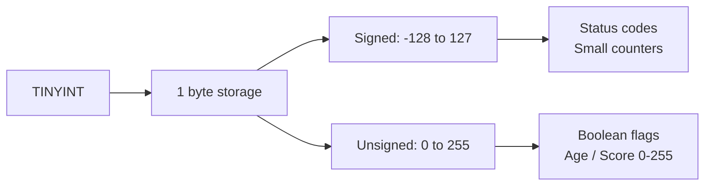

# How to Use TINYINT Data Type in MySQL

Author: [nawazdhandala](https://www.github.com/nawazdhandala)

Tags: MySQL, SQL, Data Type, Integer, Database

Description: Learn how to use the TINYINT data type in MySQL, its storage size, signed and unsigned ranges, and practical use cases like boolean flags and small counters.

---

## What Is TINYINT

`TINYINT` is the smallest integer data type in MySQL. It occupies **1 byte** of storage and is ideal for columns that hold small whole numbers such as boolean flags, status codes, age buckets, or small counters.



## Storage and Value Range

| Type | Storage | Minimum | Maximum |
|---|---|---|---|
| `TINYINT` (signed) | 1 byte | -128 | 127 |
| `TINYINT UNSIGNED` | 1 byte | 0 | 255 |

## Syntax

```sql
column_name TINYINT [(display_width)] [UNSIGNED] [ZEROFILL] [NOT NULL] [DEFAULT value]
```

The optional display width (e.g., `TINYINT(1)`) does **not** affect storage or the value range; it is a display hint for older client tools and is deprecated in MySQL 8.0.17+.

## Basic Usage

```sql
CREATE TABLE product_ratings (
    id          INT AUTO_INCREMENT PRIMARY KEY,
    product_id  INT NOT NULL,
    rating      TINYINT NOT NULL,          -- signed: allows negative if needed
    priority    TINYINT UNSIGNED NOT NULL  -- unsigned: 0-255
);

INSERT INTO product_ratings (product_id, rating, priority)
VALUES (101, 5, 10),
       (102, -1, 200),
       (103, 127, 255);
```

## TINYINT as a Boolean Flag

MySQL does not have a native `BOOLEAN` type; `TINYINT(1)` is the conventional substitute (and what `BOOL`/`BOOLEAN` aliases resolve to).

```sql
CREATE TABLE users (
    id            INT AUTO_INCREMENT PRIMARY KEY,
    username      VARCHAR(50) NOT NULL,
    is_active     TINYINT(1) NOT NULL DEFAULT 1,
    email_verified TINYINT(1) NOT NULL DEFAULT 0
);

INSERT INTO users (username, is_active, email_verified)
VALUES ('alice', 1, 1),
       ('bob', 1, 0),
       ('carol', 0, 0);

-- Query active, verified users
SELECT username
FROM users
WHERE is_active = 1
  AND email_verified = 1;
```

```text
+----------+
| username |
+----------+
| alice    |
+----------+
```

## Status Codes

```sql
CREATE TABLE orders (
    id        INT AUTO_INCREMENT PRIMARY KEY,
    order_ref VARCHAR(20),
    status    TINYINT UNSIGNED NOT NULL DEFAULT 0
    -- 0 = pending, 1 = confirmed, 2 = shipped, 3 = delivered, 4 = cancelled
);

INSERT INTO orders (order_ref, status) VALUES
('ORD-001', 1),
('ORD-002', 3),
('ORD-003', 4);

SELECT order_ref,
       CASE status
           WHEN 0 THEN 'Pending'
           WHEN 1 THEN 'Confirmed'
           WHEN 2 THEN 'Shipped'
           WHEN 3 THEN 'Delivered'
           WHEN 4 THEN 'Cancelled'
           ELSE 'Unknown'
       END AS status_label
FROM orders;
```

```text
+-----------+-------------+
| order_ref | status_label|
+-----------+-------------+
| ORD-001   | Confirmed   |
| ORD-002   | Delivered   |
| ORD-003   | Cancelled   |
+-----------+-------------+
```

## Overflow Behavior

MySQL raises an error (in strict mode) or silently clamps the value (in non-strict mode) when you exceed the range.

```sql
-- With strict mode enabled (default in MySQL 8.0)
INSERT INTO product_ratings (product_id, rating, priority) VALUES (104, 200, 10);
-- ERROR 1264 (22003): Out of range value for column 'rating' at row 1
```

## Checking the Current SQL Mode

```sql
SELECT @@sql_mode;
```

`STRICT_TRANS_TABLES` or `STRICT_ALL_TABLES` in the output means out-of-range values raise errors.

## Inspecting Column Metadata

```sql
SELECT column_name, column_type, is_nullable, column_default
FROM information_schema.columns
WHERE table_schema = DATABASE()
  AND table_name = 'users'
  AND column_name IN ('is_active', 'email_verified');
```

```text
+----------------+------------+-------------+----------------+
| column_name    | column_type| is_nullable | column_default |
+----------------+------------+-------------+----------------+
| is_active      | tinyint(1) | NO          | 1              |
| email_verified | tinyint(1) | NO          | 0              |
+----------------+------------+-------------+----------------+
```

## Aggregation with TINYINT

```sql
SELECT
    SUM(is_active)      AS active_count,
    SUM(email_verified) AS verified_count,
    COUNT(*)            AS total_users
FROM users;
```

```text
+--------------+----------------+-------------+
| active_count | verified_count | total_users |
+--------------+----------------+-------------+
| 2            | 1              | 3           |
+--------------+----------------+-------------+
```

## Best Practices

- Use `TINYINT(1)` (or the `BOOLEAN` alias) for boolean columns to maintain compatibility with ORMs like Hibernate, Sequelize, and SQLAlchemy.
- Prefer `TINYINT UNSIGNED` when negative values are impossible to gain an extra bit of range (0-255 vs -128 to 127).
- Use `ENUM` instead of `TINYINT` for status codes when the label set is fixed and small, because `ENUM` is self-documenting.
- Avoid relying on the display width parameter (`TINYINT(1)` vs `TINYINT(4)`) for formatting; use application-level formatting instead.
- Add an index to `TINYINT` flag columns only when cardinality is high enough to be useful; low-cardinality indexes (e.g., a boolean column) rarely improve query plans.

## Summary

`TINYINT` stores whole numbers in 1 byte. The signed range is -128 to 127; the unsigned range is 0 to 255. It is the standard way to store boolean flags (`TINYINT(1)`) and compact status codes in MySQL. Use `TINYINT UNSIGNED` when values are always non-negative to maximize the available range.
