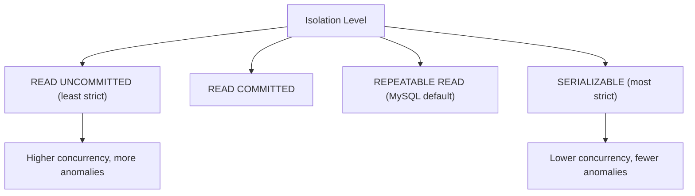

# How to Set Transaction Isolation Level in MySQL

Author: [nawazdhandala](https://www.github.com/nawazdhandala)

Tags: MySQL, SQL, Transaction, Isolation Level, ACID, InnoDB, Database

Description: Learn the four MySQL transaction isolation levels - READ UNCOMMITTED, READ COMMITTED, REPEATABLE READ, and SERIALIZABLE - and when to use each.

---

## How Transaction Isolation Works

When multiple transactions run concurrently, they can interfere with each other in several ways. Transaction isolation levels control how visible the changes made by one transaction are to other concurrent transactions, balancing between data consistency and performance/concurrency.



## Concurrency Anomalies

| Anomaly | Description |
|---------|-------------|
| Dirty Read | Reading uncommitted changes from another transaction |
| Non-Repeatable Read | Reading the same row twice yields different values (another tx committed a change) |
| Phantom Read | A range query returns different rows on re-execution (another tx inserted/deleted rows) |

## Isolation Level Comparison

| Level | Dirty Read | Non-Repeatable Read | Phantom Read |
|-------|------------|---------------------|--------------|
| READ UNCOMMITTED | Possible | Possible | Possible |
| READ COMMITTED | Prevented | Possible | Possible |
| REPEATABLE READ | Prevented | Prevented | Prevented (InnoDB) |
| SERIALIZABLE | Prevented | Prevented | Prevented |

InnoDB's REPEATABLE READ prevents phantom reads via gap locks and MVCC - a stronger guarantee than the SQL standard requires.

## Syntax

```sql
-- Set isolation level for the current session
SET SESSION TRANSACTION ISOLATION LEVEL READ COMMITTED;

-- Set before the next transaction only
SET TRANSACTION ISOLATION LEVEL SERIALIZABLE;

-- Set globally (affects new connections)
SET GLOBAL TRANSACTION ISOLATION LEVEL READ COMMITTED;

-- View current isolation level
SELECT @@transaction_isolation;
-- or
SHOW VARIABLES LIKE 'transaction_isolation';
```

## Examples

### Setup: Demonstrating Each Level

```sql
CREATE TABLE inventory (
    id INT PRIMARY KEY AUTO_INCREMENT,
    product VARCHAR(100),
    quantity INT
);

INSERT INTO inventory (product, quantity) VALUES
    ('Laptop',   50),
    ('Mouse',   200),
    ('Keyboard', 75);
```

### Demonstrating Dirty Read (READ UNCOMMITTED)

With READ UNCOMMITTED, Transaction B can read Transaction A's uncommitted changes.

**Session A:**
```sql
SET SESSION TRANSACTION ISOLATION LEVEL READ UNCOMMITTED;
START TRANSACTION;
UPDATE inventory SET quantity = 999 WHERE product = 'Laptop';
-- NOT committed yet
```

**Session B (same level):**
```sql
SET SESSION TRANSACTION ISOLATION LEVEL READ UNCOMMITTED;
START TRANSACTION;
SELECT quantity FROM inventory WHERE product = 'Laptop';
-- Returns 999 - a dirty read of A's uncommitted change!
```

**Session A:**
```sql
ROLLBACK;  -- The change never persisted, but B already read 999
```

### READ COMMITTED: Preventing Dirty Reads

```sql
SET SESSION TRANSACTION ISOLATION LEVEL READ COMMITTED;
```

With this level, Session B only sees committed data. If Session A has not committed yet, Session B reads the original value. However, if A commits between two reads by B, B may see different values (non-repeatable read).

### REPEATABLE READ (Default): Consistent Snapshot

```sql
SET SESSION TRANSACTION ISOLATION LEVEL REPEATABLE READ;
```

Once Transaction B starts, it sees a consistent snapshot of the database as of the start of the transaction. Even if Transaction A commits changes during B's transaction, B always reads the same data.

```sql
-- Session B
SET SESSION TRANSACTION ISOLATION LEVEL REPEATABLE READ;
START TRANSACTION;

SELECT quantity FROM inventory WHERE product = 'Laptop';
-- Returns 50

-- Meanwhile, Session A commits: UPDATE inventory SET quantity = 100 WHERE product = 'Laptop'

SELECT quantity FROM inventory WHERE product = 'Laptop';
-- Still returns 50 (consistent snapshot from transaction start)

COMMIT;
```

### SERIALIZABLE: Full Serialization

```sql
SET SESSION TRANSACTION ISOLATION LEVEL SERIALIZABLE;
```

SERIALIZABLE adds range locks so that concurrent transactions execute as if they were fully sequential. This prevents all anomalies but significantly reduces concurrency.

```sql
-- Session B
SET SESSION TRANSACTION ISOLATION LEVEL SERIALIZABLE;
START TRANSACTION;

SELECT * FROM inventory WHERE quantity > 100;
-- Takes a shared range lock on all rows with quantity > 100

-- Session A trying to INSERT a new row with quantity > 100 will BLOCK
-- until Session B commits or rolls back
```

### Choosing the Right Level Per Session

Different use cases may need different isolation levels within the same application.

```sql
-- For financial transfers: use SERIALIZABLE to prevent phantom reads
SET SESSION TRANSACTION ISOLATION LEVEL SERIALIZABLE;
START TRANSACTION;
SELECT SUM(balance) FROM accounts;
-- ... proceed with transfer
COMMIT;
SET SESSION TRANSACTION ISOLATION LEVEL REPEATABLE READ;  -- reset to default

-- For high-throughput reads that tolerate slight inconsistency: READ COMMITTED
SET SESSION TRANSACTION ISOLATION LEVEL READ COMMITTED;
SELECT * FROM reports_cache;
```

### Setting Default Isolation Level in my.cnf

```text
[mysqld]
transaction_isolation = READ-COMMITTED
```

Many high-traffic applications use READ COMMITTED as the global default for better performance, accepting the possibility of non-repeatable reads.

## When to Use Each Level

```text
READ UNCOMMITTED
  - Almost never used in practice
  - Only if raw performance outweighs correctness (analytics on non-critical data)

READ COMMITTED
  - Common in high-throughput OLTP applications
  - Good default when non-repeatable reads are acceptable
  - Reduces lock contention vs REPEATABLE READ

REPEATABLE READ (MySQL InnoDB default)
  - Suitable for most applications
  - Strong consistency within a transaction
  - Use for most financial and transactional workloads

SERIALIZABLE
  - Use for operations where correctness is critical and concurrency can be sacrificed
  - Audit reads, exact balance snapshots, critical reservation systems
```

## Best Practices

- Use the default REPEATABLE READ for most applications - it provides strong consistency without the full overhead of SERIALIZABLE.
- Switch to READ COMMITTED for high-concurrency read-heavy workloads where non-repeatable reads are acceptable.
- Set isolation level at the session level before sensitive transactions rather than changing the global default.
- Combine appropriate isolation levels with explicit SELECT ... FOR UPDATE locking when you need to lock specific rows.
- Monitor for lock wait timeouts and deadlocks with Performance Schema when using SERIALIZABLE.

## Summary

MySQL's four transaction isolation levels (READ UNCOMMITTED, READ COMMITTED, REPEATABLE READ, SERIALIZABLE) control the tradeoff between concurrency and data consistency. MySQL InnoDB defaults to REPEATABLE READ, which prevents dirty reads, non-repeatable reads, and phantom reads. READ COMMITTED is a popular choice for high-throughput applications. SERIALIZABLE provides the strongest guarantees but limits concurrency. Set isolation level with `SET SESSION TRANSACTION ISOLATION LEVEL` before starting transactions that require specific consistency guarantees.
