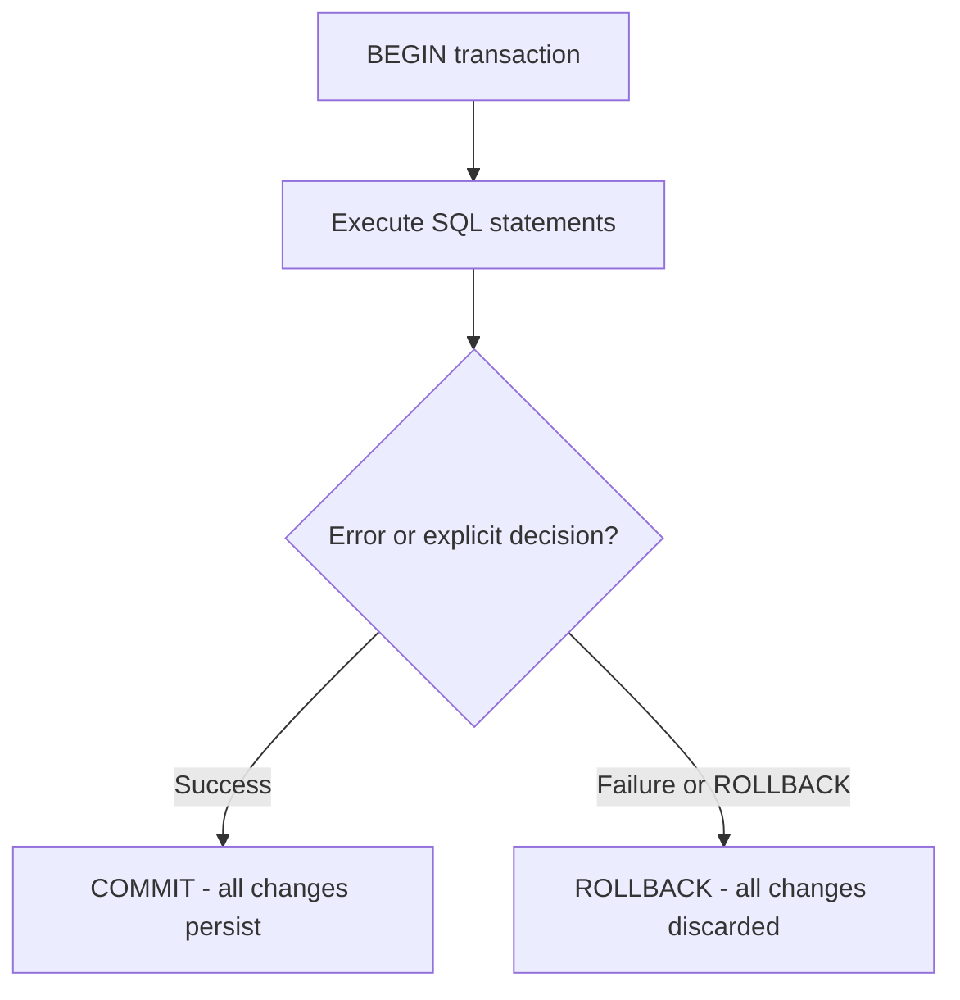

# How to Use Transactions in MySQL with BEGIN, COMMIT, ROLLBACK

Author: [nawazdhandala](https://www.github.com/nawazdhandala)

Tags: MySQL, SQL, Transaction, ACID, BEGIN, Commit, Rollback, Database

Description: Learn how to use MySQL transactions with BEGIN, COMMIT, and ROLLBACK to ensure data integrity across multiple SQL statements.

---

## How Transactions Work

A transaction is a group of SQL statements that execute as a single unit. Either all statements succeed (COMMIT) or none of them take effect (ROLLBACK). This is the foundation of ACID (Atomicity, Consistency, Isolation, Durability) database guarantees.



InnoDB (MySQL's default storage engine) supports transactions. MyISAM does not.

## ACID Properties

| Property | Meaning |
|----------|---------|
| Atomicity | All-or-nothing: all statements commit or all roll back |
| Consistency | Database moves from one valid state to another |
| Isolation | Concurrent transactions don't interfere with each other |
| Durability | Committed changes survive crashes |

## Syntax

```sql
-- Start a transaction
START TRANSACTION;
-- or
BEGIN;

-- Commit (make changes permanent)
COMMIT;

-- Rollback (undo all changes since BEGIN)
ROLLBACK;

-- Check if autocommit is on
SHOW VARIABLES LIKE 'autocommit';

-- Disable autocommit (each statement needs explicit COMMIT)
SET autocommit = 0;
```

By default, MySQL runs in autocommit mode where each statement is its own transaction. Use `START TRANSACTION` or `BEGIN` to start an explicit multi-statement transaction.

## Examples

### Setup: Create Sample Tables

```sql
CREATE TABLE accounts (
    id INT PRIMARY KEY AUTO_INCREMENT,
    holder_name VARCHAR(100) NOT NULL,
    balance DECIMAL(12, 2) NOT NULL DEFAULT 0,
    CONSTRAINT chk_balance CHECK (balance >= 0)
);

CREATE TABLE transfer_log (
    id INT PRIMARY KEY AUTO_INCREMENT,
    from_account INT,
    to_account INT,
    amount DECIMAL(12, 2),
    transfer_time DATETIME DEFAULT CURRENT_TIMESTAMP,
    status VARCHAR(20)
);

INSERT INTO accounts (holder_name, balance) VALUES
    ('Alice', 5000.00),
    ('Bob',   3000.00),
    ('Carol', 1500.00);
```

### Basic Transaction: Bank Transfer

Transfer $500 from Alice to Bob. Both operations must succeed together.

```sql
START TRANSACTION;

-- Deduct from Alice
UPDATE accounts SET balance = balance - 500.00 WHERE id = 1;

-- Add to Bob
UPDATE accounts SET balance = balance + 500.00 WHERE id = 2;

-- Log the transfer
INSERT INTO transfer_log (from_account, to_account, amount, status)
VALUES (1, 2, 500.00, 'completed');

COMMIT;

-- Verify
SELECT id, holder_name, balance FROM accounts;
```

```text
+----+-------------+---------+
| id | holder_name | balance |
+----+-------------+---------+
| 1  | Alice       | 4500.00 |
| 2  | Bob         | 3500.00 |
| 3  | Carol       | 1500.00 |
+----+-------------+---------+
```

### ROLLBACK on Error

Attempt to overdraw Alice's account beyond her balance. The CHECK constraint will cause an error, and ROLLBACK undoes everything.

```sql
START TRANSACTION;

UPDATE accounts SET balance = balance - 10000.00 WHERE id = 1;
-- This violates the CHECK constraint (balance < 0)

-- If the above failed, rollback to restore consistency
ROLLBACK;

-- Verify balance unchanged
SELECT id, holder_name, balance FROM accounts WHERE id = 1;
```

### Transaction in Application Code Pattern

In real applications, ROLLBACK typically happens inside error handling:

```sql
-- Simulate application-level transaction logic
START TRANSACTION;

UPDATE accounts SET balance = balance - 200.00 WHERE id = 3 AND balance >= 200.00;

-- Check if the UPDATE affected any rows (0 rows = insufficient funds)
-- ROW_COUNT() returns number of rows affected by the last DML
SET @rows_updated = ROW_COUNT();

IF @rows_updated = 0 THEN
    ROLLBACK;
    SELECT 'Transfer failed: insufficient funds' AS result;
ELSE
    UPDATE accounts SET balance = balance + 200.00 WHERE id = 2;
    INSERT INTO transfer_log (from_account, to_account, amount, status)
    VALUES (3, 2, 200.00, 'completed');
    COMMIT;
    SELECT 'Transfer successful' AS result;
END IF;
```

### Checking Transaction Status

```sql
-- See if you're in a transaction
SELECT @@autocommit;

-- Using INFORMATION_SCHEMA to view running transactions (MySQL 8.0+)
SELECT trx_id, trx_state, trx_started, trx_query
FROM information_schema.INNODB_TRX;
```

### Autocommit Mode

When autocommit is ON (default), each statement is automatically committed unless you explicitly start a transaction.

```sql
-- Default: autocommit ON
SHOW VARIABLES LIKE 'autocommit';
-- Value: ON

-- Each statement below auto-commits
UPDATE accounts SET balance = balance + 100 WHERE id = 1;
UPDATE accounts SET balance = balance - 100 WHERE id = 2;

-- To group them, use explicit BEGIN/COMMIT
START TRANSACTION;
UPDATE accounts SET balance = balance + 100 WHERE id = 1;
UPDATE accounts SET balance = balance - 100 WHERE id = 2;
COMMIT;
```

### DDL Statements Implicitly Commit

Be aware that DDL statements (CREATE TABLE, ALTER TABLE, DROP TABLE) automatically commit any open transaction.

```sql
START TRANSACTION;
UPDATE accounts SET balance = 9999 WHERE id = 1;
-- This next statement implicitly commits the UPDATE above!
CREATE TABLE temp_table (id INT);
-- Now you cannot ROLLBACK the UPDATE to accounts
ROLLBACK;  -- Does nothing for the UPDATE
```

## Best Practices

- Always pair START TRANSACTION with either COMMIT or ROLLBACK - never leave a transaction open.
- Keep transactions short to minimize lock contention and reduce blocking.
- Do DDL operations (CREATE, ALTER, DROP) outside of transactions - they auto-commit and cannot be rolled back.
- Use `START TRANSACTION READ ONLY` for reporting queries to signal no writes are expected.
- Handle errors in application code and call ROLLBACK in catch/finally blocks.
- Use `SET SESSION transaction_isolation = 'REPEATABLE-READ'` to control isolation level per session.

## Summary

MySQL transactions group multiple SQL statements into an atomic unit using BEGIN/START TRANSACTION, COMMIT, and ROLLBACK. InnoDB ensures ACID guarantees: all statements in a transaction either all succeed (COMMIT) or all fail (ROLLBACK). Keep transactions short to minimize lock contention, avoid DDL inside transactions (they auto-commit), and always handle errors with proper ROLLBACK calls in application code. Transactions are essential for any operation that modifies multiple rows or tables that must remain consistent together.
